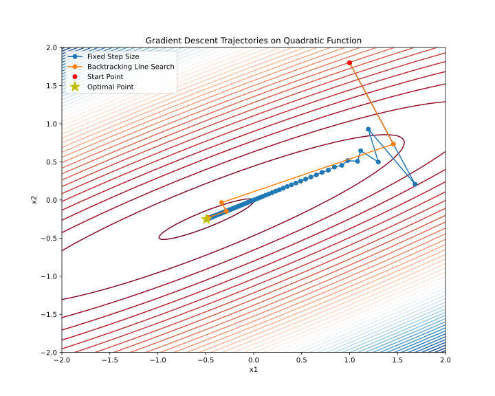

### Linear algebra basics


1. [5 points] **Sensitivity Analysis in Linear Systems** Consider a nonsingular matrix $A \in \mathbb{R}^{n \times n}$ and a vector $b \in \mathbb{R}^n$. Suppose that due to measurement or computational errors, the vector $b$ is perturbed to $\tilde{b} = b + \delta b$.  
    1. Derive an upper bound for the relative error in the solution $x$ of the system $Ax = b$ in terms of the condition number $\kappa(A)$ and the relative error in $b$.  
    1. Provide a concrete example using a $2 \times 2$ matrix where $\kappa(A)$ is large (say, $\geq 100500$).

1. [5 points] **Effect of Diagonal Scaling on Rank** Let $A \in \mathbb{R}^{n \times n}$ be a matrix with rank $r$. Suppose $D \in \mathbb{R}^{n \times n}$ is a diagonal matrix. Determine the rank of the product $DA$. Explain your reasoning.

1. [8 points] **Unexpected SVD** Compute the Singular Value Decomposition (SVD) of the following matrices:
    * $A_1 = \begin{bmatrix} 2 \\ 2 \\ 8 \end{bmatrix}$
    * $A_2 = \begin{bmatrix} 0 & x \\ x & 0 \\ 0 & 0 \end{bmatrix}$, where $x$ is the sum of your birthdate numbers (day + month).

1. [10 points] **Effect of normalization on rank** Assume we have a set of data points $x^{(i)}\in\mathbb{R}^{n},\,i=1,\dots,m$, and decide to represent this data as a matrix
    $$
    X =
    \begin{pmatrix}
     | & & | \\
     x^{(1)} & \dots & x^{(m)} \\
     | & & | \\
    \end{pmatrix} \in \mathbb{R}^{n \times m}.
    $$

    We suppose that $\text{rank}\,X = r$.

    In the problem below, we ask you to find the rank of some matrix $M$ related to $X$.
    In particular, you need to find relation between $\text{rank}\,X = r$ and $\text{rank}\,M$, e.g., that the rank of $M$ is always larger/smaller than the rank of $X$ or that $\text{rank}\,M = \text{rank}\,X \big / 35$.
    Please support your answer with legitimate arguments and make the answer as accurate as possible.

    Note that border cases are possible depending on the structure of the matrix $X$. Make sure to cover them in your answer correctly.

    In applied statistics and machine learning, data is often normalized.
    One particularly popular strategy is to subtract the estimated mean $\mu$ and divide by the square root of the estimated variance $\sigma^2$. i.e.
    $$
    x \rightarrow (x - \mu) \big / \sigma.
    $$
    After the normalization, we get a new matrix
    $$
    \begin{split}
    Y &:=
    \begin{pmatrix}
     | & & | \\
     y^{(1)} & \dots & y^{(m)} \\
     | & & | \\
    \end{pmatrix},\\
    y^{(i)} &:= \frac{x^{(i)} - \frac{1}{m}\sum_{j=1}^{m} x^{(j)}}{\sigma}.
    \end{split}
    $$
    What is the rank of $Y$ if $\text{rank} \; X = r$? Here $\sigma$ is a vector and the division is element-wise. The reason for this is that different features might have different scales. Specifically:
    $$
    \sigma_i = \sqrt{\frac{1}{m}\sum_{j=1}^{m} \left(x_i^{(j)}\right)^2 - \left(\frac{1}{m}\sum_{j=1}^{m} x_i^{(j)}\right)^2}.
    $$

1. [20 points] **Image Compression with Truncated SVD** Explore image compression using Truncated Singular Value Decomposition (SVD). Understand how varying the number of singular values affects the quality of the compressed image.
    Implement a Python script to compress a grayscale image using Truncated SVD and visualize the compression quality.
    
    * **Truncated SVD**: Decomposes an image $A$ into $U, S,$ and $V$ matrices. The compressed image is reconstructed using a subset of singular values.
    * **Mathematical Representation**: 
        $$
        A \approx U_k \Sigma_k V_k^T
        $$
        * $U_k$ and $V_k$ are the first $k$ columns of $U$ and $V$, respectively.
        * $\Sigma_k$ is a diagonal matrix with the top $k$ singular values.
        * **Relative Error**: Measures the fidelity of the compressed image compared to the original. 
            $$
            \text{Relative Error} = \frac{\| A - A_k \|}{\| A \|}
            $$

    ```python
    import matplotlib.pyplot as plt
    import matplotlib.animation as animation
    import numpy as np
    from skimage import io, color
    import requests
    from io import BytesIO

    def download_image(url):
        response = requests.get(url)
        img = io.imread(BytesIO(response.content))
        return color.rgb2gray(img)  # Convert to grayscale

    def update_plot(i, img_plot, error_plot, U, S, V, original_img, errors, ranks, ax1, ax2):
        # Adjust rank based on the frame index
        if i < 70:
            rank = i + 1
        else:
            rank = 70 + (i - 69) * 10

        reconstructed_img = ... # YOUR CODE HERE 

        # Calculate relative error
        relative_error = ... # YOUR CODE HERE
        errors.append(relative_error)
        ranks.append(rank)

        # Update the image plot and title
        img_plot.set_data(reconstructed_img)
        ax1.set_title(f"Image compression with SVD\n Rank {rank}; Relative error {relative_error:.2f}")

        # Remove axis ticks and labels from the first subplot (ax1)
        ax1.set_xticks([])
        ax1.set_yticks([])

        # Update the error plot
        error_plot.set_data(ranks, errors)
        ax2.set_xlim(1, len(S))
        ax2.grid(linestyle=":")
        ax2.set_ylim(1e-4, 0.5)
        ax2.set_ylabel('Relative Error')
        ax2.set_xlabel('Rank')
        ax2.set_title('Relative Error over Rank')
        ax2.semilogy()

        # Set xticks to show rank numbers
        ax2.set_xticks(range(1, len(S)+1, max(len(S)//10, 1)))  # Adjust the step size as needed
        plt.tight_layout()

        return img_plot, error_plot


    def create_animation(image, filename='svd_animation.mp4'):
        U, S, V = np.linalg.svd(image, full_matrices=False)
        errors = []
        ranks = []

        fig, (ax1, ax2) = plt.subplots(2, 1, figsize=(5, 8))
        img_plot = ax1.imshow(image, cmap='gray', animated=True)
        error_plot, = ax2.plot([], [], 'r-', animated=True)  # Initial empty plot for errors

        # Add watermark
        ax1.text(1, 1.02, '@fminxyz', transform=ax1.transAxes, color='gray', va='bottom', ha='right', fontsize=9)

        # Determine frames for the animation
        initial_frames = list(range(70))  # First 70 ranks
        subsequent_frames = list(range(70, len(S), 10))  # Every 10th rank after 70
        frames = initial_frames + subsequent_frames

        ani = animation.FuncAnimation(fig, update_plot, frames=len(frames), fargs=(img_plot, error_plot, U, S, V, image, errors, ranks, ax1, ax2), interval=50, blit=True)
        ani.save(filename, writer='ffmpeg', fps=8, dpi=300)

        # URL of the image
        url = ""

        # Download the image and create the animation
        image = download_image(url)
        create_animation(image)
    ```


### Convergence rates

1. [6 points] Determine (it means to prove the character of convergence if it is convergent) the convergence or divergence of a given sequences
    * $r_{k} = \frac{1}{\sqrt{k+5}}$.
    * $r_{k} = 0.101^k$.
    * $r_{k} = 0.101^{2^k}$.

1. [8 points] Let the sequence $\{r_k\}$ be defined by
    $$
    r_{k+1} = 
    \begin{cases}
    \frac{1}{2}\,r_k, & \text{if } k \text{ is even}, \\
    r_k^2, & \text{if } k \text{ is odd},
    \end{cases}
    $$
    with initial value $0 < r_0 < 1$. Prove that $\{r_k\}$ converges to 0 and analyze its convergence rate. In your answer, determine whether the overall convergence is linear, superlinear, or quadratic.

1. [6 points] Determine the following sequence $\{r_k\}$ by convergence rate (linear, sublinear, superlinear). In the case of superlinear convergence, determine whether there is quadratic convergence.
    $$
    r_k = \dfrac{1}{k!}
    $$

1. [8 points] Consider the recursive sequence defined by
    $$
    r_{k+1} = \lambda\,r_k + (1-\lambda)\,r_k^p,\quad k\ge0,
    $$
    where $\lambda\in [0,1)$ and $p>1$. Which additional conditions on $r_0$ should be satisfied for the sequence to converge? Show that when $\lambda>0$ the sequence converges to 0 with a linear rate (with asymptotic constant $\lambda$), and when $\lambda=0$ determine the convergence rate in terms of $p$. In particular, for $p=2$ decide whether the convergence is quadratic.

### Line search

1. [10 points] Consider a strongly convex quadratic function $f: \mathbb{R}^n \rightarrow \mathbb{R}$, and let us start from a point $x_k \in \mathbb{R}^n$ moving in the direction of the antigradient $-\nabla f(x_k)$, note that $\nabla f(x_k)\neq 0$. Show that the minimum of $f$ along this direction as a function of the step size $\alpha$, for a decreasing function at $x_k$, satisfies Armijo's condition for any $c_1$ in the range $0 \leq c_1 \leq \frac{1}{2}$. Specifically, demonstrate that the following inequality holds at the optimal $\alpha^*$:
    $$
    \varphi(\alpha) = f(x_{k+1}) = f(x_k - \alpha \nabla f(x_k)) \leq f(x_k) - c_1 \alpha \|\nabla f(x_k)\|_2^2
    $$

1. **Implementing and Testing Line Search Conditions in Gradient Descent** [36 points] 
    $$
    x_{k+1} = x_k - \alpha \nabla f(x_k)
    $$
    In this assignment, you will modify an existing Python code for gradient descent to include various line search conditions. You will test these modifications on two functions: a quadratic function and the Rosenbrock function. The main objectives are to understand how different line search strategies influence the convergence of the gradient descent algorithm and to compare their efficiencies based on the number of function evaluations.

    ```python
    import numpy as np
    import matplotlib.pyplot as plt
    from scipy.optimize import minimize_scalar
    np.random.seed(214)

    # Define the quadratic function and its gradient
    def quadratic_function(x, A, b):
        return 0.5 * np.dot(x.T, np.dot(A, x)) - np.dot(b.T, x)

    def grad_quadratic(x, A, b):
        return np.dot(A, x) - b

    # Generate a 2D quadratic problem with a specified condition number
    def generate_quadratic_problem(cond_number):
        # Random symmetric matrix
        M = np.random.randn(2, 2)
        M = np.dot(M, M.T)

        # Ensure the matrix has the desired condition number
        U, s, V = np.linalg.svd(M)
        s = np.linspace(cond_number, 1, len(s))  # Spread the singular values
        A = np.dot(U, np.dot(np.diag(s), V))

        # Random b
        b = np.random.randn(2)

        return A, b

    # Gradient descent function
    def gradient_descent(start_point, A, b, stepsize_func, max_iter=100):
        x = start_point.copy()
        trajectory = [x.copy()]

        for i in range(max_iter):
            grad = grad_quadratic(x, A, b)
            step_size = stepsize_func(x, grad)
            x -= step_size * grad
            trajectory.append(x.copy())

        return np.array(trajectory)

    # Backtracking line search strategy using scipy
    def backtracking_line_search(x, grad, A, b, alpha=0.3, beta=0.8):
        def objective(t):
            return quadratic_function(x - t * grad, A, b)
        res = minimize_scalar(objective, method='golden')
        return res.x

    # Generate ill-posed problem
    cond_number = 30
    A, b = generate_quadratic_problem(cond_number)

    # Starting point
    start_point = np.array([1.0, 1.8])

    # Perform gradient descent with both strategies
    trajectory_fixed = gradient_descent(start_point, A, b, lambda x, g: 5e-2)
    trajectory_backtracking = gradient_descent(start_point, A, b, lambda x, g: backtracking_line_search(x, g, A, b))

    # Plot the trajectories on a contour plot
    x1, x2 = np.meshgrid(np.linspace(-2, 2, 400), np.linspace(-2, 2, 400))
    Z = np.array([quadratic_function(np.array([x, y]), A, b) for x, y in zip(x1.flatten(), x2.flatten())]).reshape(x1.shape)

    plt.figure(figsize=(10, 8))
    plt.contour(x1, x2, Z, levels=50, cmap='viridis')
    plt.plot(trajectory_fixed[:, 0], trajectory_fixed[:, 1], 'o-', label='Fixed Step Size')
    plt.plot(trajectory_backtracking[:, 0], trajectory_backtracking[:, 1], 'o-', label='Backtracking Line Search')

    # Add markers for start and optimal points
    plt.plot(start_point[0], start_point[1], 'ro', label='Start Point')
    optimal_point = np.linalg.solve(A, b)
    plt.plot(optimal_point[0], optimal_point[1], 'y*', markersize=15, label='Optimal Point')

    plt.legend()
    plt.title('Gradient Descent Trajectories on Quadratic Function')
    plt.xlabel('x1')
    plt.ylabel('x2')
    plt.savefig("linesearch.svg")
    plt.show()
    ```

    

    Start by reviewing the provided Python code. This code implements gradient descent with a fixed step size and a backtracking line search on a quadratic function. Familiarize yourself with how the gradient descent function and the step size strategies are implemented.

    1. [10/36 points] Modify the gradient descent function to include the following line search conditions:

        1. Dichotomy 
        1. Sufficient Decrease Condition
        1. Wolfe Condition
        1. Polyak step size
            $$
            \alpha_k = \frac{f(x_k) - f^*}{\|\nabla f(x_k)\|_2^2},
            $$
            where $f^*$ is the optimal value of the function. It seems strange to use the optimal value of the function in the step size, but there are options to estimate it even without knowing the optimal value.       
        1. Sign Gradient Method:
            $$
            \alpha_k = \frac{1}{\|\nabla f(x_k)\|_2},
            $$
        Test your modified gradient descent algorithm with the implemented step size search conditions on the provided quadratic function. Plot the trajectories over iterations for each condition. Choose and specify hyperparameters for inexact line search conditions. Choose and specify the **termination criterion**. Start from the point $x_0 = (-1, 2)^T$.

    1. [8/36 points] Compare these 7 methods from the budget perspective. Plot the graph of function value from the number of function evaluations for each method on the same graph.
    1. [10/36 points] Plot trajectory for another function with the same set of methods
        $$
        f(x_1, x_2) =  10(x_2 − x_1^2)^2 + (x_1 − 1)^2
        $$
        with $x_0 = (-1, 2)^T$. You might need to adjust hyperparameters.

    1. [8/36 points] Plot the same function value from the number of function calls for this experiment.

### Matrix calculus

1. [6 points] Find the gradient $\nabla f(x)$ and hessian $f^{\prime\prime}(x)$, if $f(x) = \frac{1}{2}\Vert A - xx^T\Vert ^2_F, A \in \mathbb{S}^n$

1. [6 points] Find the gradient $\nabla f(x)$ and hessian $f''(x)$, if $f(x) = \dfrac{1}{2} \Vert Ax - b\Vert^2_2$.

1. [8 points] Find the gradient $\nabla f(x)$ and hessian $f''(x)$, if 
    $$
    f(x) = \frac1m \sum\limits_{i=1}^m \log \left( 1 + \exp(a_i^{T}x) \right) + \frac{\mu}{2}\Vert x\Vert _2^2, \; a_i, x \in \mathbb R^n, \; \mu>0
    $$

1. [8 points] Compute the gradient $\nabla_A f(A)$ of the trace of the matrix exponential function $f(A) = \text{tr}(e^A)$ with respect to $A$. Hint: Use the definition of the matrix exponential. Use the definition of the differential $df = f(A + dA) - f(A) + o(\Vert dA \Vert)$ with the limit $\Vert dA \Vert \to 0$.

1. [20 points] **Principal Component Analysis through gradient calculation.** Let there be a dataset $\{x_i\}_{i=1}^N, x_i \in \mathbb{R}^D$, which we want to transform into a dataset of reduced dimensionality $d$ using projection onto a linear subspace defined by the matrix $P \in \mathbb{R}^{D \times d}$. The orthogonal projection of a vector $x$ onto this subspace can be computed as $P(P^TP)^{-1}P^Tx$. To find the optimal matrix $P$, consider the following optimization problem:
    $$
    F(P) = \sum_{i=1}^N \|x_i - P(P^TP)^{-1}P^Tx_i\|^2 = N \cdot \text{tr}\left((I - P(P^TP)^{-1}P^T)^2 S\right) \to \min_{P \in \mathbb{R}^{D \times d}},
    $$
    where $S = \frac{1}{N} \sum_{i=1}^N x_i x_i^T$ is the sample covariance matrix for the normalized dataset.

    1. Find the gradient $\nabla_P F(P)$, calculated for an arbitrary matrix $P$ with orthogonal columns, i.e., $P : P^T P = I$. 
    
        *Hint: When calculating the differential $dF(P)$, first treat $P$ as an arbitrary matrix, and then use the orthogonality property of the columns of $P$ in the resulting expression.*
    1. Consider the eigendecomposition of the matrix $S$: 
        $$
        S = Q \Lambda Q^T,
        $$
        where $\Lambda$ is a diagonal matrix with eigenvalues on the diagonal, and $Q = [q_1 | q_2 | \ldots | q_D] \in \mathbb{R}^{D \times D}$ is an orthogonal matrix consisting of eigenvectors $q_i$ as columns. Prove the following:

        1. The gradient $\nabla_P F(P)$ equals zero for any matrix $P$ composed of $d$ distinct eigenvectors $q_i$ as its columns.
        2. The minimum value of $F(P)$ is achieved for the matrix $P$ composed of eigenvectors $q_i$ corresponding to the largest eigenvalues of $S$.


### Automatic differentiation and jax

1. **Benchmarking Hessian-Vector Product (HVP) Computation in a Neural Network via JAX** [22 points]

    You are given a simple neural network model (an MLP with several hidden layers using a nonlinearity such as GELU). The model's parameters are defined by the weights of its layers. Your task is to compare different approaches for computing the Hessian-vector product (HVP) with respect to the model's loss and to study how the computation time scales as the model grows in size.

    **Model and Loss Definition:** [2/22 points] Here is the code for the model and loss definition. Write a method `get_params()` that returns the flattened vector of all model weights.

    ```python
    import jax
    import jax.numpy as jnp
    import time
    import matplotlib.pyplot as plt
    import numpy as np
    import pandas as pd
    from tqdm.auto import tqdm
    from jax.nn import gelu

    # Определение MLP модели
    class MLP:
        def __init__(self, key, layer_sizes):
            self.layer_sizes = layer_sizes
            keys = jax.random.split(key, len(layer_sizes) - 1)
            self.weights = [
                jax.random.normal(k, (layer_sizes[i], layer_sizes[i + 1]))
                for i, k in enumerate(keys)
                ]
        
        def forward(self, x):
            for w in self.weights[:-1]:
                x = gelu(jnp.dot(x, w))
            return jnp.dot(x, self.weights[-1])
        
        def get_params(self):
            ### YOUR CODE HERE ###
            return None
    ```

    **Hessian and HVP Implementations:** [2/22 points] Write a function 
    
    ```python
    # Функция для вычисления Гессиана
    def calculate_hessian(model, params):
        def loss_fn(p):
            x = jnp.ones((1, model.layer_sizes[0]))  # Заглушка входа
            return jnp.sum(model.forward(x))
        
        ### YOUR CODE HERE ###
        #hessian_fn =           
        return hessian_fn(params)
    ```
    that computes the full Hessian $H$ of the loss function with respect to the model parameters using JAX's automatic differentiation.
    
    **Naive HVP via Full Hessian:** [2/22 points] Write a function ```naive_hvp(hessian, vector)``` that, given a precomputed Hessian $H$ and a vector $v$ (of the same shape as the parameters), computes the Hessian-vector product using a straightforward matrix-vector multiplication.

    **Efficient HVP Using Autograd:** [4/22 points] Write a function 
    ```python
     def hvp(f, x, v):
         return jax.grad(lambda x: jnp.vdot(jax.grad(f)(x), v))(x)
    ```
    that directly computes the HVP without explicitly forming the full Hessian. This leverages the reverse-mode differentiation capabilities of JAX.
     
    **Timing Experiment:** Consider a family of models with an increasing number of hidden layers. 

    ```python
    ns = np.linspace(50, 1000, 15, dtype=int)  # The number of hidden layers
    num_runs = 10  # The number of runs for averaging
    ```

    For each model configuration:
    * Generate the model and extract its parameter vector.
    * Generate a random vector $v$ of the same dimension as the parameters.
    * Measure (do not forget to use ```.block_until_ready()``` to ensure accurate timing and proper synchronization) the following:
       1. **Combined Time (Full Hessian + Naive HVP):** The total time required to compute the full Hessian and then perform the matrix-vector multiplication.
       2. **Naive HVP Time (Excluding Hessian Computation):** The time required to perform the matrix-vector multiplication given a precomputed Hessian.
       3. **Efficient HVP Time:** The time required to compute the HVP using the autograd-based function.
    * Repeat each timing measurement for a fixed number of runs (e.g., 10 runs) and record both the mean and standard deviation of the computation times. 
    
    **Visualization and Analysis:** [12/22 points]
    * Plot the timing results for the three methods on the same graph. For each method, display error bars corresponding to the standard deviation over the runs.
    * Label the axes clearly (e.g., "Number of Layers" vs. "Computation Time (seconds)") and include a legend indicating which curve corresponds to which method.
    * Analyze the scaling behavior. Try analytically derive the scaling of the methods and compare it with the experimental results.

1. [15 points] We can use automatic differentiation not only to calculate necessary gradients but also for tuning hyperparameters of the algorithm like learning rate in gradient descent (with gradient descent 🤯). Suppose, we have the following function $f(x) = \frac{1}{2}\Vert x\Vert^2$, select a random point $x_0 \in \mathbb{B}^{1000} = \{0 \leq x_i \leq 1 \mid \forall i\}$. Consider $10$ steps of the gradient descent starting from the point $x_0$:
    $$
    x_{k+1} = x_k - \alpha_k \nabla f(x_k)
    $$
    Your goal in this problem is to write the function, that takes $10$ scalar values $\alpha_i$ and return the result of the gradient descent on function $L = f(x_{10})$. And optimize this function using gradient descent on $\alpha \in \mathbb{R}^{10}$. Suppose that each of $10$ components of $\alpha$ is uniformly distributed on $[0; 0.1]$.
    $$
    \alpha_{k+1} = \alpha_k - \beta \frac{\partial L}{\partial \alpha}
    $$
    Choose any constant $\beta$ and the number of steps you need. Describe the obtained results. How would you understand, that the obtained schedule ($\alpha \in \mathbb{R}^{10}$) becomes better than it was at the start? How do you check numerically local optimality in this problem?

### Convexity

1. [10 points] Show that this function is convex:
    $$
    f(x, y, z) = z \log \left(e^{\frac{x}{z}} + e^{\frac{y}{z}}\right) + (z - 2)^2 + e^{\frac{1}{x + y}}
    $$
    where the function $f : \mathbb{R}^3 \to \mathbb{R}$ has its domain defined as:
    $$
    \text{dom } f = \{ (x, y, z) \in \mathbb{R}^3 : x + y > 0, \, z > 0 \}.
    $$

1. [8 points] Show, that $\mathbf{conv}\{xx^\top: x \in \mathbb{R}^n, \Vert x\Vert  = 1\} = \{A \in \mathbb{S}^n_+: \text{tr}(A) = 1\}$.
1. [5 points] Prove that the set of $\{x \in \mathbb{R}^2 \mid e^{x_1}\le x_2\}$ is convex.
1. [8 points] Consider the function $f(x) = x^d$, where $x \in \mathbb{R}_{+}$. Fill the following table with ✅ or ❎. Explain your answers (with proofs).

    | $d$ | Convex | Concave | Strictly Convex | $\mu$-strongly convex |
    |:-:|:-:|:-:|:-:|:-:|
    | $-2, x \in \mathbb{R}_{++}$| | | | |
    | $-1, x \in \mathbb{R}_{++}$| | | | |
    | $0$| | | | |
    | $0.5$ | | | | |
    |$1$ | | | | |
    | $\in (1; 2)$ | | | | |
    | $2$| | | | |
    | $> 2$| | | |

    : {.responsive}

1. [6 points] Prove that the entropy function, defined as
    $$
    f(x) = -\sum_{i=1}^n x_i \log(x_i),
    $$
    with $\text{dom}(f) = \{x \in \R^n_{++} : \sum_{i=1}^n x_i = 1\}$, is strictly concave.

1. [8 points] Show that the maximum of a convex function $f$ over the polyhedron $P = \text{conv}\{v_1, \ldots, v_k\}$ is achieved at one of its vertices, i.e.,
    $$
    \sup_{x \in P} f(x) = \max_{i=1, \ldots, k} f(v_i).
    $$

    A stronger statement is: the maximum of a convex function over a closed bounded convex set is achieved at an extreme point, i.e., a point in the set that is not a convex combination of any other points in the set. (you do not have to prove it). *Hint:* Assume the statement is false, and use Jensen's inequality.

1. [6 points] Show, that the two definitions of $\mu$-strongly convex functions are equivalent:
    1. $f(x)$ is $\mu$-strongly convex $\iff$ for any $x_1, x_2 \in S$ and $0 \le \lambda \le 1$ for some $\mu > 0$:
        $$
        f(\lambda x_1 + (1 - \lambda)x_2) \le \lambda f(x_1) + (1 - \lambda)f(x_2) - \frac{\mu}{2} \lambda (1 - \lambda)\|x_1 - x_2\|^2
        $$

    1. $f(x)$ is $\mu$-strongly convex $\iff$ if there exists $\mu>0$ such that the function $f(x) - \dfrac{\mu}{2}\Vert x\Vert^2$ is convex.

1. [6 points] **Convexity of the log-sum-exp function.** The function $\text{lse}(x) = \log\left(\sum_{i=1}^n e^{x_i}\right)$, known as the *log-sum-exp*, is one of the most important convex functions in machine learning (it appears in softmax, cross-entropy loss, and logistic regression).

    1. Prove that $\text{lse}(x)$ is convex on $\mathbb{R}^n$ by computing its Hessian and showing it is positive semidefinite. *Hint:* define $p_i = \frac{e^{x_i}}{\sum_j e^{x_j}}$ and express the Hessian as $\text{diag}(p) - pp^T$. To show PSD, consider $z^T H z$ and interpret $p$ as probability weights.
    2. Using the result from part (a), prove the **log-sum-exp inequality**: for any probability vector $\lambda \in \Delta_n$ (i.e., $\lambda_i \geq 0$, $\sum_i \lambda_i = 1$) and any $x \in \mathbb{R}^n$,
        $$
        \sum_{i=1}^n \lambda_i x_i \leq \log\left(\sum_{i=1}^n \lambda_i e^{x_i}\right) \leq \log\left(\sum_{i=1}^n e^{x_i}\right).
        $$
        Name the classical inequality that the left-hand bound is a direct consequence of.

### Optimality conditions. KKT. Duality

In this section, you can consider either the arbitrary norm or the Euclidian norm if nothing else is specified.

1. **Toy example** [10 points]
    $$
    \begin{split}
    & x^2 + 1 \to \min\limits_{x \in \mathbb{R} }\\
    \text{s.t. } & (x-2)(x-4) \leq 0
    \end{split}
    $$

    1. Give the feasible set, the optimal value, and the optimal solution.
    1.  Plot the objective $x^2 +1$ versus $x$. On the same plot, show the feasible set, optimal point, and value, and plot the Lagrangian $L(x,\mu)$ versus $x$ for a few positive values of $\mu$. Verify the lower bound property ($p^* \geq \inf_x L(x, \mu)$for $\mu \geq 0$). Derive and sketch the Lagrange dual function $g$.
    1. State the dual problem, and verify that it is a concave maximization problem. Find the dual optimal value and dual optimal solution $\mu^*$. Does strong duality hold?
    1.  Let $p^*(u)$ denote the optimal value of the problem

    $$
    \begin{split}
    & x^2 + 1 \to \min\limits_{x \in \mathbb{R} }\\
    \text{s.t. } & (x-2)(x-4) \leq u
    \end{split}
    $$

    as a function of the parameter $u$. Plot $p^*(u)$. Verify that $\dfrac{dp^*(0)}{du} = -\mu^*$

1. Consider a smooth convex function $f(x)$ at some point $x_k$. One can define the first-order Taylor expansion of the function as:
    $$
    f^I_{x_k}(x) = f(x_k) + \nabla f(x_k)^\top (x - x_k),
    $$
    where we can define $\delta x = x - x_k$ and $g = \nabla f(x_k)$. Thus, the expansion can be rewritten as:
    $$
    f^I_{x_k}(\delta x) = f(x_k) + g^\top \delta x.
    $$
    Suppose, we would like to design the family of optimization methods that will be defined as:
    $$
    x_{k+1} = \text{arg}\min_{x} \left\{f^I_{x_k}(\delta x) + \frac{\lambda}{2} \|\delta x\|^2\right\},
    $$
    where $\lambda > 0$ is a parameter.

    1. [5 points] Show, that this method is equivalent to the gradient descent method with the choice of Euclidean norm of the vector $\|\delta x\| = \|\delta x\|_2$. Find the corresponding learning rate.
    1. [5 points] Prove, that the following holds:
        $$
        \text{arg}\min_{\delta x \in \mathbb{R}^n} \left\{ g^T\delta x + \frac{\lambda}{2} \|\delta x\|^2\right\} = - \frac{\|g\|_*}{\lambda} \text{arg}\max_{\|t\|=1} \left\{ t^T g \right\},
        $$
        where $\|g\|_*$ is the [dual norm](https://fmin.xyz/docs/theory/Dual%20norm.html) of $g$.
    1. [3 points] Consider another vector norm $\|\delta x\| = \|\delta x\|_\infty$. Write down explicit expression for the corresponding method.
    1. [2 points] Consider induced operator matrix norm for any matrix $W \in \mathbb{R}^{d_{out} \times d_{in}}$
        $$
        \|W\|_{\alpha \to \beta} = \max_{x \in \mathbb{R}^{d_{in}}} \frac{\|Wx\|_{\beta}}{\|x\|_{\alpha}}.
        $$
        Typically, when we solve optimization problems in deep learning, we stack the weight matrices for all layers $l = [1, L]$ into a single vector.
        $$
        w = \text{vec}(W_1, W_2, \ldots, W_L) \in \mathbb{R}^{n},
        $$
        Can you write down the explicit expression, that relates
        $$
        \|w\|_\infty \qquad \text{ and } \qquad \|W_l\|_{\alpha \to \beta}, \; l = [1, L]?
        $$

1. [10 points] Derive the dual problem for the Ridge regression problem with $A \in \mathbb{R}^{m \times n}, b \in \mathbb{R}^m, \lambda > 0$:

    $$
    \begin{split}
    \dfrac{1}{2}\|y-b\|^2 + \dfrac{\lambda}{2}\|x\|^2 &\to \min\limits_{x \in \mathbb{R}^n, y \in \mathbb{R}^m }\\
    \text{s.t. } & y = Ax
    \end{split}
    $$

1. [20 points] Derive the dual problem for the support vector machine problem with $A \in \mathbb{R}^{m \times n}, \mathbf{1} \in \mathbb{R}^m \in \mathbb{R}^m, \lambda > 0$:

    $$
    \begin{split}
    \langle \mathbf{1}, t\rangle + \dfrac{\lambda}{2}\|x\|^2 &\to \min\limits_{x \in \mathbb{R}^n, t \in \mathbb{R}^m }\\
    \text{s.t. } & Ax \succeq \mathbf{1} - t \\
    & t \succeq 0
    \end{split}
    $$

1. [20 points] Show, that the following problem has a unique solution and find it:

    $$
    \begin{split}
    & \langle C^{-1}, X\rangle - \log \det X \to \min\limits_{x \in \mathbb{R}^{n \times n} }\\
    \text{s.t. } & \langle Xa, a\rangle \leq 1,
    \end{split}
    $$

    where $C \in \mathbb{S}^n_{++}, a \in \mathbb{R}^n \neq 0$. The answer should not involve inversion of the matrix $C$.

1. **Maximum entropy and the softmax.** [15 points] In machine learning, the softmax function plays a central role in classification. Here we derive it from first principles using the maximum entropy principle. Given $n$ classes with features $z_1, \ldots, z_n \in \mathbb{R}$, find the probability distribution $p = (p_1, \ldots, p_n)$ that maximizes entropy subject to a feature-matching constraint:

    $$
    \begin{split}
    & -\sum_{i=1}^n p_i \ln p_i \to \max\limits_{p \in \mathbb{R}^n }\\
    \text{s.t. } & \sum_{i=1}^n p_i = 1, \\
    & \sum_{i=1}^n p_i z_i = \mu, \\
    & p_i \geq 0, \quad i = [1,n]
    \end{split}
    $$

    where $\mu \in (\min_i z_i,\, \max_i z_i)$ is a given expected feature value. Here $0 \ln 0 := 0$ by continuity.

    1. [5 points] Write the Lagrangian (ignoring the inequality constraints $p_i \geq 0$ for now). Using the stationarity condition, show that the optimal distribution has the form:
        $$
        p_i^* = \frac{e^{\alpha z_i}}{\sum_{j=1}^n e^{\alpha z_j}}
        $$
        for some $\alpha \in \mathbb{R}$. Recognize this as the **softmax function**. Explain why $p_i^* > 0$ for all $i$, justifying that the ignored inequality constraints are indeed inactive at the optimum.
    1. [5 points] Denote $Z(\alpha) = \sum_{j=1}^n e^{\alpha z_j}$. After eliminating $\lambda_0$, write the reduced dual objective $\phi(\alpha)$. Show that the dual problem takes the form:
        $$
        \min_{\alpha \in \mathbb{R}}\ \phi(\alpha), \qquad \phi(\alpha) = \ln\left(\sum_{j=1}^n e^{\alpha z_j}\right) - \alpha \mu
        $$
        Find the condition on $\alpha$ from the constraint $\sum_i p_i z_i = \mu$ and show that it is equivalent to $\phi'(\alpha) = 0$. *(Note: the log-sum-exp function from the Convexity section appears here!)*
    1. [5 points] For the case $n = 3$, $z = (0, 1, 2)$, $\mu = 1$:
        1. Show that the uniform distribution $p = \left(\frac{1}{3}, \frac{1}{3}, \frac{1}{3}\right)$ is optimal and find the corresponding $\alpha$.
        1. Verify all the KKT conditions explicitly (including the inequality constraints $p_i \geq 0$).
        1. Compute the maximum entropy value and compare it with the entropy of the distribution $q = \left(\frac{1}{4}, \frac{1}{2}, \frac{1}{4}\right)$, which also satisfies $\sum_i q_i z_i = 1$.

### Linear programming

1. **📊 Sparse signal recovery via Linear Programming.** [20 points] In machine learning and signal processing, we often want to recover a sparse vector from noisy linear measurements. Consider the following setup: we observe $b = Ax + \varepsilon$, where $A \in \mathbb{R}^{m \times n}$ with $m < n$, $x \in \mathbb{R}^n$ is a sparse signal, and $\varepsilon$ is measurement noise. A classical approach is **Basis Pursuit Denoising**:

    $$
    \min_{x \in \mathbb{R}^n} \|x\|_1 \quad \text{s.t.} \quad \|Ax - b\|_\infty \leq \delta
    $$

    where $\delta > 0$ is a noise tolerance parameter.

    1. [7 points] Show that this problem can be reformulated as a **linear program**. Write the LP explicitly, clearly defining all new variables and constraints. *Hint: handle the absolute values in $\|x\|_1$ via splitting $x_i = u_i - v_i$ with $u_i, v_i \geq 0$, and the $\ell_\infty$-constraint via $2m$ linear inequalities.*

    1. [5 points] Write down the dual of the LP you obtained in (a). *Hint: you may find it useful to introduce $\nu = \lambda^- - \lambda^+$ and express the dual in terms of $\nu$.* Give an interpretation: what do the dual variables correspond to in the context of signal recovery?

    1. [8 points] Let $n = 4$, $m = 2$, and

        $$A = \begin{pmatrix} 1 & 1 & 0 & 1 \\ 0 & 1 & 1 & -1 \end{pmatrix}, \quad b = \begin{pmatrix} 1 \\ 1 \end{pmatrix}, \quad \delta = 0.$$

        In the noiseless case ($\delta = 0$), the problem becomes $\min \|x\|_1$ s.t. $Ax = b$.

        1. Solve this LP (you may use any method: simplex by hand, complementary slackness, or a solver).

        1. Using **strong LP duality** (from part (b) with $\delta = 0$), show that $x^\star = (0, 1, 0, 0)^\top$ is optimal by finding a dual vector $\nu \in \mathbb{R}^m$ such that: (1) $\|A^\top \nu\|_\infty \leq 1$ (dual feasibility), and (2) $b^\top \nu = \|x^\star\|_1$ (zero duality gap). Verify both conditions.

        1. Compute the $\ell_2$-minimum-norm solution $x_{\ell_2} = A^\top(AA^\top)^{-1}b$ and compare its sparsity with $x^\star$. Explain geometrically or intuitively why $\ell_1$-minimization promotes sparsity, while $\ell_2$-minimization does not.

1. [10 points] Prove the optimality of the solution

    $$
    x = \left(\frac{7}{3} , 0, \frac{1}{3}\right)^T
    $$

    to the following linear programming problem:

    $$
    \begin{split}
    & 9x_1 + 3x_2 + 7x_3 \to \max\limits_{x \in \mathbb{R}^3 }\\
    \text{s.t. } & 2x_1 + x_2 + 3x_3 \leq 6 \\
    & 5x_1 + 4x_2 + x_3 \leq 12 \\
    & 3x_3 \leq 1,\\
    & x_1, x_2, x_3 \geq 0
    \end{split}
    $$

    but you cannot use any numerical algorithm here.

1. [10 points] Economic interpretation of the dual problem: Suppose a small shop makes wooden toys, where each toy train requires one piece of wood and $2$ tins of paint, while each toy boat requires one piece of wood and $1$ tin of paint. The profit on each toy train is $\$30$, and the profit on each toy boat is $\$20$. Given an inventory of $80$ pieces of wood and $100$ tins of paint, how many of each toy
should be made to maximize the profit?
    1. Write out the optimization problem in standard form, writing all constraints as inequalities.
    1. Sketch the feasible set and determine $p^*$ and $x^*$
    1. Find the dual problem, then determine $d^*$ and $\lambda^*$. Note that we can interpret the Lagrange multipliers $\lambda_k$ associated with the constraints on wood and paint as the prices for each piece of wood and tin of paint, so that $−d^*$ is how much money would be obtained from selling the inventory for those prices. Strong duality says a buyer should not pay more for the inventory than what the toy store would make by producing and selling toys from it, and that the toy store should not sell the inventory for less than that.
    1. The other interpretation of the Lagrange multipliers is as sensitivities to changes in the constraints. Suppose the toymaker found some more pieces of wood; the $\lambda_k$ associated with the wood constraint will equal the partial derivative of $−p^*$ with respect to how much more wood became available. Suppose the inventory increases by one piece of wood. Use $\lambda^*$ to estimate how much the profit would increase, without solving the updated optimization problem. How is this consistent with the price interpretation given above for the Lagrange multipliers? [source](https://tleise.people.amherst.edu/Math294Spring2017/TeXfiles/LagrangeDualityHW.pdf)

### Gradient Descent

1. **Convergence of Gradient Descent in non-convex smooth case** [10 points]

    We will assume nothing about the convexity of $f$.  We will show that gradient descent reaches an $\varepsilon$-substationary point $x$, such that $\|\nabla f(x)\|_2 \leq \varepsilon$, in $O(1/\varepsilon^2)$ iterations. Important note: you may use here Lipschitz parabolic upper bound:

    $$
    f(y) \leq f(x) + \nabla f(x)^T (y-x) + \frac{L}{2} \|y-x\|_2^2, \;\;\;
    \text{for all $x,y$}.
    $$ {#eq-quad_ub}

    * Plug in $y = x^{k+1} = x^{k} - \alpha \nabla f(x^k), x = x^k$ to (@eq-quad_ub) to show that

        $$
        f(x^{k+1}) \leq f(x^k) - \Big (1-\frac{L\alpha}{2} \Big) \alpha \|\nabla f(x^k)\|_2^2.
        $$

    * Use $\alpha \leq 1/L$, and rearrange the previous result, to get

        $$
        \|\nabla f(x^k)\|_2^2 \leq \frac{2}{\alpha} \left( f(x^k) - f(x^{k+1}) \right).
        $$

    * Sum the previous result over all iterations from $1,\ldots,k+1$ to establish

        $$
        \sum_{i=0}^k \|\nabla f(x^{i})\|_2^2 \leq
        \frac{2}{\alpha} ( f(x^{0}) - f^*).
        $$

    * Lower bound the sum in the previous result to get

        $$
        \min_{i=0,\ldots,k} \|\nabla f(x^{i}) \|_2
        \leq \sqrt{\frac{2}{\alpha(k+1)} (f(x^{0}) - f^*)},
        $$
        which establishes the desired $O(1/\varepsilon^2)$ rate for achieving $\varepsilon$-substationarity.

1. **How gradient descent convergence depends on the condition number and dimensionality.** [20 points] Investigate how the number of iterations required for gradient descent to converge depends on the following two parameters: the condition number $\kappa \geq 1$ of the function being optimized, and the dimensionality $n$ of the space of variables being optimized.

    To do this, for given parameters $n$ and $\kappa$, randomly generate a quadratic problem of size $n$ with condition number $\kappa$ and run gradient descent on it with some fixed required precision. Measure the number of iterations $T(n, \kappa)$ that the method required for convergence (successful termination based on the stopping criterion).

    Recommendation: The simplest way to generate a random quadratic problem of size $n$ with a given condition number $\kappa$ is as follows. It is convenient to take a diagonal matrix $A \in S_{n}^{++}$ as simply the diagonal matrix $A = \text{Diag}(a)$, whose diagonal elements are randomly generated within $[1, \kappa]$, and where $\min(a) = 1$, $\max(a) = \kappa$. As the vector $b \in \mathbb{R}^n$, you can take a vector with random elements. Diagonal matrices are convenient to consider since they can be efficiently processed with even for large values of $n$.

    Fix a certain value of the dimensionality $n$. Iterate over different condition numbers $\kappa$ on a grid and plot the dependence of $T(n,\kappa)$ against $\kappa$. Since the quadratic problem is generated randomly each time, repeat this experiment several times. As a result, for a fixed value of $n$, you should obtain a whole family of curves showing the dependence of $T(n, \kappa)$ on $\kappa$. Draw all these curves in the same color for clarity (for example, red).

    Now increase the value of $n$ and repeat the experiment. You should obtain a new family of curves $T(n',\kappa)$ against $\kappa$. Draw all these curves in the same color but different from the previous one (for example, blue).

    Repeat this procedure several times for other values of $n$. Eventually, you should have several different families of curves - some red (corresponding to one value of $n$), some blue (corresponding to another value of $n$), some green, etc.

    Note that it makes sense to iterate over the values of the dimensionality $n$ on a logarithmic grid (for example, $n = 10, n = 100, n = 1000$, etc.). Use the following stopping criterion: $\|\nabla f(x_k)\|_2^2 \leq \varepsilon \|\nabla f(x_0)\|_2^2$ with $\varepsilon = 10^{-5}$. Select the starting point $x_0 = (1, \ldots, 1)^T$

    What conclusions can be drawn from the resulting picture?


### Accelerated methods

1. **Local Convergence of Heavy Ball Method.** [20 points] We will work with the heavy ball method in this problem

    $$
    \tag{HB}
    x_{k+1} = x_k - \alpha \nabla f(x_k) + \beta (x_k - x_{k-1})
    $$

    It is known, that for the quadratics the best choice of hyperparameters is $\alpha^* = \dfrac{4}{(\sqrt{L} + \sqrt{\mu})^2}, \beta^* = \dfrac{(\sqrt{L} - \sqrt{\mu})^2}{(\sqrt{L} + \sqrt{\mu})^2}$, which ensures accelerated linear convergence for a strongly convex quadratic function.

    Consider the following continuously differentiable, strongly convex with parameter $\mu$, and smooth function with parameter $L$:

    $$
    f(x) =
    \begin{cases}
    \frac{25}{2}x^2, & \text{if } x < 1 \\
    \frac12x^2 + 24x - 12, & \text{if } 1 \leq x < 2 \\
    \frac{25}{2}x^2 - 24x + 36, & \text{if } x \geq 2
    \end{cases}
    \quad
    \nabla f(x) =
    \begin{cases}
    25x, & \text{if } x < 1 \\
    x + 24, & \text{if } 1 \leq x < 2 \\
    25x - 24, & \text{if } x \geq 2
    \end{cases}
    $$

    1. How to prove, that the given function is convex? Strongly convex? Smooth?
    1. Find the constants $\mu$ and $L$ for a given function.
    1. Plot the function value for $x \in [-4, 4]$.
    1. Run the Heavy Ball method for the function with optimal hyperparameters $\alpha^* = \dfrac{4}{(\sqrt{L} + \sqrt{\mu})^2}, \beta^* = \dfrac{(\sqrt{L} - \sqrt{\mu})^2}{(\sqrt{L} + \sqrt{\mu})^2}$ for quadratic function, starting from $x_0 = 3.5$.
    1. Change the starting point to $x_0 = 3.4$. What do you see? How could you name such a behavior of the method?
    1. Change the hyperparameter $\alpha^{\text{Global}} = \frac2L, \beta^{\text{Global}} = \frac{\mu}{L}$ and run the method again from $x_0 = 3.4$. Check whether you have accelerated convergence here.

    Context: this counterexample was provided in the [paper](https://arxiv.org/pdf/1408.3595.pdf), while the global convergence of the heavy ball method for general smooth strongly convex function was introduced in another [paper](https://arxiv.org/pdf/1412.7457.pdf). Recently, it was [suggested](https://arxiv.org/pdf/2307.11291.pdf), that the heavy-ball (HB) method provably does not reach an accelerated convergence rate on smooth strongly convex problems.

1. [40 points] In this problem we will work with accelerated methods applied to the logistic regression problem. A good visual introduction to the topic is available [here](https://mlu-explain.github.io/logistic-regression/).

    Logistic regression is a standard model in classification tasks. For simplicity, consider only the case of binary classification. Informally, the problem is formulated as follows: There is a training sample $\{(a_i, b_i)\}_{i=1}^m$, consisting of $m$ vectors $a_i \in \mathbb{R}^n$ (referred to as features) and corresponding numbers $b_i \in \{-1, 1\}$ (referred to as classes or labels). The goal is to construct an algorithm $b(\cdot)$, which for any new feature vector $a$ automatically determines its class $b(a) \in \{-1, 1\}$.

    In the logistic regression model, the class determination is performed based on the sign of the linear combination of the components of the vector $a$ with some fixed coefficients $x \in \mathbb{R}^n$:

    $$
    b(a) := \text{sign}(\langle a, x \rangle).
    $$

    The coefficients $x$ are the parameters of the model and are adjusted by solving the following optimization problem:

    $$
    \tag{LogReg}
    \min_{x \in \mathbb{R}^n} \left( \frac{1}{m} \sum_{i=1}^m \ln(1 + \exp(-b_i \langle a_i, x \rangle)) + \frac{\lambda}{2} \|x\|^2 \right),
    $$

    where $\lambda \geq 0$ is the regularization coefficient (a model parameter).

    1. Will the LogReg problem be convex for $\lambda = 0$? What is the gradient of the objective function? Will it be strongly convex? What if you will add regularization with $\lambda > 0$?
    1. We will work with the real-world data for $A$ and $b$: take the mushroom dataset. Be careful, you will need to predict if the mushroom is poisonous or edible. A poor model can cause death in this exercise.

        ```python
        import requests
        from sklearn.datasets import load_svmlight_file

        # URL of the file to download
        url = 'https://hse24.fmin.xyz/files/mushrooms.txt'

        # Download the file and save it locally
        response = requests.get(url)
        dataset = 'mushrooms.txt'

        # Ensure the request was successful
        if response.status_code == 200:
            with open(dataset, 'wb') as f:
                f.write(response.content)

            # Load the dataset from the downloaded file
            data = load_svmlight_file(dataset)
            A, b = data[0].toarray(), data[1]
            n, d = A.shape

            print("Data loaded successfully.")
            print(f"Number of samples: {n}, Number of features: {d}")
        else:
            print(f"Failed to download the file. Status code: {response.status_code}")

        ```
    1. Divide the data into two parts: training and test. We will train the model on the $A_{train}$, $b_{train}$ and measure the accuracy of the model on the $A_{test}$, $b_{test}$.

        ```python
        from sklearn.model_selection import train_test_split
        # Split the data into training and test sets
        A_train, A_test, b_train, b_test = train_test_split(A, b, test_size=0.2, random_state=214)
        ```
    1. For the training part $A_{train}$, $b_{train}$, estimate the constants $\mu, L$ of the training/optimization problem. Use the same small value $\lambda$ for all experiments
    1. Using gradient descent with the step $\frac{1}{L}$, train a model. Plot: accuracy versus iteration number.

        $$
        \tag{HB}
        x_{k+1} = x_k - \alpha \nabla f(x_k) + \beta (x_k - x_{k-1})
        $$

        Fix a step $\alpha = \frac{1}{L}$ and search for different values of the momentum $\beta$ from $-1$ to $1$. Choose your own convergence criterion and plot convergence for several values of momentum on the same graph. Is the convergence always monotonic?

    1. For the best value of momentum $\beta$, plot the dependence of the model accuracy on the test sample on the running time of the method. Add to the same graph the convergence of gradient descent with step $\frac{1}{L}$. Draw a conclusion. Ensure, that you use the same value of $\lambda$ for both methods.
    1. Solve the logistic regression problem using the Nesterov method.

        $$
        \tag{NAG}
        x_{k+1} = x_k - \alpha \nabla f(x_k + \beta (x_k - x_{k-1})) + \beta (x_k - x_{k-1})
        $$

        Fix a step $\frac{1}{L}$ and search for different values of momentum $\beta$ from $-1$ to $1$. Check also the momentum values equal to $\frac{k}{k+3}$, $\frac{k}{k+2}$, $\frac{k}{k+1}$ ($k$ is the number of iterations), and if you are solving a strongly convex problem, also $\frac{\sqrt{L} - \sqrt{\mu}}{\sqrt{L} + \sqrt{\mu}}$. Plot the convergence of the method as a function of the number of iterations (choose the convergence criterion yourself) for different values of the momentum. Is the convergence always monotonic?
    1. For the best value of momentum $\beta$, plot the dependence of the model accuracy on the test sample on the running time of the method. Add this graph to the graphs for the heavy ball and gradient descent from the previous steps. Make a conclusion.
    1. Now we drop the estimated value of $L$ and will try to do it adaptively. Let us make the selection of the constant $L$ adaptive.

        $$
        f(y) \leq f(x^k) + \langle \nabla f(x^k), y - x^k \rangle + \frac{L}{2}\|x^k - y\|_2^2
        $$

        In particular, the procedure might work:

        ```python
        def backtracking_L(f, grad, x, h, L0, rho, maxiter=100):
            L = L0
            fx = f(x)
            gradx = grad(x)
            iter = 0
            while iter < maxiter :
                y = x - 1 / L * h
                if f(y) <= fx - 1 / L gradx.dot(h) + 1 / (2 * L) h.dot(h):
                    break
                else:
                    L = L * rho

                iter += 1
            return L
        ```

        What should $h$ be taken as? Should $\rho$ be greater or less than $1$? Should $L_0$ be taken as large or small? Draw a similar figure as it was in the previous step for L computed adaptively (6 lines - GD, HB, NAG, GD adaptive L, HB adaptive L, NAG adaptive L)
