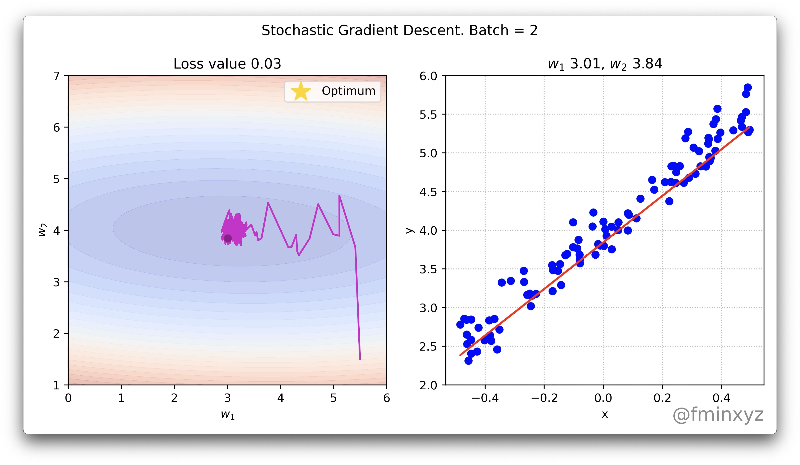

# Напоминание: задача минимизации конечной суммы

## От градиентного спуска к стохастическому

Рассмотрим классическую задачу минимизации среднего по конечной выборке:
$$
\min_{x \in \mathbb{R}^p} f(x) = \min_{x \in \mathbb{R}^p}\frac{1}{n} \sum_{i=1}^n f_i(x)
$$

Градиентный спуск:
$$
\tag{GD}
x_{k+1} = x_k - \frac{\alpha_k}{n} \sum_{i=1}^n \nabla f_i(x_k)
$$

* Стоимость итерации линейна по $n$.

. . .

Стохастический градиентный спуск — несмещённая оценка градиента по случайному индексу $i_k \sim \mathrm{U}\{1, \dots, n\}$:
$$
\tag{SGD}
x_{k+1} = x_k - \alpha_k \nabla f_{i_k}(x_k), \qquad \mathbb{E}[\nabla f_{i_k}(x)] = \nabla f(x)
$$

## Сравнение GD и SGD: что мы знаем

Если $\nabla f$ — $L$-липшицев, то:

| Предположение  | Градиентный спуск           | Стохастический ГС             |
|:----------:|:-----------------------:|:----------------------:|
| PL         | $O(\log(1/\varepsilon))$ | $O(1/\varepsilon)$    |
| Выпуклая   | $O(1/\varepsilon)$       | $O(1/\varepsilon^2)$  |
| Невыпуклая | $O(1/\varepsilon)$       | $O(1/\varepsilon^2)$  |

* **SGD** — дешёвая итерация $O(1)$, но медленная сублинейная сходимость.
* Сублинейная скорость даже в сильно выпуклом случае.
* Оценки неулучшаемы при стандартных предположениях.

. . .

* Методы с моментом и квазиньютоновские методы **не улучшают скорость** в стохастическом случае — узким местом становится дисперсия, а не число обусловленности.

* **Вопрос лекции**: можно ли получить **линейную** скорость, как у GD, при стоимости итерации, как у SGD?

## SGD с постоянным шагом не сходится

{width=85% fig-align="center"}

## Основная проблема SGD

$$
f(x) = \frac{\mu}{2} \|x\|_2^2 + \frac{1}{n} \sum_{i=1}^n \log (1 + \exp(- y_i \langle a_i, x \rangle)) \to \min_{x \in \mathbb{R}^p}
$$

# Методы редукции дисперсии

## Дисперсия мини-батч градиента: с возвращением

Обозначим $\sigma^2 = \frac{1}{n}\sum_{i=1}^n \|\nabla f_i(x_k) - \nabla f(x_k)\|^2$ — дисперсия индивидуальных градиентов.

**Схема с возвращением** (sampling with replacement): индексы $i_1, \ldots, i_B$ выбираются независимо и равномерно из $\{1, \ldots, n\}$ (могут повторяться).
$$
g^k = \frac{1}{B}\sum_{j=1}^{B} \nabla f_{i_j}(x_k)
$$

. . .

Поскольку индексы $i_j$ независимы и одинаково распределены, слагаемые $\nabla f_{i_j}(x_k)$ — также независимые одинаково распределённые случайные величины. Дисперсия среднего из $B$ независимых величин:
$$
\mathbb{E}\left[\left\|g^k - \nabla f(x_k)\right\|^2\right] = \frac{1}{B^2} \sum_{j=1}^B \mathbb{E}\left[\left\|\nabla f_{i_j}(x_k) - \nabla f(x_k)\right\|^2\right] = \frac{\sigma^2}{B}
$$

## Дисперсия мини-батч градиента: без возвращения (постановка)

**Схема без возвращения** (sampling without replacement): батч $\mathcal{B}_k$ — равномерно случайное подмножество размера $B$ из $\{1, \ldots, n\}$ (без повторов).
$$
g^k = \frac{1}{B}\sum_{i \in \mathcal{B}_k} \nabla f_i(x_k)
$$

. . .

Слагаемые теперь **зависимы**: если знаем, что некоторый индекс уже попал в батч, вероятности для остальных меняются.

. . .

Введём индикаторы $\mathrm{I}_i = [i \in \mathcal{B}_k]$. Тогда:

* $\mathbb{E}[\mathrm{I}_i] = \frac{B}{n}$,
* $\mathbb{E}[\mathrm{I}_i^2] = \frac{B}{n}$,
* $\mathbb{E}[\mathrm{I}_i \mathrm{I}_j] = \frac{B (B-1)}{n (n-1)}$ для $i \neq j$.

Отсюда $\operatorname{Cov}(\mathrm{I}_i, \mathrm{I}_j) = -\frac{B (n-B)}{n^2 (n-1)}$ — отрицательная ковариация, которая и даёт уменьшение дисперсии по сравнению со схемой с возвращением.

## Дисперсия мини-батч градиента: без возвращения (вывод)

Обозначим $d_i = \nabla f_i(x_k) - \nabla f(x_k)$. Тогда $\sum_i d_i = 0$ и $\sigma^2 = \tfrac{1}{n}\sum_i \|d_i\|^2$.

. . .

Перепишем $g^k - \nabla f(x_k)$ через индикаторы $\mathrm{I}_i$, пользуясь тем, что $\sum_i \mathrm{I}_i = B$:
$$
g^k - \nabla f(x_k)
= \frac{1}{B}\sum_{i=1}^n \mathrm{I}_i \nabla f_i(x_k) - \nabla f(x_k)
= \frac{1}{B}\sum_{i=1}^n \mathrm{I}_i\, d_i.
$$

. . .

Берём квадрат нормы и матожидание:
$$
\mathbb{E}\bigl[\|g^k - \nabla f(x_k)\|^2\bigr]
= \frac{1}{B^2}\sum_{i,j} \mathbb{E}[\mathrm{I}_i \mathrm{I}_j]\, \langle d_i, d_j \rangle.
$$

. . .

Подставим моменты индикаторов:
$$
= \frac{1}{B^2}\left[\frac{B}{n}\sum_i \|d_i\|^2 + \frac{B(B-1)}{n(n-1)}\sum_{i\neq j}\langle d_i, d_j\rangle\right].
$$

. . .

Из $\sum_i d_i = 0$ следует $\sum_{i \neq j}\langle d_i, d_j\rangle = -\sum_i \|d_i\|^2 = -n\sigma^2$.

## Дисперсия мини-батч градиента: без возвращения (результат)

Сворачиваем выражение, помня, что $\sum_i \|d_i\|^2 = n\sigma^2$:
$$
\mathbb{E}\bigl[\|g^k - \nabla f(x_k)\|^2\bigr]
= \frac{1}{B^2}\Bigl[\frac{B}{n}\cdot n\sigma^2 - \frac{B(B-1)}{n(n-1)}\cdot n\sigma^2\Bigr]
= \frac{\sigma^2}{B}\Bigl[1 - \frac{B-1}{n-1}\Bigr].
$$

Окончательно:
$$
\boxed{\mathbb{E}\bigl[\|g^k - \nabla f(x_k)\|^2\bigr] = \frac{\sigma^2}{B}\cdot\frac{n - B}{n - 1}.}
$$

. . .

Множитель $\dfrac{n - B}{n - 1}$ — **поправка на конечность генеральной совокупности** (finite population correction).

. . .

**Что отсюда видно**:

* при $B = 1$ — поправка равна $1$, обе схемы совпадают (один элемент — нет разницы, с повтором или без);
* при $B \ll n$ — поправка $\approx 1$, обе схемы дают почти одинаковую дисперсию $\sigma^2 / B$;
* при $B = n$ — поправка $0$: батч равен всей выборке, и оценка совпадает с точным градиентом, дисперсия $0$.

В частности, для одинакового $B$ схема без возвращения **всегда не хуже** схемы с возвращением.

## Сравнение двух схем сэмплирования

| | С возвращением | Без возвращения |
|:--|:--:|:--:|
| **Дисперсия** | $\dfrac{\sigma^2}{B}$ | $\dfrac{\sigma^2}{B} \cdot \dfrac{n-B}{n-1}$ |
| $B \ll n$ | $\dfrac{\sigma^2}{B}$ | $\approx \dfrac{\sigma^2}{B}$ |
| $B = n$ | $\dfrac{\sigma^2}{n} > 0$ | $0$ (точный градиент) |

* Схема без возвращения **всегда не хуже**: $\frac{n-B}{n-1} \leq 1$.
* Дисперсия с возвращением **не зависит** от $n$ и **точно** равна $\sigma^2 / B$ — независимо от $B$ относительно $n$.
* Дисперсия убывает как $1/B$: удвоение батча снижает дисперсию вдвое.
* Но стоимость итерации растёт линейно по $B$.
* **Дилемма**: маленький батч — дешёвые, но шумные шаги; большой батч — точные, но дорогие.
* **Вопрос**: можно ли снизить дисперсию, не увеличивая батч?

## Ключевая идея редукции дисперсии: метод контрольной переменной

Идея: снизить дисперсию случайной величины $X$ с помощью другой, **вспомогательной** случайной величины $Y$, у которой математическое ожидание известно точно. В англоязычной литературе этот приём называют *control variate*; в русской — **метод контрольной переменной**. Рассмотрим новую случайную величину $Z_\alpha$:
$$
Z_\alpha = \alpha (X - Y) + \mathbb{E}[Y]
$$

* $\mathbb{E}[Z_\alpha] = \alpha \mathbb{E}[X] + (1-\alpha)\mathbb{E}[Y]$
* $\text{var}(Z_\alpha) = \alpha^2 \left(\text{var}(X) + \text{var}(Y) - 2\,\text{cov}(X, Y)\right)$
  * Если $\alpha = 1$: без смещения, $\mathbb{E}[Z_1] = \mathbb{E}[X]$.
  * Если $\alpha < 1$: возможно смещение (но меньше дисперсия).
* Полезно, если $Y$ положительно коррелирована с $X$: тогда $\text{cov}(X, Y) > 0$ и $\text{var}(Z_\alpha) < \alpha^2 \text{var}(X)$.

## Интуиция: «якорь + малая поправка»

Если $Y \approx X$, то $X - Y \approx 0$ — разность почти детерминирована, и дисперсия мала. При этом $\mathbb{E}[Y]$ нам известно точно, поэтому мы «якоримся» к точному значению и корректируем на маленькую стохастическую добавку:

$$
\underbrace{Z_1}_{\text{наша оценка}} = \underbrace{\mathbb{E}[Y]}_{\text{точный якорь}} + \underbrace{(X - Y)}_{\approx 0,\ \text{малая дисперсия}}
$$

. . .

**Применение к оценке градиента.** Пусть $X = \nabla f_{i_k}(x^{(k-1)})$ и $Y = \nabla f_{i_k}(\tilde{x})$, где $\tilde{x}$ — некоторая «опорная» точка, в которой однажды вычислен полный градиент. Тогда
$$
g^k = \underbrace{\nabla f(\tilde{x})}_{\text{якорь}} + \underbrace{\nabla f_{i_k}(x^{(k-1)}) - \nabla f_{i_k}(\tilde{x})}_{\text{стохастическая коррекция}}
$$

* Коррекция мала, когда $x^{(k-1)} \approx \tilde{x}$.
* Дисперсия $\to 0$ при $x^{(k-1)} \to x^*$ (если $\tilde{x}$ тоже близка к $x^*$) — в отличие от SGD.

## SAG (Stochastic Average Gradient) ^[[\faLink\ Schmidt, Le Roux, Bach (2013). Minimizing Finite Sums with the Stochastic Average Gradient.](https://arxiv.org/abs/1309.2388)]

* Поддерживаем таблицу градиентов $g_i$ функции $f_i$, $i = 1, \dots, n$.
* Инициализируем $x^{(0)}$ и $g^{(0)}_i = \nabla f_i(x^{(0)})$, $i = 1, \dots, n$.
* На шаге $k = 1, 2, 3, \dots$ выбираем случайный $i_k \in \{1, \dots, n\}$:
  $$
  g^{(k)}_{i_k} = \nabla f_{i_k}(x^{(k-1)}) \quad \text{(свежий градиент $f_{i_k}$)},
  $$
  остальные $g_i^{(k)} = g_i^{(k-1)}$, $i \neq i_k$, — не меняются.
* Обновление:
  $$
  x^{(k)} = x^{(k-1)} - \alpha_k \frac{1}{n} \sum_{i=1}^n g_i^{(k)}
  $$
* Оценки градиента SAG **смещённые** (на каждой итерации $\mathbb{E}[g^{(k)}] \neq \nabla f(x^{(k-1)})$), но с сильно сниженной дисперсией.
* Дёшево обновлять среднее: один член меняется в сумме, остальные $n-1$ — нет:
  $$
  x^{(k)} = x^{(k-1)} - \alpha_k \underbrace{ \left(\frac{1}{n} g_{i_k}^{(k)} - \frac{1}{n} g_{i_k}^{(k-1)} + \underbrace{\frac{1}{n} \sum_{i=1}^n g_i^{(k-1)}}_{\text{старое среднее}}\right)}_{\text{новое среднее}}
  $$

## Сходимость SAG

Предположим $f(x) = \frac{1}{n} \sum_{i=1}^n f_i(x)$, каждая $f_i$ дифференцируема, $\nabla f_i$ — липшицев с константой $L$.

Обозначим $\bar{x}^{(k)} = \frac{1}{k} \sum_{l=0}^{k-1} x^{(l)}$ — среднее итераций после $k - 1$ шагов.

:::{.callout-note}
## Теорема (SAG, выпуклый случай)
SAG с фиксированным шагом $\alpha = \frac{1}{16L}$ и инициализацией
$$g^{(0)}_i = \nabla f_i(x^{(0)}) - \nabla f(x^{(0)}), \quad i = 1, \dots, n$$
удовлетворяет
$$\mathbb{E}[f(\bar{x}^{(k)})] - f^\star \leq \frac{48n}{k}[f(x^{(0)}) - f^\star] + \frac{128 L}{k} \|x^{(0)} - x^\star\|^2.$$
:::

* Скорость $\mathcal{O}\left(1/k\right)$ для SAG — как у GD, но при стоимости итерации $O(1)$.
* Первый член содержит множитель $n$; авторы рекомендуют разумную инициализацию (например, $n$ шагов SGD).

## Сходимость SAG: сильно выпуклый случай

Дополнительно: каждая $f_i$ сильно выпукла с параметром $\mu$.

:::{.callout-note}
## Теорема (SAG, сильно выпуклый случай)
SAG с шагом $\alpha = \frac{1}{16L}$ и той же инициализацией:
$$
\mathbb{E}[f(x^{(k)})] - f^\star \leq \left(1 - \min\left(\frac{\mu}{16L}, \frac{1}{8n}\right)\right)^k \left(\frac{3}{2}\left(f(x^{(0)}) - f^\star\right) + \frac{4 L}{n} \|x^{(0)} - x^\star\|^2\right).
$$
:::

* **Линейная** скорость $\mathcal{O}(\gamma^k)$ для SAG. Сравните: $\mathcal{O}(\gamma^k)$ для GD и лишь $\mathcal{O}(1/k)$ для SGD.
* Как и GD, SAG адаптивен к сильной выпуклости.
* Доказательство непростое: около 15 страниц, часть выкладок выполняется с помощью компьютера.

## Замечания к SAG

* В исходной формулировке требует $\mathcal{O}(np)$ памяти — не применим к большим нейросетям.
* На практике константу Липшица $L$ можно подбирать по ходу — линейным поиском с дроблением шага:
  * выбираем начальное $L_0$;
  * увеличиваем $L$, пока не выполнится
    $$
    f_{i_k}(x^{k+1}) \leq f_{i_k}(x^{k}) + \langle \nabla f_{i_k}(x^{k}), x^{k+1} - x^{k} \rangle + \frac{L}{2} \|x^{k+1} - x^{k}\|^2_2;
    $$
  * между итерациями $L$ можно уменьшать.
* По мере сходимости $x^k \to x^*$ дисперсия оценки $g(x^k)$ уменьшается и значение оценки сходится к истинному градиенту $\nabla f(x^k)$, поэтому норму $\|g(x^k)\|$ можно использовать как критерий остановки (в SGD это бесполезно, так как дисперсия не убывает).
* Для обобщённых линейных моделей (LogReg, МНК) достаточно $\mathcal{O}(n)$ памяти вместо $\mathcal{O}(np)$:
  $$
  f_i(w) = \varphi (w^T x_i) \quad \Rightarrow \quad \nabla f_i(w) = \varphi^\prime(w^T x_i)\, x_i.
  $$

## SAG: неравномерный выбор индекса

* Скорость определяется $L = \max_i L_i$, где $L_i$ — константа Липшица для $f_i$.
* Если индекс $i$ выбирать с вероятностью, пропорциональной $L_i$, эффективная константа Липшица становится $\bar{L} = \frac{1}{n}\sum_i L_i$ — обычно существенно меньше $\max_i L_i$.

. . .

* Для гарантии сходимости берут смешанное распределение: с вероятностью $\tfrac{1}{2}$ — равномерный выбор, с вероятностью $\tfrac{1}{2}$ — выбор с весами $L_i / \sum_j L_j$.
* Реализация такой выборки возможна за $O(\log n)$ на одну итерацию.

## SVRG (Stochastic Variance Reduced Gradient) ^[[\faLink\ Johnson, Zhang (2013). Accelerating SGD using Predictive Variance Reduction.](https://papers.nips.cc/paper/2013/file/ac1dd209cbcc5e5d1c6e28598e8cbbe8-Paper.pdf)]

* **Инициализация:** $\tilde{x} \in \mathbb{R}^p$.
* **Для** $s = 1, 2, \dots$ (внешний цикл — эпохи):
  * Вычисляем все градиенты $\nabla f_i(\tilde{x})$ и сохраняем
    $\nabla f(\tilde{x}) = \frac{1}{n} \sum_{i=1}^n \nabla f_i(\tilde{x})$.
  * Инициализируем $x_0 = \tilde{x}$.
  * **Для** $t = 1, \dots, m$ (внутренний цикл):
    * выбираем $i_t \in \{1, \dots, n\}$ равномерно;
    * $x_t = x_{t-1} - \alpha \left[\nabla f_{i_t}(x_{t-1}) - \nabla f_{i_t}(\tilde{x}) + \nabla f(\tilde{x})\right]$.
  * Обновляем $\tilde{x} = x_m$.

. . .

**Замечания:**

* Два вычисления градиента на внутреннем шаге.
* Только два параметра: длина эпохи $m$ и шаг $\alpha$.
* Память $O(p)$ — в $n$ раз меньше, чем у SAG.
* Линейная скорость сходимости в сильно выпуклом случае, доказательство гораздо короче.

## SAGA ^[[\faLink\ Defazio, Bach, Lacoste-Julien (2014). SAGA: A Fast Incremental Gradient Method.](https://arxiv.org/abs/1407.0202)]

SAGA — прямое развитие SAG. Структура та же, отличается **одна** деталь в обновлении.

* Поддерживаем таблицу градиентов $g_i$ функции $f_i$, $i = 1, \dots, n$.
* Инициализируем $x^{(0)}$ и $g^{(0)}_i = \nabla f_i(x^{(0)})$.
* На шаге $k = 1, 2, \dots$ выбираем случайный $i_k \in \{1, \dots, n\}$, обновляем только одну запись:
  $$
  g^{(k)}_{i_k} = \nabla f_{i_k}(x^{(k-1)}), \qquad g^{(k)}_i = g^{(k-1)}_i \text{ для } i \neq i_k.
  $$
* Обновление параметра:
  $$
  x^{(k)} = x^{(k-1)} - \alpha\,\Bigl[\, \underbrace{g^{(k)}_{i_k} - g^{(k-1)}_{i_k}}_{\text{свежая поправка}} + \underbrace{\frac{1}{n}\sum_{i=1}^n g^{(k-1)}_i}_{\text{старое среднее}} \Bigr].
  $$

. . .

**Сравнение оценок**: $g^{(k)}_{\text{SAGA}} = g^{(k)}_{i_k} - g^{(k-1)}_{i_k} + \tfrac{1}{n}\sum_i g^{(k-1)}_i$ — отличается от SAG только **отсутствием множителя $\tfrac{1}{n}$** у поправки.

## SAG vs SAGA: смещённость через контрольную переменную

Вернёмся к семейству оценок $\theta_\alpha = \alpha(X - Y) + \mathbb{E}[Y]$ для оценивания $\mathbb{E}[X]$, где $X, Y$ — коррелированы:
$$
\mathbb{E}[\theta_\alpha] = \alpha\,\mathbb{E}[X] + (1-\alpha)\,\mathbb{E}[Y], \qquad
\mathrm{Var}(\theta_\alpha) = \alpha^2 \bigl(\mathrm{Var}(X) + \mathrm{Var}(Y) - 2\,\mathrm{Cov}(X,Y)\bigr).
$$

. . .

Для оценок градиента возьмём $X = g^{(k)}_{i_k}$ (свежий), $Y = g^{(k-1)}_{i_k}$ (старый), $\mathbb{E}[Y] = \tfrac{1}{n}\sum_i g^{(k-1)}_i$.

* **SAGA** использует $\alpha = 1$ $\Rightarrow$ оценка **несмещённая**: $\mathbb{E}[g^{(k)}_{\text{SAGA}}] = \nabla f(x^{(k-1)})$.
* **SAG** использует $\alpha = 1/n$ $\Rightarrow$ оценка **смещённая**, но дисперсия в $n^2$ раз меньше.

. . .

**Замечательный факт**: SAGA достигает **тех же скоростей сходимости**, что и SAG, при значительно более простом доказательстве (несмещённость убирает кучу хитростей).

## Сходимость SAGA

Те же предположения: каждая $f_i$ выпукла, дифференцируема, $\nabla f_i$ — $L$-липшицев.

:::{.callout-note}
## Теорема (SAGA, выпуклый случай)
SAGA с шагом $\alpha = \frac{1}{3L}$ и инициализацией $g^{(0)}_i = \nabla f_i(x^{(0)}) - \nabla f(x^{(0)})$:
$$
\mathbb{E}[f(\bar{x}^{(k)})] - f^\star \leq \frac{4n}{k} \bigl[ f(x^{(0)}) - f^\star \bigr] + \frac{8L}{k} \bigl\|x^{(0)} - x^\star\bigr\|^2.
$$
:::

* В сильно выпуклом случае ($\mu > 0$): шаг $\alpha = \frac{1}{2(\mu n + L)}$, линейная скорость с коэффициентом сжатия $1 - \frac{\mu}{2(\mu n + L)}$.
* SAGA естественно расширяется на композитные задачи $\min\, f(x) + h(x)$ через проксимальный оператор от $h$.

## Сравнение методов

| Метод | Стоимость итерации | Сходимость (сильно выпуклый) | Память   | Несмещён? |
|:-----:|:------------------:|:----------------------------:|:--------:|:---------:|
| GD    | $O(n)$             | Линейная                     | $O(p)$   | —        |
| SGD   | $O(1)$             | Сублинейная $O(1/k)$         | $O(p)$   | да       |
| SAG   | $O(1)$             | Линейная                     | $O(np)$  | нет      |
| SVRG  | $O(1)$             | Линейная                     | $O(p)$   | да       |
| SAGA  | $O(1)$             | Линейная                     | $O(np)$  | да       |

. . .

**Главное достижение**: VR-методы достигают **линейной** сходимости при стоимости итерации **$O(1)$** — то, чего нет у обычного SGD.

## Численный эксперимент: SGD vs SAG vs SAGA

Логистическая регрессия с $\ell_2$-регуляризацией, $n=800$, $d=100$. Шаги: $\alpha_{\text{SAG}} = \alpha_{\text{SGD}} = \frac{1}{16L}$, $\alpha_{\text{SAGA}} = \frac{1}{3L}$. По 15 запусков с разными случайными перестановками.

{width=70% fig-align="center"}

**Что видно:**

* **SAGA** (благодаря допустимому большему шагу) убывает быстрее всех — это типичная картина: SAGA в среднем менее консервативен в выборе шага, и при этом траектории очень похожи на SGD (шум на каждой итерации сопоставим).
* **SAG** идёт линейно, но с малым шагом $\tfrac{1}{16L}$ медленнее SAGA при той же скорости сходимости.
* **SGD** с постоянным шагом сначала уверенно убывает, но затем замедляется — приближается к окрестности оптимума ниже которой шумовой пол не пускает.

## Можно ли быстрее? Нижние оценки и ускорение

Для выпуклой задачи с конечной суммой ($n$ компонент, $\mu$-сильно выпуклых, $L$-гладких) известны **точные нижние оценки**.

. . .

**Верхняя оценка** для SAG / SAGA / SVRG (и им подобных):
$$
\#\,\text{итераций} = \mathcal{O}\!\left(\bigl(n + \tfrac{L}{\mu}\bigr) \log \tfrac{1}{\varepsilon}\right).
$$

. . .

**Нижняя оценка** ^[Lan, Zhou (2015). *An optimal randomized incremental gradient method.*; Woodworth, Srebro (2016).]:
$$
\#\,\text{итераций} = \Omega\!\left(\bigl(n + \sqrt{\tfrac{n L}{\mu}}\bigr) \log \tfrac{1}{\varepsilon}\right).
$$

Между ними есть **зазор**: на плохо обусловленных задачах ($L/\mu \gg n$) можно ускориться в $\sqrt{n}$ раз.

. . .

**Ускоренные VR-методы** (Catalyst, Lan-Zhou, Allen-Zhu Katyusha) этот зазор закрывают:
$$
\#\,\text{итераций} = \mathcal{O}\!\left(\bigl(n + \sqrt{\tfrac{n L}{\mu}}\bigr) \log \tfrac{1}{\varepsilon}\right) \;-\; \text{оптимально}.
$$

## Моментум, ускорение и невыпуклый случай

* **Выпуклая задача с конечной суммой** — закрыта: VR + ускорение дают оптимальную скорость.
* **Общий выпуклый стохастический случай** (без конечной суммы): SGD оптимален, улучшить нельзя ^[Nemirovski, Juditsky, Lan, Shapiro (2009)].

. . .

* **Невыпуклый случай** — история сильно сложнее. Ускорение в стиле Нестерова используется реже; вместо него — **момент** (Polyak 1964, предшествует ускорению почти на 20 лет):
  $$
  x^{k+1} = x^k + \beta\,(x^k - x^{k-1}) - \alpha\, \nabla f_{i_k}(x^k).
  $$
* На практике моментум работает очень хорошо, но менее устойчив.
* Ускорение Нестерова отличается **корректирующим градиентным членом**, и сама корректировка устроена по-разному в выпуклом и сильно выпуклом случае.
* **Открытая задача**: когда и почему всё это работает в невыпуклом случае?

## Работают ли VR-методы для нейросетей? ^[[\faLink\ Defazio, Bottou (2019). On the Ineffectiveness of Variance Reduced Optimization for Deep Learning.](https://proceedings.neurips.cc/paper_files/paper/2019/file/84d2004bf28a2095230e8e14993d398d-Paper.pdf)]

* Обучение нейросетей нарушает большинство предположений, на которых строятся VR-методы:
  * данные не фиксированы — на каждой эпохе работают аугментации и dropout;
  * траектория обучения долго остаётся вдали от окрестности оптимума $x^*$;
  * задача невыпуклая и нелинейная.
* Авторы рассматривают SVRG (наиболее экономный по памяти) и получают **либо ухудшение качества, либо расходимость** на CIFAR и ImageNet.
* В конце они предлагают комбинировать редукцию дисперсии с адаптивными методами (AdaGrad, Adam, ...). Это естественный мостик к следующей части лекции.

# Адаптивные стохастические методы

## Почему нужна адаптивность

* Единый скаляр $\alpha$ — плохой выбор, когда **разные координаты** имеют существенно разные масштабы:
  * редкие признаки в логистической регрессии и NLP-моделях, отдельные параметры в глубоких сетях;
  * слой эмбеддингов для редких слов обновляется намного реже, чем плотные слои.
* Идея адаптивных методов — **подобрать свой эффективный шаг каждой координате**, опираясь на накопленную историю градиентов.
* Содержательно это можно трактовать как грубое приближение диагонали гессиана (или информационной матрицы Фишера).

## Adagrad ^[[\faLink\ Duchi, Hazan, Singer (2010). Adaptive Subgradient Methods for Online Learning and Stochastic Optimization.](https://jmlr.org/papers/volume12/duchi11a/duchi11a.pdf)]

Пусть $g^{(k)} = \nabla f_{i_k}(x^{(k-1)})$. Обновление для каждой координаты $j = 1, \dots, p$:

$$
v^{(k)}_j = v^{(k-1)}_j + \left(g_j^{(k)}\right)^2
$$
$$
x_j^{(k)} = x_j^{(k-1)} - \alpha \frac{g_j^{(k)}}{\sqrt{v^{(k)}_j  + \varepsilon}}
$$

**Замечания:**

* Не требует тонкой настройки $\alpha$ — эффективный шаг убывает автоматически по каждой координате.
* Для редких, но информативных признаков шаг убывает медленно — алгоритм даёт им «работать» дольше.
* Заметно улучшает SGD в разреженных задачах (NLP, рекомендательные системы).
* Главная слабость — **монотонное** накопление в знаменателе: эффективный шаг $\to 0$ слишком рано, и обучение «затухает».

## RMSProp ^[[\faLink\ Tieleman, Hinton (2012). Coursera Lecture 6.](https://www.cs.toronto.edu/~tijmen/csc321/slides/lecture_slides_lec6.pdf)]

Решает проблему монотонно убывающей скорости обучения. Использует экспоненциально затухающее среднее квадратов градиентов:
$$
v^{(k)}_j = \gamma v^{(k-1)}_j + (1-\gamma) \left(g_j^{(k)}\right)^2
$$
$$
x_j^{(k)} = x_j^{(k-1)} - \alpha \frac{g_j^{(k)}}{\sqrt{v^{(k)}_j + \varepsilon}}
$$

**Замечания:**

* В знаменателе — корень из скользящего среднего квадратов градиентов: грубая оценка корня из среднеквадратичной величины градиента по каждой координате.
* Более гибкая настройка, чем у AdaGrad, подходит для нестационарных задач.
* Долгое время был выбором по умолчанию при обучении рекуррентных сетей.

## Adadelta ^[[\faLink\ Zeiler (2012). ADADELTA: An Adaptive Learning Rate Method.](https://arxiv.org/abs/1212.5701)]

Развитие RMSProp: вообще **не требует** глобального шага $\alpha$. Вместо этого использует «единицы измерения» обновлений:

$$
v^{(k)}_j = \gamma v^{(k-1)}_j + (1-\gamma) \left(g_j^{(k)}\right)^2
$$
$$
\tilde{g}_j^{(k)} = \frac{\sqrt{\Delta x_j^{(k-1)} + \varepsilon}}{\sqrt{v^{(k)}_j + \varepsilon}}\, g_j^{(k)}
$$
$$
x_j^{(k)} = x_j^{(k-1)} - \tilde{g}_j^{(k)}, \qquad
\Delta x_j^{(k)} = \rho\, \Delta x_j^{(k-1)} + (1-\rho) \left(\tilde{g}_j^{(k)}\right)^2
$$

**Замечания:**

* Шаг автоматически масштабируется так, чтобы иметь те же единицы, что и параметр.
* Полезен, когда масштабы параметров между слоями существенно различаются.

## Adam ^[[\faLink\ Kingma, Ba (2014). Adam: A Method for Stochastic Optimization.](https://arxiv.org/abs/1412.6980)] ^[[\faLink\ Reddi, Kale, Kumar (2018). On the Convergence of Adam and Beyond.](https://arxiv.org/abs/1904.09237)]

Комбинирует элементы AdaGrad и RMSProp. Экспоненциально затухающее среднее градиентов и квадратов градиентов:

::::{.columns}
:::{.column width="55%"}
\begin{tabular}{ll}
EMA: & $m_j^{(k)} = \beta_1 m_j^{(k-1)} + (1-\beta_1) g_j^{(k)}$ \\[1ex]
                           & $v_j^{(k)} = \beta_2 v_j^{(k-1)} + (1-\beta_2) \left(g_j^{(k)}\right)^2$ \\[1ex]
Коррекция:          & $\hat{m}_j = \dfrac{m_j^{(k)}}{1 - \beta_1^k}$ \\[1ex]
                           & $\hat{v}_j = \dfrac{v_j^{(k)}}{1 - \beta_2^k}$ \\[1ex]
Обновление:                   & $x_j^{(k)} = x_j^{(k-1)} - \alpha\,\dfrac{\hat{m}_j}{\sqrt{\hat{v}_j} + \varepsilon}$ \\
\end{tabular}
:::
:::{.column width="45%"}
**Замечания:**

* Корректирует смещение моментов к нулю на старте.
* Одна из самых цитируемых работ в области ML.
* Не сходится для некоторых простых задач (даже выпуклых).
* Гораздо лучше работает для языковых моделей, чем для задач компьютерного зрения — открытый вопрос «почему».
:::
::::

## AdamW ^[[\faLink\ Loshchilov, Hutter (2017). Decoupled Weight Decay Regularization.](https://arxiv.org/abs/1711.05101)]

Решает проблему $\ell_2$-регуляризации в адаптивных оптимизаторах. Стандартная $\ell_2$-регуляризация добавляет $\lambda \|x\|^2$ к целевой функции, порождая градиентный член $\lambda x$. В Adam этот член делится на $\bigl(\sqrt{\hat{v}_j} + \varepsilon\bigr)$ — то есть сила регуляризации оказывается связана с величинами градиентов, что нежелательно.

AdamW **разделяет** weight decay и адаптацию градиентов:
$$
x_j^{(k)} = x_j^{(k-1)} - \alpha \left( \frac{\hat{m}_j}{\sqrt{\hat{v}_j} + \varepsilon} + \lambda x_j^{(k-1)} \right)
$$

**Замечания:**

* Член weight decay $\lambda x_j^{(k-1)}$ добавляется *после* адаптивного градиентного шага и не масштабируется на $\sqrt{\hat{v}_j}$.
* Широко используется при обучении трансформеров и больших моделей; выбор по умолчанию в HuggingFace Trainer.

## Adam не сходится: постановка ^[[\faLink\ Reddi et al. (2018). On the Convergence of Adam and Beyond.](https://arxiv.org/abs/1904.09237)]

Рассмотрим **простейшую** возможную задачу — выпуклую, гладкую, сильно выпуклую, с единственным глобальным минимумом в нуле:
$$
L(w) = w^2, \qquad \nabla L(w) = 2w, \qquad w \in \mathbb{R}.
$$

Обновление Adam (одномерный случай, без коррекции смещения и для упрощения $\varepsilon = 0$):
$$
\begin{aligned}
g_t &= 2 w_{t-1}, \\
m_t &= \beta_1 m_{t-1} + (1-\beta_1) g_t, \\
v_t &= \beta_2 v_{t-1} + (1-\beta_2) g_t^2, \\
w_t &= w_{t-1} - \eta\,\frac{m_t}{\sqrt{v_t}}.
\end{aligned}
$$

. . .

Чего мы **ждём** от любого приличного метода: $w_t \to 0$ и шаг $|w_t - w_{t-1}| \to 0$ по мере приближения к оптимуму. У GD с шагом $\eta < 1/2$ это так: $w_t = (1 - 2\eta) w_{t-1}$, экспоненциальная сходимость.

Покажем, что у Adam **этого не происходит**.

## Adam не сходится: анализ масштаба при малых $|w|$

Предположим, что итерации находятся в окрестности нуля и величина $|w_t|$ ведёт себя как масштаб $|w| \to 0$. Что происходит с $m_t$ и $v_t$?

. . .

**$m_t$ — линеен по $w$.** Это сумма (взвешенная) прошлых градиентов $g_\tau = 2 w_{\tau-1}$, каждый из которых линеен по $w$:
$$
m_t \;=\; (1-\beta_1) \sum_{\tau \leq t} \beta_1^{t-\tau}\, 2 w_{\tau-1} \;\propto\; w.
$$

. . .

**$v_t$ — квадратичен по $w$.** Сумма прошлых $g_\tau^2 = 4 w_{\tau-1}^2$, каждый член квадратичен:
$$
v_t \;=\; (1-\beta_2) \sum_{\tau \leq t} \beta_2^{t-\tau}\, 4 w_{\tau-1}^2 \;\propto\; w^2.
$$

. . .

Следовательно:
$$
\boxed{\;\sqrt{v_t} \;\propto\; |w| \quad \Longrightarrow \quad \frac{m_t}{\sqrt{v_t}} \;\approx\; \operatorname{sign}(w) \;=\; \pm 1\;}
$$

Это отношение **не зависит** от $|w|$: какой бы маленькой ни стала итерация, нормированный градиент остаётся порядка единицы.

## Adam не сходится: предельный цикл

Из предыдущего шага: шаг Adam в окрестности нуля имеет постоянную **по модулю** длину
$$
|w_t - w_{t-1}| \;=\; \eta \,\left|\frac{m_t}{\sqrt{v_t}}\right| \;\approx\; \eta,
$$
независимо от того, насколько $w$ близко к оптимуму.

. . .

**Что это означает.** Если $|w_{t-1}| < \eta/2$, то шаг $\pm\eta$ «перепрыгивает» через ноль и оказывается с противоположной стороны на расстоянии $\approx \eta/2$. На следующем шаге — обратно.

. . .

Получаем **предельный цикл**:
$$
w_t \;\in\; \{-\eta/2,\; +\eta/2\}, \qquad t \to \infty.
$$

Метод **не сходится** ни к точке, ни даже к нулю по среднему.

. . .

**Сравнение с SGD.** Для $L(w) = w^2$ обновление SGD:
$$
w_t = w_{t-1} - \eta \cdot 2 w_{t-1} = (1 - 2\eta) w_{t-1}.
$$
Шаг **пропорционален** $w$, обнуляется в пределе $\Rightarrow$ сходимость.

. . .

**Мораль.** Адаптивная нормировка $\frac{m_t}{\sqrt{v_t}}$ убивает информацию о масштабе — даже на самой простой выпуклой задаче.

## Adam не сходится: иллюстрация

{width=80% fig-align="center"}

## Много оптимизаторов — как сравнивать?

[{width=85% fig-align="center"}](https://fmin.xyz/docs/visualizations/nag_gs.mp4)

## AlgoPerf benchmark ^[[\faLink\ Dahl et al. (2023). Benchmarking Neural Network Training Algorithms.](https://arxiv.org/abs/2306.07179)]

* **AlgoPerf** — стандартизированный бенчмарк для сравнения алгоритмов обучения нейросетей по двум регламентам:
    * **External Tuning** — подбор гиперпараметров с ограниченными ресурсами (5 попыток);
    * **Self-Tuning** — автоматическая настройка на одной машине ($3{\times}$ бюджет).
* **Оценка** агрегируется через профили производительности; финальный балл — нормализованная площадь под профилем (1.0 = быстрейший на всех задачах).
* **Стоимость** оценки: ${\sim}\,49\,240$ часов работы на 8 NVIDIA V100 GPU.

## AlgoPerf benchmark: результаты

{fig-align="center" width=80%}

## Итоги лекции

* **VR-методы** (SAG, SVRG, SAGA) достигают **линейной** сходимости при цене итерации $O(1)$ для выпуклой задачи минимизации конечной суммы:
  * SAG — смещённый, минимальная дисперсия, $O(np)$ памяти;
  * SVRG — несмещённый, $O(p)$ памяти, двойное вычисление градиента и полный проход раз в эпоху;
  * SAGA — несмещённый, $O(np)$ памяти, простой анализ, расширяется на композитные задачи.
* **Ускоренные VR-методы** (Katyusha, Catalyst) закрывают зазор между верхними и нижними оценками и оптимальны для выпуклой конечной суммы.
* На практике VR-методы плохо переносятся на современное глубокое обучение из-за нарушения предположений (аугментации, dropout, невыпуклость).
* **Адаптивные методы** (AdaGrad, RMSProp, Adadelta, Adam, AdamW) задают **свой** эффективный шаг каждой координате через статистики градиентов.
* Adam — де-факто стандарт для обучения LLM, но не сходится даже на простейших выпуклых примерах. AdamW — улучшение, корректно учитывающее регуляризацию.

. . .

**Дальше**: оптимизация для **матричных** параметров — спектральная норма, ортогонализация градиента, Muon и Neon.
