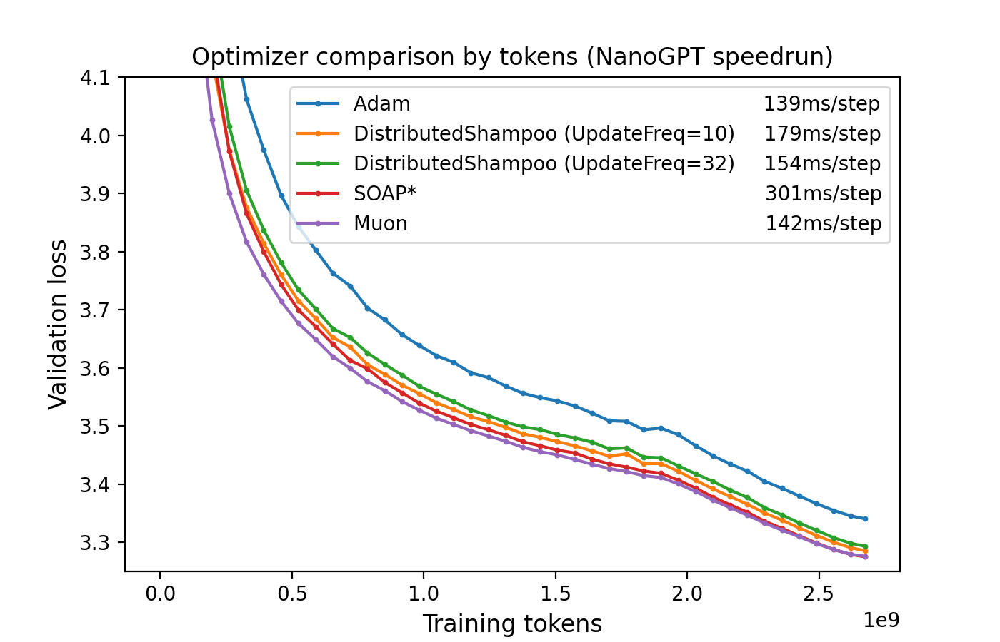
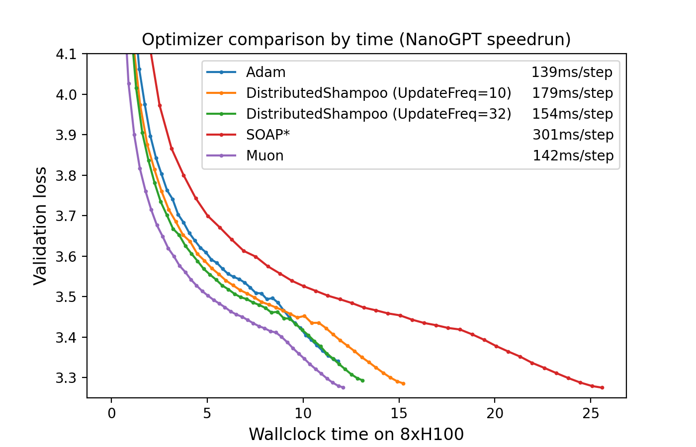
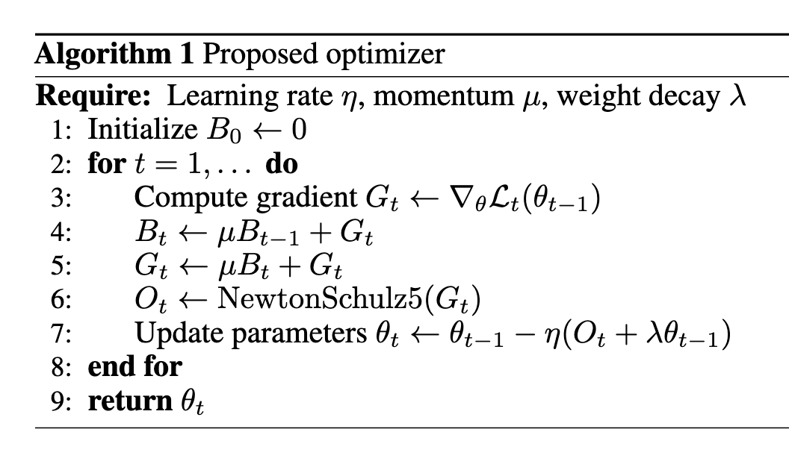
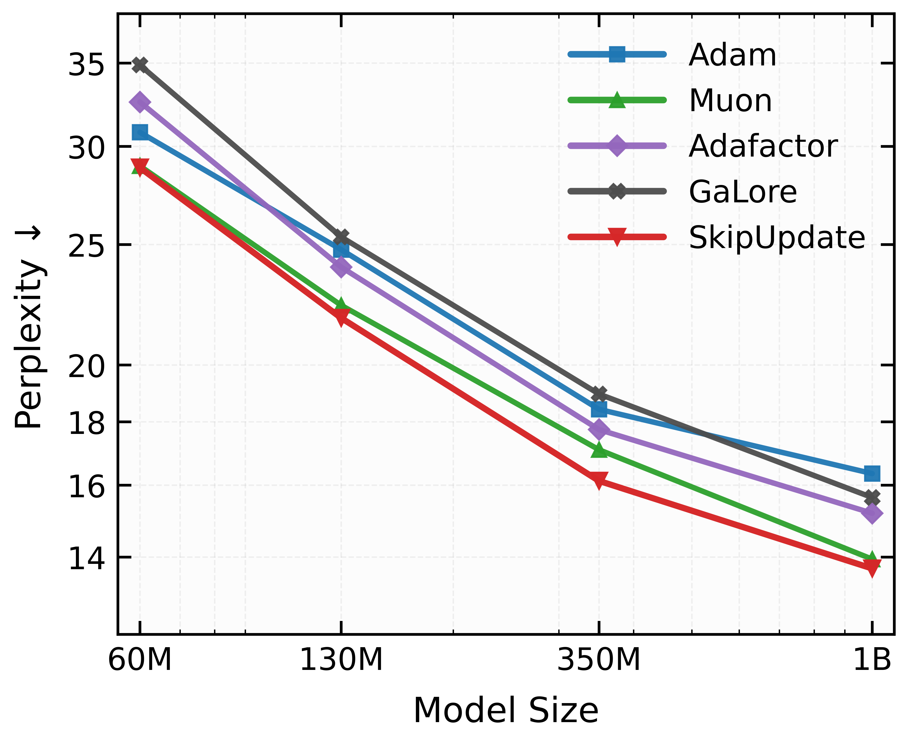

# Адаптивные стохастические методы

## Почему нужна адаптивность

* Единый скаляр $\alpha$ — плохой выбор, когда **разные координаты** имеют существенно разные масштабы:
  * редкие признаки в логистической регрессии и NLP-моделях;
  * в embedding-слое строка редкого слова получает ненулевой градиент только когда это слово попало в батч — в отличие от плотных слоёв, где все параметры обновляются на каждом шаге.
* Идея адаптивных методов — **подобрать свой эффективный шаг каждой координате**, опираясь на накопленную историю градиентов.
* Содержательно это можно трактовать как грубое приближение диагонали гессиана (или информационной матрицы Фишера).

## Adagrad ^[[\faLink\ Duchi, Hazan, Singer (2010). Adaptive Subgradient Methods for Online Learning and Stochastic Optimization.](https://jmlr.org/papers/volume12/duchi11a/duchi11a.pdf)]

Пусть $g^{(k)} = \nabla f_{i_k}(x^{(k-1)})$. Обновление для каждой координаты $j = 1, \dots, p$:

$$
v^{(k)}_j = v^{(k-1)}_j + \left(g_j^{(k)}\right)^2
$$
$$
x_j^{(k)} = x_j^{(k-1)} - \alpha \frac{g_j^{(k)}}{\sqrt{v^{(k)}_j  + \varepsilon}}
$$

**Замечания:**

* Не требует тонкой настройки $\alpha$ — эффективный шаг убывает автоматически по каждой координате.
* Для редких, но информативных признаков шаг убывает медленно — алгоритм даёт им «работать» дольше.
* Заметно улучшает SGD в разреженных задачах (NLP, рекомендательные системы).
* Главная слабость — **монотонное** накопление в знаменателе: эффективный шаг $\to 0$ слишком рано, и обучение «затухает».

## RMSProp ^[[\faLink\ Tieleman, Hinton (2012). Coursera Lecture 6.](https://www.cs.toronto.edu/~tijmen/csc321/slides/lecture_slides_lec6.pdf)]

Решает проблему монотонно убывающей скорости обучения. Использует экспоненциально затухающее среднее квадратов градиентов:
$$
v^{(k)}_j = \gamma v^{(k-1)}_j + (1-\gamma) \left(g_j^{(k)}\right)^2
$$
$$
x_j^{(k)} = x_j^{(k-1)} - \alpha \frac{g_j^{(k)}}{\sqrt{v^{(k)}_j + \varepsilon}}
$$

**Замечания:**

* В знаменателе — скользящее среднее квадратов градиентов (RMS): «забывает» старые градиенты, в отличие от монотонного накопления в AdaGrad.
* Эффективный шаг может как убывать, так и возрастать — подходит для нестационарных задач.
* Долгое время был выбором по умолчанию при обучении рекуррентных сетей.

## Adadelta ^[[\faLink\ Zeiler (2012). ADADELTA: An Adaptive Learning Rate Method.](https://arxiv.org/abs/1212.5701)]

Развитие RMSProp: вообще **не требует** глобального шага $\alpha$. Вместо него масштабирует шаг через накопленные обновления параметров:

$$
v^{(k)}_j = \gamma v^{(k-1)}_j + (1-\gamma) \left(g_j^{(k)}\right)^2
$$
$$
\tilde{g}_j^{(k)} = \frac{\sqrt{\Delta x_j^{(k-1)} + \varepsilon}}{\sqrt{v^{(k)}_j + \varepsilon}}\, g_j^{(k)}
$$
$$
x_j^{(k)} = x_j^{(k-1)} - \tilde{g}_j^{(k)}, \qquad
\Delta x_j^{(k)} = \rho\, \Delta x_j^{(k-1)} + (1-\rho) \left(\tilde{g}_j^{(k)}\right)^2
$$

**Замечания:**

* Числитель $\sqrt{\Delta x_j^{(k-1)} + \varepsilon}$ имеет те же единицы, что и параметр — шаг автоматически согласован по масштабу.
* Полезен, когда масштабы параметров между слоями существенно различаются.

## Adam ^[[\faLink\ Kingma, Ba (2014). Adam: A Method for Stochastic Optimization.](https://arxiv.org/abs/1412.6980)] ^[[\faLink\ Reddi, Kale, Kumar (2018). On the Convergence of Adam and Beyond.](https://arxiv.org/abs/1904.09237)]

Комбинирует элементы AdaGrad и RMSProp. Экспоненциально затухающее среднее градиентов и квадратов градиентов:

::::{.columns}
:::{.column width="55%"}
\begin{tabular}{ll}
EMA: & $m_j^{(k)} = \beta_1 m_j^{(k-1)} + (1-\beta_1) g_j^{(k)}$ \\[1ex]
                           & $v_j^{(k)} = \beta_2 v_j^{(k-1)} + (1-\beta_2) \left(g_j^{(k)}\right)^2$ \\[1ex]
Коррекция:          & $\hat{m}_j = \dfrac{m_j^{(k)}}{1 - \beta_1^k}$ \\[1ex]
                           & $\hat{v}_j = \dfrac{v_j^{(k)}}{1 - \beta_2^k}$ \\[1ex]
Обновление:                   & $x_j^{(k)} = x_j^{(k-1)} - \alpha\,\dfrac{\hat{m}_j}{\sqrt{\hat{v}_j} + \varepsilon}$ \\
\end{tabular}
:::
:::{.column width="45%"}
**Замечания:**

* Корректирует смещение моментов к нулю на старте.
* Одна из самых цитируемых работ в области ML.
* Не сходится для некоторых простых задач (даже выпуклых).
* Гораздо лучше работает для языковых моделей, чем для задач компьютерного зрения — открытый вопрос «почему».
:::
::::

## AdamW ^[[\faLink\ Loshchilov, Hutter (2017). Decoupled Weight Decay Regularization.](https://arxiv.org/abs/1711.05101)]

Решает проблему $\ell_2$-регуляризации в адаптивных оптимизаторах. При стандартном подходе $\ell_2$-регуляризация добавляет $\lambda \|x\|^2$ к функции потерь, порождая градиентный член $\lambda x$. В Adam этот член делится на $\bigl(\sqrt{\hat{v}_j} + \varepsilon\bigr)$ — сила регуляризации оказывается зависимой от магнитуд градиентов, что нежелательно.

AdamW **разделяет** weight decay и адаптацию градиентов:
$$
x_j^{(k)} = x_j^{(k-1)} - \alpha \left( \frac{\hat{m}_j}{\sqrt{\hat{v}_j} + \varepsilon} + \lambda x_j^{(k-1)} \right)
$$

**Замечания:**

* Член weight decay $\lambda x_j^{(k-1)}$ добавляется *после* адаптивного градиентного шага и не масштабируется на $\sqrt{\hat{v}_j}$.
* Широко используется при обучении трансформеров и больших моделей; выбор по умолчанию в HuggingFace Trainer.

## Adam не сходится: постановка ^[[\faLink\ Reddi et al. (2018). On the Convergence of Adam and Beyond.](https://arxiv.org/abs/1904.09237)]

Рассмотрим **простейшую** возможную задачу — выпуклую, гладкую, сильно выпуклую, с единственным глобальным минимумом в нуле:
$$
L(w) = w^2, \qquad \nabla L(w) = 2w, \qquad w \in \mathbb{R}.
$$

Обновление Adam (одномерный случай, без коррекции смещения и для упрощения $\varepsilon = 0$):
$$
\begin{aligned}
g_t &= 2 w_{t-1}, \\
m_t &= \beta_1 m_{t-1} + (1-\beta_1) g_t, \\
v_t &= \beta_2 v_{t-1} + (1-\beta_2) g_t^2, \\
w_t &= w_{t-1} - \eta\,\frac{m_t}{\sqrt{v_t}}.
\end{aligned}
$$

. . .

Чего мы **ждём** от корректного метода: $w_t \to 0$ и длина шага $|w_t - w_{t-1}| \to 0$ по мере приближения к оптимуму. У GD с $\eta < 1/2$ это так: $w_t = (1 - 2\eta) w_{t-1}$, экспоненциальная сходимость.

Покажем, что у Adam **этого не происходит**.

## Adam не сходится: анализ масштаба при малых $|w|$

Предположим, что итерации находятся в окрестности нуля и величина $|w_t|$ ведёт себя как масштаб $|w| \to 0$. Что происходит с $m_t$ и $v_t$?

. . .

**$m_t$ — линеен по $w$.** Это сумма (взвешенная) прошлых градиентов $g_\tau = 2 w_{\tau-1}$, каждый из которых линеен по $w$:
$$
m_t \;=\; (1-\beta_1) \sum_{\tau \leq t} \beta_1^{t-\tau}\, 2 w_{\tau-1} \;\propto\; w.
$$

. . .

**$v_t$ — квадратичен по $w$.** Сумма прошлых $g_\tau^2 = 4 w_{\tau-1}^2$, каждый член квадратичен:
$$
v_t \;=\; (1-\beta_2) \sum_{\tau \leq t} \beta_2^{t-\tau}\, 4 w_{\tau-1}^2 \;\propto\; w^2.
$$

. . .

Следовательно:
$$
\boxed{\;\sqrt{v_t} \;\propto\; |w| \quad \Longrightarrow \quad \frac{m_t}{\sqrt{v_t}} \;\approx\; \operatorname{sign}(w) \;=\; \pm 1\;}
$$

Это отношение **не зависит** от $|w|$: какой бы маленькой ни стала итерация, нормированный градиент остаётся порядка единицы.

## Adam не сходится: предельный цикл

Из предыдущего шага: шаг Adam в окрестности нуля имеет постоянную **по модулю** длину
$$
|w_t - w_{t-1}| \;=\; \eta \,\left|\frac{m_t}{\sqrt{v_t}}\right| \;\approx\; \eta,
$$
независимо от того, насколько $w$ близко к оптимуму.

. . .

**Что это означает.** Если $|w_{t-1}| < \eta/2$, то шаг $\pm\eta$ «перепрыгивает» через ноль и оказывается с противоположной стороны на расстоянии $\approx \eta/2$. На следующем шаге — обратно.

. . .

Получаем **предельный цикл**:
$$
w_t \;\in\; \{-\eta/2,\; +\eta/2\}, \qquad t \to \infty.
$$

Метод **не сходится** ни к точке, ни даже к нулю по среднему.

. . .

**Сравнение с SGD.** Для $L(w) = w^2$ обновление SGD:
$$
w_t = w_{t-1} - \eta \cdot 2 w_{t-1} = (1 - 2\eta) w_{t-1}.
$$
Шаг **пропорционален** $w$, обнуляется в пределе $\Rightarrow$ сходимость.

## Adam не сходится: иллюстрация

{width=80% fig-align="center"}

# Как сравнивать оптимизаторы в задачах машинного обучения

## Много оптимизаторов — как сравнивать?

[{width=85% fig-align="center"}](https://fmin.xyz/docs/visualizations/nag_gs.mp4)

## AlgoPerf benchmark ^[[\faLink\ Dahl et al. (2023). Benchmarking Neural Network Training Algorithms.](https://arxiv.org/abs/2306.07179)]

* **AlgoPerf** — стандартизированный бенчмарк для сравнения алгоритмов обучения нейросетей по двум регламентам:
    * **External Tuning** — подбор гиперпараметров с ограниченными ресурсами (5 попыток);
    * **Self-Tuning** — автоматическая настройка на одной машине ($3{\times}$ бюджет).
* **Оценка** агрегируется через профили производительности; финальный балл — нормализованная площадь под профилем (1.0 = быстрейший на всех задачах).
* **Стоимость** оценки: ${\sim}\,49\,240$ часов работы на 8 NVIDIA V100 GPU.

## AlgoPerf benchmark: результаты

{fig-align="center" width=80%}

## NanoGPT speedrun ^[[\faLink\ Источник](https://github.com/KellerJordan/modded-nanogpt)]

{width=96%}

## Работают ли трюки, если увеличить размер модели?

](../files/nanogpt_speedrun_scale.png){width=75%}

## Сравнение оптимизаторов на NanoGPT speedrun

::::{.columns}
:::{.column width="50%"}
{width=100%}
:::
:::{.column width="50%"}
{width=100%}
:::
::::

Muon (фиолетовый) — лучший по обоим метрикам: быстрейшая сходимость по токенам и самый дешёвый по времени (142 ms/step).

# Muon

## Новый подход к оптимизации ^[[\faLink\ Kimi K2: Open Agentic Intelligence](https://arxiv.org/pdf/2507.20534)]

::::{.columns}
:::{.column width="50%"}
{width=100%}
:::
:::{.column width="50%"}
{width=100%}
:::
::::

Модели, отмеченные звёздочкой, были обучены методом Muon, остальные модели были обучены другими алгоритмами оптимизации.

## Интуиция за методом Muon ^[[\faLink\ Презентация R. Gower](https://docs.google.com/presentation/d/1KDjkaIa-7UyjacQSsuU88GdZh_UJTl2jT188Qzfnlek)]

\begin{center}
\fontsize{18pt}{22pt}\selectfont
$$
\min_{x \in \mathbb{R}^p} \tikznode{func}{f(x)}
$$
\vspace{0.5cm}
$$
f(x) = \tikznode{linear}{f(\tikznode{wk}{x_k}) + \langle \nabla f(x_k), x - x_k \rangle} + \tikznode{bigo}{\mathcal{O}(\|x - x_k\|_2^2)}.
$$
\end{center}

\begin{tikzpicture}[remember picture, overlay]
    \tikzset{
        box/.style={draw=blue!50!black, rounded corners, very thick, align=center, fill=white, font=\small\sffamily},
        arrow/.style={->, >=latex, very thick, blue!50!black}
    }

    \pause
    % Loss Function
    \node[box, above right=0.2cm and 1.5cm of func] (loss_label) {Функция потерь};
    \draw[arrow] (loss_label) -- (func);

    \pause
    % Linear Approximation
    \draw[very thick, blue!50!black, decoration={brace, mirror, raise=5pt}, decorate] (linear.south west) -- (linear.south east) node[midway, below=15pt, box] (lin_label) {Линейная\\аппроксимация};

    \pause
    % Good approx
    \node[box, below=1cm of bigo] (bigo_label) {{Хорошее приближение}\\в окрестности $x_k$};
    \draw[arrow] (bigo_label) -- (bigo);

\end{tikzpicture}

## Интуиция за методом Muon. Градиентный спуск

\begin{center}
\fontsize{18pt}{22pt}\selectfont
\vspace{0.5cm}
$$
\begin{aligned}
x_{k+1} &= \argmin_{x \in \mathbb{R}^p} \left( f(x_k) + \langle \nabla f(x_k), x - x_k \rangle + \tikznode{prox}{\frac{1}{2\alpha} \|x - x_k\|_2^2} \right) \pause \\
&= x_k - \tikznode{lr}{\alpha} \nabla f(x_k)
\end{aligned}
$$
\end{center}

\begin{tikzpicture}[remember picture, overlay]
    \tikzset{
        box/.style={draw=blue!50!black, rounded corners, very thick, align=center, fill=white, font=\small\sffamily},
        arrow/.style={->, >=latex, very thick, blue!50!black}
    }

    \pause
    % Incentives to stay close
    \node[box, above right=0.5cm and -2.0cm of prox] (prox_label) {Штраф за\\дальность от $x_k$};
    \draw[arrow] (prox_label) -- (prox);

    \pause
    % Learning rate
    \node[box, below=1.0cm of lr] (lr_label) {Шаг обучения /\\коэффициент регуляризации};
    \draw[arrow] (lr_label) -- (lr);

    \node[anchor=south east, xshift=-0.3cm, yshift=0.5cm] at (current page.south east) {\includegraphics[width=0.2\paperwidth]{../files/muon_gd.jpeg}};

\end{tikzpicture}

## Интуиция за методом Muon. Нормированный градиентный спуск

\begin{center}
\fontsize{18pt}{22pt}\selectfont
\vspace{0.5cm}
$$
\begin{aligned}
x_{k+1} &= \argmin_{\tikznode{constr}{\|x - x_k\|_2 = \alpha}} \left( f(x_k) + \langle \nabla f(x_k), x - x_k \rangle \right) \pause \\
&= x_k - \tikznode{lr2}{\alpha} \frac{\nabla f(x_k)}{\|\nabla f(x_k)\|_2}
\end{aligned}
$$
\end{center}

\begin{tikzpicture}[remember picture, overlay]
    \tikzset{
        box/.style={draw=blue!50!black, rounded corners, very thick, align=center, fill=white, font=\small\sffamily},
        arrow/.style={->, >=latex, very thick, blue!50!black}
    }

    \pause
    % Constraint
    \node[box, below left=0.1cm and -9.0cm of constr] (constr_label) {Ограничение на\\длину шага};
    \draw[arrow] (constr_label) -- (constr);

    \pause
    % Learning rate
    \node[box, below=1.0cm of lr2] (lr_label2) {Параметр ограничения /\\шаг обучения};
    \draw[arrow] (lr_label2) -- (lr2);

    \node[anchor=south east, xshift=-0.3cm, yshift=0.5cm] at (current page.south east) {\includegraphics[width=0.2\paperwidth]{../files/muon_lmo.jpeg}};

\end{tikzpicture}

## Что насчёт других норм?

## Для неевклидовых норм нужно ввести несколько определений

* Сопряжённая норма:
  $$
  \|g\|^* = \sup_{\|x\| = 1} \langle g, x \rangle
  $$
* Linear Minimization Oracle:
  $$
  \text{LMO}_{\|\cdot\|}(g) = \argmin_{\|x\| = 1} \langle g, x \rangle
  $$
* Важное свойство, связывающее эти два понятия:
  $$
  \langle g, \text{LMO}_{\|\cdot\|}(g) \rangle = -\|g\|^*
  $$

## Неевклидовы записи методов ^[[\faLink\ Old Optimizer, New Norm: An Anthology](https://arxiv.org/abs/2409.20325)]

:::{.callout-important appearance="simple"}

### Неевклидов градиентный спуск

Для вектора градиента $g = \nabla f(x_k)$ и шага $\alpha > 0$:
$$
x_{k+1} = \argmin_{x \in \mathbb{R}^p} \left( f(x_k) + \langle g, x - x_k \rangle + \frac{1}{2\alpha} \|x - x_k\|^2 \right) = x_k + \alpha \|g\|^*\text{LMO}_{\|\cdot\|}(g)
$$

:::

. . .

:::{.callout-important appearance="simple"}

### Неевклидов нормированный градиентный спуск

Для вектора градиента $g = \nabla f(x_k)$ и шага $\alpha > 0$:
$$
x_{k+1} = \argmin_{\|x - x_k\| = \alpha} \left( f(x_k) + \langle g, x - x_k \rangle \right) = x_k + \alpha \text{LMO}_{\|\cdot\|}(g)
$$

:::

## Вывод: неевклидов градиентный спуск

$$
\min_{d \in \mathbb{R}^p} \left( \langle g, d \rangle + \frac{1}{2\alpha} \|d\|^2 \right)
$$

. . .

Подставим $d = r \cdot u$, где $\|u\| = 1$, $r \geq 0$:
$$
\min_{r \geq 0,\; \|u\|=1} \left( r\langle g, u \rangle + \frac{r^2}{2\alpha} \right)
$$

. . .

При фиксированном $u$ оптимальное $r^* = -\alpha \langle g, u \rangle$ (при $\langle g, u \rangle < 0$). Подставляя:
$$
-\frac{\alpha}{2}\langle g, u \rangle^2 \;\to\; \min_{\|u\|=1}
$$

. . .

Максимум $\langle g, u \rangle^2$ при $\|u\|=1$ достигается на $u^* = \text{LMO}_{\|\cdot\|}(g)$, где $\langle g, u^* \rangle = -\|g\|^*$:
$$
\boxed{\;d^* = \alpha\|g\|^* \cdot \text{LMO}_{\|\cdot\|}(g) \;\;\Longrightarrow\;\; x_{k+1} = x_k + \alpha\|g\|^*\,\text{LMO}_{\|\cdot\|}(g)\;}
$$

## Вывод: неевклидов нормированный градиентный спуск

$$
\min_{\|d\| = \alpha} \langle g, d \rangle
$$

. . .

Подставим $d = \alpha u$, где $\|u\| = 1$:
$$
\min_{\|u\|=1} \alpha \langle g, u \rangle = \alpha \cdot \min_{\|u\|=1} \langle g, u \rangle
$$

. . .

По определению $\text{LMO}_{\|\cdot\|}(g) = \argmin_{\|u\|=1} \langle g, u \rangle$:
$$
\boxed{\;d^* = \alpha \cdot \text{LMO}_{\|\cdot\|}(g) \;\;\Longrightarrow\;\; x_{k+1} = x_k + \alpha\,\text{LMO}_{\|\cdot\|}(g)\;}
$$

. . .

**Сравнение**: градиентный спуск масштабирует шаг на $\|g\|^*$ (зависит от величины градиента), нормированный — нет (фиксированная длина шага $\alpha$).

## В нейросетях параметры — матрицы

* В линейных слоях, attention, embedding-слоях параметр — матрица весов
  $$
  W \in \mathbb{R}^{d \times n},\qquad
  G_k = \nabla_W f(W_k) \in \mathbb{R}^{d \times n}.
  $$
* Естественно использовать **матричные нормы**: операторную $\|\cdot\|_{\mathrm{op}}$, ядерную $\|\cdot\|_{\mathrm{nuc}}$, Фробениуса $\|\cdot\|_F$ и т.п.
* Вся логика переносится: вместо вектора ищем «лучшее направление спуска» среди матриц заданной нормы.
* Скалярное произведение:
  $$
  \langle A,B\rangle := \operatorname{tr}(A^\top B) = \sum_{ij} A_{ij}B_{ij}.
  $$

## Неевклидов нормированный спуск для матриц

Пусть заданы матричная норма $\|\cdot\|$ и шаг $\lambda>0$. Тогда нормированный шаг по матрице $W$:

$$
W_{k+1}
= \argmin_{\|W - W_k\| = \lambda}
\Bigl(
f(W_k) + \langle G_k, W - W_k \rangle
\Bigr)
$$

. . .

Подставим $D = W - W_k$, $\|D\| = \lambda$, $D = \lambda U$, $\|U\| = 1$:
$$
\min_{\|U\|=1} \lambda \langle G_k, U \rangle = \lambda \langle G_k, \text{LMO}_{\|\cdot\|}(G_k) \rangle
$$

. . .

$$
\boxed{\;W_{k+1} = W_k + \lambda\, \text{LMO}_{\|\cdot\|}(G_k)\;}
$$

. . .

где
$$
\text{LMO}_{\|\cdot\|}(G)
= \argmin_{\|W\|=1} \langle G, W\rangle
$$

— тот же самый LMO, только теперь он ищет **матрицу** единичной нормы, дающую наибольшее убывание линейного приближения.

## Операторная норма и быстрый расчёт ($UV^\top$)

Рассмотрим операторную (спектральную) норму $\|\cdot\|_{\mathrm{op}}$.
Пусть
$$
G_k = U\Sigma V^\top
$$
— редуцированное SVD градиента. Тогда

* LMO по операторной норме:
  $$
  \text{LMO}_{\|\cdot\|}(G)= - U V^\top,
  $$
  то есть оптимальное направление — **полярный фактор** матрицы $G_k$ (ортогональная часть полярного разложения $G = UP$).

* Проблема: полное SVD стоит $O(d^3)$ на каждом шаге.
  Но нам нужен только произведение $UV^\top$, а не сами $U$, $\Sigma$, $V$ по отдельности.

* Итерации **Newton–Schulz** используют только матричные умножения и дают приближение $UV^\top$ за 5–10 шагов — снимают вычислительное узкое место Muon.

## Muon: вывод через наискорейший спуск в спектральной норме ^[[\faLink\ J. Bernstein "Deriving Muon". 2025.](https://jeremybernste.in/writing/deriving-muon)] ^[[\faLink\ Kovalev, D. (2025). Understanding Gradient Orthogonalization.](https://arxiv.org/pdf/2503.12645)]

Задача наискорейшего спуска для матричного параметра $W$:
$$
D^* = \arg\min_{\|D\|_\sigma \leq 1} \text{tr}\left[\nabla L(W)^\top D\right]
$$
где $\|\cdot\|_\sigma$ — спектральная норма (максимальное сингулярное число).

. . .

* **SGD** (норма Фробениуса): $D^* = -G / \|G\|_F$ — направление $\propto$ градиенту
* **SignGD** ($\ell_\infty$-норма): $D^* = -\text{sign}(G)$ — знак каждого элемента
* **Muon** (спектральная норма): $D^* = -UV^\top$ — полярный фактор градиента

. . .

Двойственная норма к спектральной — **ядерная** (сумма сингулярных чисел):
$$
\|G\|_* = \sum_i \sigma_i(G), \qquad \arg\min_{\|D\|_\sigma \leq 1} \langle G, D \rangle = -UV^\top
$$

## Вывод: SGD как наискорейший спуск в норме Фробениуса

$$
D^* = \argmin_{\|D\|_F \leq 1} \langle G, D \rangle
$$

. . .

Двойственная норма к $\|\cdot\|_F$ — это $\|\cdot\|_F$ (норма Фробениуса самосопряжена):
$$
\|G\|_F^* = \sup_{\|D\|_F = 1} \langle G, D \rangle = \|G\|_F
$$

. . .

$\text{LMO}_{\|\cdot\|_F}(G)$: ищем $\|D\|_F = 1$, минимизирующую $\langle G, D \rangle$. Решение по Коши–Шварцу:
$$
D^* = -\frac{G}{\|G\|_F}
$$

. . .

$$
\boxed{\;W_{k+1} = W_k - \alpha\,\frac{G_k}{\|G_k\|_F} \;\;=\;\; \text{нормированный SGD}\;}
$$

## Вывод: SignGD как наискорейший спуск в $\ell_\infty$-норме

$$
D^* = \argmin_{\|D\|_\infty \leq 1} \langle G, D \rangle = \argmin_{\max_{ij}|D_{ij}| \leq 1} \sum_{ij} G_{ij} D_{ij}
$$

. . .

Каждый элемент $D_{ij}$ независимо ограничен $|D_{ij}| \leq 1$. Минимум $G_{ij} D_{ij}$ достигается при:
$$
D_{ij}^* = -\text{sign}(G_{ij})
$$

. . .

Двойственная норма: $\|G\|_\infty^* = \|G\|_1 = \sum_{ij} |G_{ij}|$

. . .

$$
\boxed{\;W_{k+1} = W_k - \alpha\,\text{sign}(G_k) \;\;=\;\; \text{SignGD}\;}
$$

## Вывод: Muon как наискорейший спуск в спектральной норме

$$
D^* = \argmin_{\|D\|_\sigma \leq 1} \langle G, D \rangle, \qquad G = U\Sigma V^\top \text{ (SVD)}
$$

. . .

Двойственная норма к спектральной — **ядерная**: $\|G\|_\sigma^* = \|G\|_* = \sum_i \sigma_i(G)$

. . .

$\text{LMO}_{\|\cdot\|_\sigma}(G)$: ищем $\|D\|_\sigma = 1$ (т.е. $\sigma_{\max}(D) = 1$), минимизирующую $\langle G, D \rangle = \text{tr}(G^\top D)$.

По неравенству фон Неймана: $\text{tr}(G^\top D) \geq -\sum_i \sigma_i(G)\sigma_i(D) \geq -\sum_i \sigma_i(G)$

. . .

Равенство при $D^* = -UV^\top$ (все сингулярные числа $D$ равны 1):
$$
\boxed{\;W_{k+1} = W_k - \alpha\, UV^\top \;\;=\;\; \text{Muon}\;}
$$

## Три нормы — три оптимизатора: эксперимент

[{width=100%}](https://fmin.xyz/docs/visualizations/three_norms.mp4)

$f(W) = \frac{1}{2}\|\Sigma W\|_F^2$, $W \in \mathbb{R}^{8 \times 8}$, $\kappa(\Sigma) = 20$. **Слева**: сходимость трёх методов. **Справа**: спектр обновления $\Delta W$. SGD концентрирует энергию на 1--2 сингулярных направлениях, Muon — распределяет равномерно.

## Откуда берётся итерация Newton–Schulz

**Задача**: вычислить $1/a$ без деления — только сложениями и умножениями.

. . .

Применим метод Ньютона к $f(x) = 1/x - a = 0$:
$$
x_{k+1} = x_k - \frac{f(x_k)}{f'(x_k)} = x_k - \frac{1/x_k - a}{-1/x_k^2} = x_k(2 - ax_k).
$$

. . .

Невязка $u_k = 1 - ax_k$ удовлетворяет $u_{k+1} = u_k^2$ — **квадратичная сходимость** при $|u_0| < 1$.

. . .

Заменим скаляры на матрицы: $x_k \to X_k$, $a \to A$:
$$
\boxed{\;X_{k+1} = X_k(2I - AX_k) \;\longrightarrow\; A^{-1}\;}
$$

Ни одного обращения матрицы — только умножения.

## От обращения матрицы к полярному фактору

Теперь **другая задача**: вычислить $1/\sqrt{a}$. Метод Ньютона к $f(x) = 1/x^2 - a = 0$:
$$
x_{k+1} = x_k - \frac{1/x_k^2 - a}{-2/x_k^3} = \tfrac{1}{2}x_k(3 - ax_k^2).
$$

. . .

Полярный фактор: подставим SVD $G = U\Sigma V^\top$:
$$
G(G^\top G)^{-1/2} = U\Sigma V^\top (V\Sigma^2 V^\top)^{-1/2} = U\Sigma V^\top \cdot V\Sigma^{-1} V^\top = U V^\top
$$

. . .

Итого: $UV^\top = G(G^\top G)^{-1/2}$, т.е. нужен **обратный матричный корень** от $G^\top G$.

. . .

Заменим $a \to X_k^\top X_k$ в скалярной формуле для $1/\sqrt{a}$:
$$
\boxed{\;X_{k+1} = \tfrac{1}{2}X_k(3I - X_k^\top X_k), \qquad \sigma_i(X_k) \to 1\;}
$$

## Muon: алгоритм и Newton-Schulz

::::{.columns}
:::{.column width="55%"}

{width=100%}

:::
:::{.column width="45%"}

**Newton-Schulz** вместо SVD для вычисления $UV^\top$:

$$X_0 = G / \|G\|_F$$
$$X_{k+1} = aX_k + bX_kX_k^\top X_k + c(X_kX_k^\top)^2 X_k$$

с коэффициентами $a{=}3.4445$, $b{=}{-}4.7750$, $c{=}2.0315$.

* **5 итераций** достаточно на практике
* Только матричные умножения — эффективно на GPU
* Кубическая сходимость к полярному фактору
:::
::::

## Откуда берутся коэффициенты?

Полином $p(\sigma) \to 1$ действует на сингулярные числа. Задача — **минимаксная аппроксимация единицы** нечётным полиномом:
$$
p^* = \argmin_{p \in \mathbb{P}_d^{\text{odd}}} \max_{x \in [\ell, u]} |1 - p(x)|
$$

. . .

* **Классический NS** (Schulz, 1933): $p(x) = \tfrac{3}{2}x - \tfrac{1}{2}x^3$. Нечётный кубический полином имеет вид $p(x) = ax - bx^3$. Условия $p(1) = 1$ и $p'(1) = 0$ (неподвижная точка с нулевой производной для квадратичной сходимости) дают систему $a - b = 1$, $a - 3b = 0$, откуда $a = 3/2$, $b = 1/2$. Медленный начальный этап.

. . .

* **Muon** ^[[\faLink\ K. Jordan, блог-пост (2024)](https://kellerjordan.github.io/posts/muon/)]: $p(x) = 3.4445x - 4.7750x^3 + 2.0315x^5$ — **эвристический** градиентный поиск. Не сходится к $UV^\top$ (ошибка $\approx 0.3$), но на практике достаточно для обучения.

. . .

* **Polar Express** ^[[\faLink\ Amsel et al. (2025)](https://arxiv.org/abs/2505.16932)]: **адаптивный** полином на каждой итерации, жадный минимакс → доказанная оптимальность.

* **CANS** ^[[\faLink\ Grishina et al. (2025)](https://arxiv.org/abs/2506.10935)]: оптимальные полиномы через **равноосцилляцию Чебышёва**. Явные формулы для степени 3, алгоритм Ремеза для $d > 3$.

## Newton-Schulz: эллипс $\to$ окружность

[{width=100%}](https://fmin.xyz/docs/visualizations/muon_spiral.html)

Пусть $G = U\Sigma V^\top$, $X_0 = G/\|G\|_F$. Итерация $X_{k+1} = \tfrac{1}{2}X_k(3I - X_k^\top X_k)$ сохраняет сингулярные векторы $U$, $V$ и применяет к каждому сингулярному числу отображение $\sigma \mapsto \tfrac{1}{2}\sigma(3 - \sigma^2)$. Неподвижная точка: $\sigma = 1$. Сходимость: $\sigma_i(X_k) \to 1$ $\Rightarrow$ $X_k \to UV^\top$.

# Результаты и эксперименты

## Muon: геометрия ортогонализации

{width=100%}

**Вывод**: SGD концентрирует обновление на доминирующих сингулярных направлениях (разница $500\times$). Muon нормализует все направления к единице — **равномерный прогресс** во всех направлениях пространства параметров.

## Эксперимент: классификация спиралей

[{width=100%}](https://fmin.xyz/docs/visualizations/muon_spiral.html)

400 точек, две спирали. MLP: $\mathbb{R}^3 \to 64 \text{ (tanh)} \to 1 \text{ (sigmoid)}$, mini-batch=40, 3000 шагов. Muon ортогонализует $W_1 \in \mathbb{R}^{64 \times 3}$; $W_2$ — AdamW у всех методов. Гиперпараметры **по умолчанию** (без тюнинга).

## Классификация спиралей: после HP tuning (Optuna)

::::{.columns}
:::{.column width="55%"}
{width=100%}
:::
:::{.column width="45%"}
{width=100%}
:::
::::

500 trials × 1000 steps. SGD/Nesterov: **lr доминирует** (>70%). Muon: **weight decay и lr равнозначны** — ортогонализация снижает чувствительность к шагу.

[\faLink\ Интерактивная визуализация и детали](https://fmin.xyz/docs/visualizations/muon_spiral.html)

## Muon на квадратичных задачах ^[[\faLink\ Gonon, Muşat, Boumal (2026). Insights on Muon from Simple Quadratics.](https://arxiv.org/abs/2602.11948)]

::::{.columns}
:::{.column width="55%"}
{width=100%}
:::
:::{.column width="45%"}

Простейшая задача: $L(W) = \frac{1}{2}\|W\|_F^2$, точная ортогонализация (без Newton-Schulz), без моментума.

* Обновление Muon: $W_{k+1} = W_k - \alpha\, UV^\top$, где $W_k = U\Sigma V^\top$. Каждое сингулярное число обновляется независимо: $\sigma_{k+1} = \sigma_k - \alpha\,\text{sign}(\sigma_k)$
* Шаг **фиксирован** по модулю ($\alpha$) и не зависит от $|\sigma_k|$ — аналог предельного цикла Adam, но для каждого сингулярного числа
* Итог: **2-цикл** около нуля, loss не опускается ниже $\Theta(\alpha^2)$. Скорость $O(1/\sqrt{\varepsilon})$ шагов против $O(\log(1/\varepsilon))$ у GD
:::
::::

## Muon: стабильность по спектру задачи ^[[\faLink\ Gonon, Muşat, Boumal (2026)](https://arxiv.org/abs/2602.11948)]

::::{.columns}
:::{.column width="50%"}
{width=100%}
:::
:::{.column width="50%"}

$L(W) = \frac{1}{2}\langle W, AW\rangle + \langle B, W\rangle + c$, $A = QSQ^\top$, $n = 100$.

7 спектров $S$, все с $(s_{\min}, s_{\max}) = (10^{-3}, 10)$, $\kappa = 10^4$, $T = 500$.

. . .

**Почему Muon стабилен**: обновление $-UV^\top$ имеет все сингулярные числа = 1 → одинаковый прогресс по **всем** направлениям, независимо от кривизны.

. . .

**Почему GD нестабилен**: обновление $\propto \nabla L = AW$ → прогресс пропорционален собственному числу $s_i$. Если большинство $s_i \approx s_{\min}$ (`min_spiked`) — GD медленный. Если $s_i \approx s_{\max}$ (`max_spiked`) — быстрый. При одном $\kappa$, но разной форме спектра, ранжирование Muon vs GD **переворачивается**.
:::
::::

## Magma: случайное маскирование обновлений ^[[\faLink\ Joo, T. et al. (2026). On Surprising Effectiveness of Masking Updates in Adaptive Optimizers.](https://arxiv.org/abs/2602.15322)]

**Идея**: случайное пропускание обновлений параметров во время обучения LLM **улучшает** результат!

**SkipUpdate**: на каждом шаге блокируем обновление блока параметров с вероятностью $1-p$, масштабируя оставшиеся на $1/p$.

. . .

**Magma** (Momentum-Aligned Gradient Masking): модулирует маскирование через выравнивание с моментумом:
$$
\tilde{s}_t^{(b)} = \text{sigmoid}\left(\frac{\cos(\mu_t^{(b)}, g_t^{(b)})}{\tau}\right)
$$

. . .

**Теоретический инсайт**: маскирование индуцирует геометрическую регуляризацию, зависящую от кривизны:
$$
\mathcal{R}_t^{(b)} = \frac{1-p}{2p} \cdot (\Delta_t^{(b)})^\top H_{bb}(\theta_t) \Delta_t^{(b)}
$$
Штрафует обновления вдоль направлений с большой кривизной --- оптимизация смещается к более плоским минимумам.

## Magma: масштабирование до 1B параметров ^[[\faLink\ Joo et al. (2026)](https://arxiv.org/abs/2602.15322)]

{width=55% fig-align="center"}

**Вывод**: SkipUpdate+Damping (Magma) стабильно превосходит Adam, Muon, Adafactor и GaLore на всех масштабах от 60M до 1B. На 1B параметрах: perplexity 13.8 vs 16.3 (Adam) --- улучшение на **19%**.

## Итоги лекции

* **Muon** — метод ортогонализации градиента, делающий **наискорейший спуск в спектральной норме** для матричных параметров.
* Shampoo приближает полноматричный предобусловитель AdaGrad через произведения Кронекера; Muon — его предельный случай (один градиент).
* Ключевой инсайт: ортогонализация ($UV^\top$) устраняет зависимость от числа обусловленности — **равномерный прогресс** по всем сингулярным направлениям.
* Newton-Schulz позволяет эффективно вычислять полярный фактор: 5 итераций матричных умножений вместо полного SVD.

. . .

* **На практике**: Muon — лучший по NanoGPT speedrun; используется в моделях масштаба 1T (Kimi K2).
* **Magma** — регуляризация через маскирование, смещающая обучение к плоским минимумам.

## Дополнительные материалы

- \href{https://jeremybernste.in/writing/deriving-muon}{\faLink\ J. Bernstein "Deriving Muon"}
- \href{https://kellerjordan.github.io/posts/muon/}{\faLink\ K. Jordan "Muon: An optimizer for hidden layers"}
- \href{https://arxiv.org/abs/2602.11948}{\faLink\ Gonon et al. "Insights on Muon from Simple Quadratics" (2026)}
- \href{https://arxiv.org/abs/2602.15322}{\faLink\ Joo et al. "On Surprising Effectiveness of Masking Updates" (2026)}
- \href{https://arxiv.org/abs/2505.16932}{\faLink\ Amsel et al. "The Polar Express: Optimal Matrix Sign Methods" (2025)}
- \href{https://arxiv.org/abs/2506.10935}{\faLink\ Grishina et al. "Accelerating Newton-Schulz via Chebyshev-type Polynomials" (2025)}
- \href{https://broadcast.comdi.com/watch/ra9y3cd0}{\faVideo\ Д. Ковалёв "Understanding Gradient Orthogonalization" (теория Muon)}

# Приложение

## Shampoo ^[[\faLink\ Gupta, Koren, Singer (2018). Shampoo: Preconditioned Stochastic Tensor Optimization. ICML.](https://arxiv.org/abs/1802.09568)]

**Sh**ampoo = **S**tochastic **H**essian-**A**pproximation **M**atrix **P**reconditioning for **O**ptimization **O**f deep networks — метод, вдохновлённый оптимизацией второго порядка.

**Основная идея:** Приближает полноматричный предобусловитель AdaGrad через произведения Кронекера.

Для матрицы весов $W \in \mathbb{R}^{m \times n}$:

1. Вычислить градиент $G_k$.
2. Обновить статистику $L_k = \beta L_{k-1} + (1-\beta) G_k G_k^T$ и $R_k = \beta R_{k-1} + (1-\beta) G_k^T G_k$.
3. Вычислить предобусловители $P_L = L_k^{-1/4}$ и $P_R = R_k^{-1/4}$ (обратный матричный корень).
4. Обновление: $W_{k+1} = W_k - \alpha P_L G_k P_R$.

**Замечания:**

* Учитывает информацию о кривизне эффективнее методов первого порядка.
* Вычислительно дороже Adam, но может сходиться быстрее по числу шагов.
* Требует аккуратной реализации (эффективное вычисление обратных матричных корней).

## Muon как упрощение Shampoo ^[[\faLink\ J. Bernstein "Deriving Muon"](https://jeremybernste.in/writing/deriving-muon)]

$$
W_{t+1} = W_t - \eta \underbrace{(G_tG_t^\top)^{-1/4}G_t(G_t^\top G_t)^{-1/4}}_{\text{Shampoo}}
$$

. . .

$$
= W_t - \eta (US^2U^\top)^{-1/4} (USV^\top) (VS^2V^\top)^{-1/4}
$$

. . .

$$
= W_t - \eta (US^{-1/2}U^\top) (USV^\top) (VS^{-1/2}V^\top)
$$

. . .

$$
= W_t - \eta US^{-1/2}SS^{-1/2}V^\top
$$

. . .

$$
= W_t - \eta UV^\top
$$

. . .

**Ключевой инсайт:** Shampoo с «идеальной» статистикой (один градиент вместо накопленных) — это просто ортогонализация градиента. Все сингулярные числа обновления равны 1.
