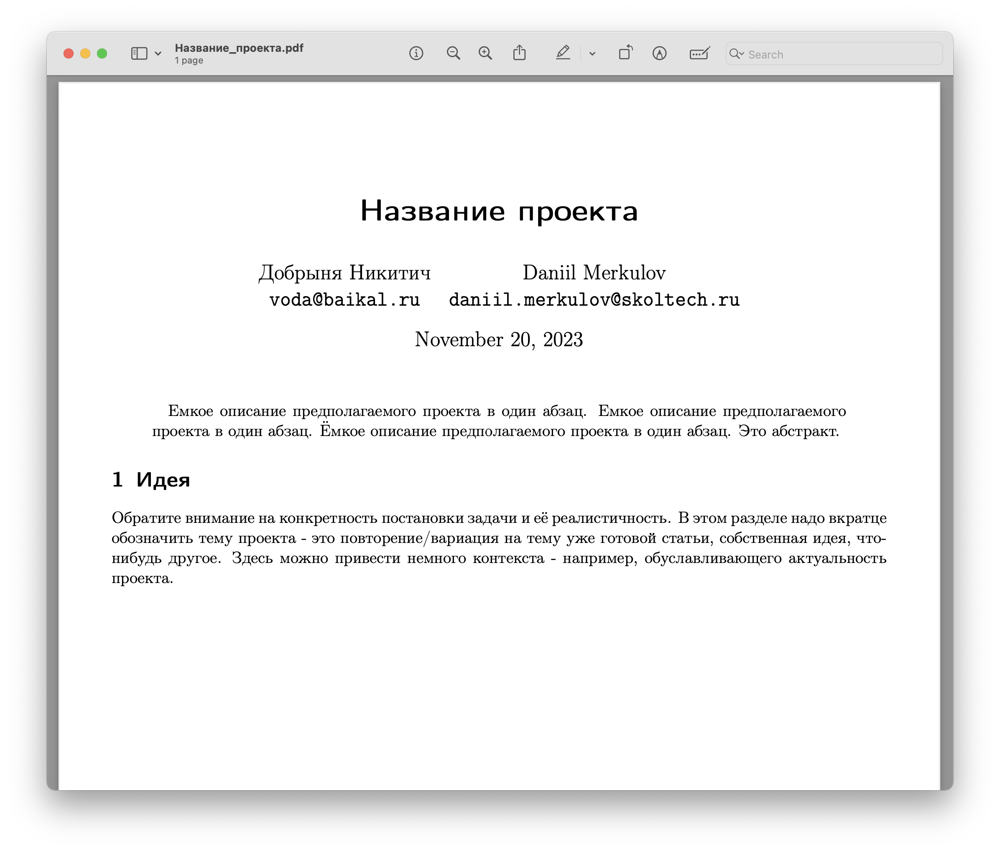
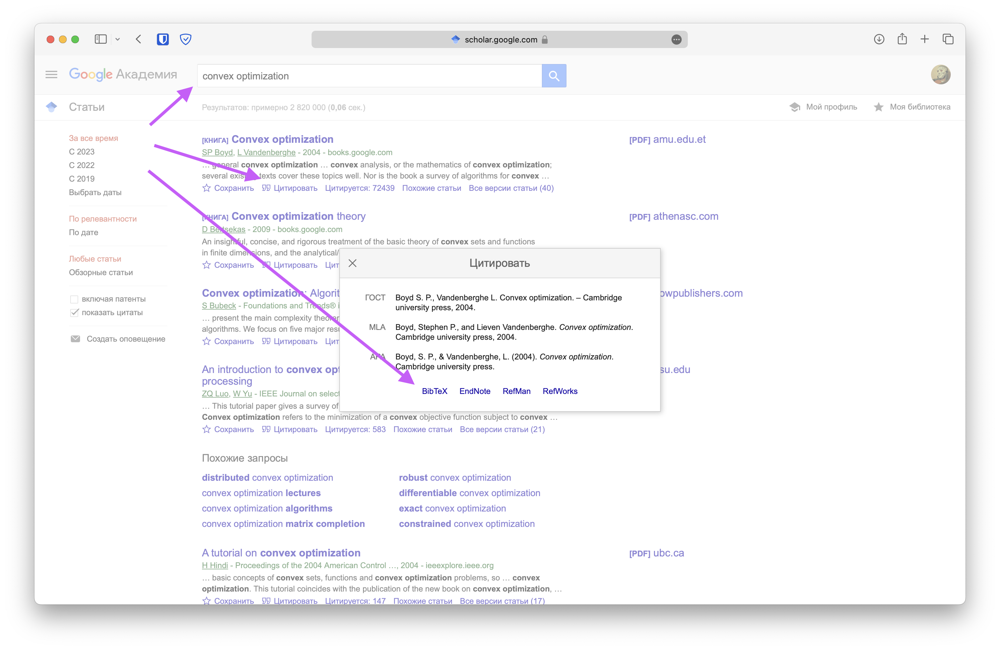

## Выбор темы

🗓 12 апреля 2026.  
🦄 10 баллов

Сначала нужно выбрать команду для проекта. Размер команды - 4-5 человек. Далее необходимо самостоятельно придумать/найти/выбрать тему проекта. Возможные темы описаны ниже на этой странице.

После выбора требуется согласовать с семинаристом/лектором тему проекта и высокоуровневое описание процесса работы над ним.

Главное требование к теме проекта - вам должно быть прикольно его делать, тема должна вас живо интересовать. Второе требование - он должен быть связан с теорией или методами оптимизации (хотя бы как-то 🙂).

Обратите внимание, что если в качестве проекта вы работаете с существующей статьей вы сначала должны написать свою задачу в рамках проекта - разобраться в чём-то, воспроизвести, повторить численные результаты, придумать другие численные эксперименты с другими моделями. А после этого необходимо так же привести в наиболее простом виде решаемую задачу из статьи. На этом этапе и далее важно не присваивать себе чужие заслуги. Постарайтесь избегать формулировок вида: *мы решаем задачу* (вместо этого можно написать *авторы статьи решают задачу*), *мы хотим исследовать проблему / предложить метод оптимизации / применить численный метод или матричное разложение / проанализировать сходимость, устойчивость* (вместо этого *авторы статьи предлагают/ исследуют* и т.д.)

### Формат сдачи

Этой и дальнейшие этапы работы выполняются в виде черновика научной статьи с использованием LaTeX шаблона. Для подготовки черновика можно взять шаблон LaTeX, используемый на научных конференциях (например, [шаблон конференций IEEE](https://www.ieee.org/conferences/publishing/templates)).

Так же доступен пример простого шаблона в [zip](./projects/project_proposal.zip) / [Overleaf](https://www.overleaf.com/read/cqynktppshnh#eae8c9), однако использование шаблонов конференций предпочтительнее. Этот шаблон содержит примеры разделов, которые будут нужны на следующих этапах.

Рекомендуется использовать Overleaf или VSCode / Cursor с расширением LaTeX Workshop. Допускается выполнение проекта в Typst, если вы умеете, но требования ниже будут предъявляться точно такие же (например, корректное цитирование). В дальнейшем необходимо использовать один шаблон, дополняя его по мере продвижения в проекте. Все материалы и ссылки по теме удобно собирать в Notion / Obsidian, чтобы при нашем обсуждении они были под рукой.

Загрузить в [таблицу](https://docs.google.com/spreadsheets/d/1KR8IkG0p68_acs_z6iEeZVKWpe1u1agHok-tZyyNKGU/edit?usp=sharing) в соответствующее поле ссылку на pdf с названием темы и абстрактом. Убедитесь, что на этом этапе вы удалили остальные пункты из шаблона выше. Файл, построенный на основе этого шаблона, должен выглядеть как-то так:

### Критерии оценивания

* 0 баллов - файл не загружен вовремя / файл загружен в другом формате
* 1-7 баллов - файл загружен вовремя, тема не согласована или решаемая задача сформулирована не чётко
* 8-10 баллов - файл загружен вовремя, тема согласована, решаемая проблема ясна и сформулирована чётко

## Project proposal

🗓 26 апреля 2026.  
🦄 20 баллов

На наш взгляд - это важнейший этап проекта. Тут нужно понять и очень четко определить куда и как двигаться, какие тропы уже пройдены другими людьми. Следует рассмотреть следующие аспекты проекта:

* **Название**
* **Abstract** – краткое описание проекта в один абзац.
* Описание проекта (обратите внимание на конкретность постановки задачи и её реалистичность)
* **Обзор литературы** – научный ландшафт вокруг выбранной постановки задачи (подробнее ниже)
* **Формальная постановка задачи** – определение в точных математических терминах, какую задачу Вы решаете, определения и обозначения, которые далее будут использоваться в работе
* **Метрики качества** (по возможности) -- приведите формальные и измеряемые показатели, по которым можно оценивать Ваше решение\ проект - это могут быть конкретные метрики качества алгоритмов, соц. опрос, логическое доказательство и т.д. Основная задача этого пункта - договориться на берегу о том, как мы сможем объективно оценить работу, проведенную в проекте. Обратите внимание, что результат проекта может быть "отрицательным" в том смысле, что мы собрались исследовать применение метода к какому-то классу задач и у нас не получилось. Это абсолютно нормально, тогда нужно будет просто описать этот процесс (мы попробовали и не вышло, но зато вот такое вот интересное наблюдали)
* **Детальный план работ** -- Какие шаги необходмо предпринять и какие задачи решить для выполнения проекта. Ясно, что в процессе выполнения проекта он будет меняться, однако наличие плана здесь лучше его отсутствия
* **Outcomes** - что конкретно будет выходом Вашего проекта (код, теорема, численные эксперименты, д.р.)

### Обзор литературы

После литературного обзора были ясны ответы на следующие вопросы:

* Какие результаты были достигнуты в похожих формулировках?
* Есть ли более простые формулировки и результаты в схожей тематике?
* На какие результаты необходимо существенно опираться?
* Какие исследования обуславливают актуальность рассматриваемой задачи?
* С какими источниками необходимо ознакомиться для существенного понимания задачи?
* Есть ли в открытом доступе код для воспроизведение экспериментов для рассматриваемой задачи?

Можно использовать поиск в интернете, поиск по Google Scholar, поиск по perplexity.ai, поиск по ссылкам в статье. В идеале ссылаться на рецензируемые опубликованные статьи/монографии. Однако, при необходимости, можно ссылаться на статьи на arxiv, блогпосты и другие источники, существенные и авторитетные для задачи. Цитирование необходимо делать с помощью bibtex. Например, bibtex описание для источника можно получить с помощью приложений Zotero/Mendeley или Google Scholar. Получение bibtex описания с помощью Google Scholar показано ниже:

После литературного обзора необходимо собрать воедино всё, что было раньше, спланировать дальнейшую работу и начать фазу прототипирования.

### Формат сдачи

Загрузить в [таблицу](https://docs.google.com/spreadsheets/d/1KR8IkG0p68_acs_z6iEeZVKWpe1u1agHok-tZyyNKGU/edit?usp=sharing) в соответствующее поле ссылку на pdf с обновленным названием, аннотацией и добавленным литературным обзором, формальной постановкой задачи и планом с учётом фидбека по предыдущему этапу. Необходимо также комментарием в таблице указать, кто именно что сделал (личный вклад каждого участника команды).

### Критерии оценивания

Баллы будут сниматься в следующих случаях (список не полный):

* Менее 5 релевантных источников по теме.
* Работа с источниками была проведена поверхностно, ссылки добавлены ради ссылок, а не ради сути.
* В результате литературного обзора совершенно не понятно, какое место занимает проект на научном ландшафте.  
* Не учтены комментарии по предыдущему этапу, если они были.
* План работ не реалистичный, очень поверхностный. Обратите внимание, что тяжело уверенно планировать творческие задачи (доказать теорему). Здесь лучше писать чуть более специфично (например, попробовать доказать/обобщить доказательство из другого источника).
* Нет формально постановки задачи
* Нет метрик качества (либо описание, почему они невозможны в вашем случае).
* Нет литературного обзора.
* Не написан чёткий выход (outcomes) проекта.
* Изображения низкого качества/плохо подписаны.

## Первый черновик работы

🗓 17 мая 2025.  
🦄 20 баллов

На этом этапе необходимо приступить к прототипированию вашего решения: максимально широкими мазками приступить к работе над проектом. Если есть существующий код - нужно его запустить, представить результаты ваших экспериментов, показать проблемы, с которыми вы столкнулись. Предпринять первые шаги к поиску решения задачи, предложить идею метода. Сделать что-нибудь с наскока. Идеально показать какой-нибудь прототип (если это применимо к проекту).

Результаты вашей работы, в том числе описание идеи, результаты первых экспериментов, должны быть добавлены в ваш pdf файл. Этот этап необходим не только для отчетности, но и для возможности получить обратнкую связь на ранеем этапе.

### Формат сдачи

Загрузить в [таблицу](https://docs.google.com/spreadsheets/d/1KR8IkG0p68_acs_z6iEeZVKWpe1u1agHok-tZyyNKGU/edit?usp=sharing) в соответствующее поле ссылку на pdf с обновленными разделами (план с предыдущего этапа можно удалить) с учётом фидбека по предыдущему этапу. Необходимо также комментарием в таблице указать, кто именно что сделал (личный вклад каждого участника команды).

### Критерии оценивания

Баллы будут сниматься в следующих случаях (список не полный):

* Черновик работы отсутствует
* Структура текста нелогична или отсутствует четкое разделение на разделы
* Не учтены комментарии по предыдущим этапам, если они были

## Второй черновик работы

🗓 31 мая 2026.  
🦄 20 баллов

На этом шаге подготовливается второй черновик вашей работы по результатам обратной связи, полученной на предыдущем этапе, а так же добавляются описания новых идей/методов/теорем/результатов экспериментов и т.д.

Так же необходимо подготовить первый черновик постера в LaTeX с разделением на разделы, объяснением - что в каком разделе где будет. Вы можете использовать любой шаблон постера, например, из [бибилиотеки шаблонов Overleaf](https://www.overleaf.com/latex/templates/tagged/poster). Так же доступен пример простого [📝 $\LaTeX$ шаблона](./projects/poster_template.zip) и [📜 пример постера](./projects/poster_template.pdf).

### Формат сдачи

Загрузить в [таблицу](https://docs.google.com/spreadsheets/d/1KR8IkG0p68_acs_z6iEeZVKWpe1u1agHok-tZyyNKGU/edit?usp=sharing) в соответствующие поля ссылки на черновик работы и черновик постера в pdf с учётом фидбека по предыдущим этапам. Необходимо также комментарием в таблице указать, кто именно что сделал (личный вклад каждого участника команды).

### Критерии оценивания

Баллы будут сниматься в следующих случаях (список не полный):

* Черновик работы отсутствует
* Черновик постера отсутствует
* Структура текста и/или постера нелогична или отсутствует четкое разделение на разделы
* Не учтены комментарии по предыдущим этапам, если они были

## Постерная сессия

🗓 15 – 19 июня 2026.  
🦄 30 баллов

К этому этапу должен быть готов финальный текст работы и постер в LaTeX с результатами проекта. Подведение итогов, публичная защита проекта. Оценивается выступление студента и качество представленных результатов. Выступление должно быть понятным, структурированным, интересным.

### Формат сдачи

Загрузить до начала периода проведения постерной сессии в [таблицу](https://docs.google.com/spreadsheets/d/1KR8IkG0p68_acs_z6iEeZVKWpe1u1agHok-tZyyNKGU/edit?usp=sharing) в соответствующие поля ссылки на финальный текст работы и на постер в pdf и подготовиться к публичной защите проекта. Точная дата проведения постерной сессии будет объяалена позже. При обнаружении опечаток или других небольших недочетов допускается вносить небольшие правки в напечатанной (демонстрируемой) версии постера. Необходимо также комментарием в таблице указать, кто именно что сделал (личный вклад каждого участника команды).

### Критерии оценивания

Баллы будут сниматься в следующих случаях (список не полный):

* Финальный постер не соответствует требованиям или отсутствует
* Финальный текст не соответствует требованиям или отсутствует
* Выступление неструктурировано, непонятно или неинтересно
* Результаты проекта представлены некачественно или неполно
* Не учтены комментарии по предыдущим этапам

:::{.callout-important}
Все дедлайны понимаются как 23:59:59 по Московскому времени.
:::

## Возможные темы

* Взять недавно (можно смело смотреть по keywords SVD, Schur decomposition, low-rank и т.д. за последние несколько лет) опубликованную статью на конференции [NeurIPS](https://openreview.net/group?id=NeurIPS.cc/2024/Conference&referrer=%5BHomepage%5D(%2F)), [ICML](https://openreview.net/group?id=ICML.cc/2024/Conference), [ICLR](https://openreview.net/group?id=ICLR.cc/2024/Conference). Детально разобраться. Воспроизвести. Попробовать на других данных/моделях/методах. Возможно, предложить посмотреть/протестировать что-нибудь новое.
* Прекрасным примером проекта может быть экстремальное выполнение классической задачи. Например,
    * Обучение огромной модели на огромном датасете
    * Минимизация очень сложной функции
    * Исследование свойств оптимизаторов с бесконечной дисперсией стох.градиента

    В рамках такого проекта предлагается очень понятная постановка задачи и творческая свобода исследовать любые современные подходы к её решению - стохастические, требующие специальный формат входов, и т.д.
* В статье [Old Optimizer, New Norm: An Anthology](https://arxiv.org/abs/2409.20325) авторы делают упор на построение разных методов оптимизации для современных задач машинного обучения с помощью решения специальной задачи оптимизации. Важно, что авторы предлагают единый взгляд на построение разных методов с помощью использования разных операторных норм. В рамках предлагается исследовать другие операторные нормы (например, ядерную), которые можно использовать для построения методов оптимизации и сравнить методы теоретически или численно. Можно вот изучить [пост](https://jeremybernste.in/writing/deriving-muon) автора по теме вывода одного из популярных сегодня оптимизаторов для LLM.
* В [нашей статье](https://openreview.net/forum?id=40rikZ1pCm) мы рассматриваем метод квантизации больших языковых моделей с помощью разложения матрицы весов на два фактора, формирующих представление Кашина. Однако, некоторые унитарные матрицы плохо подходят для построения таких разложений. В рамках проекта предлагается исследовать возможные объяснения этого феномена.Можно посмотреть наш [недавний доклад](https://disk.yandex.ru/i/JB_8DeT0t0kmIw).
* В [работе](https://openreview.net/forum?id=twtTLZnG0B) рассматривается модификация метода редукции дисперсии стохастического градиента для применений в машинном обучении. В рамках проекта предлагается исследовать предложенный подход и сравнить с другими стохастическими градиентными методами. Возможно, использовать предложенную модификацию для других методов.
* Создание питон библиотеки - черного ящика для бенчмаркинга методов оптимизации с разными запусками, единым интерфейсом, построением графиков.
* Изучение методов оптимизации в непрерывном времени

    * [Статья](https://arxiv.org/pdf/2209.14937.pdf)
    * [Статья](https://arxiv.org/abs/2004.08981)

    Градиентный спуск можно рассматривать как дискретизацию Эйлера обыкновенного дифференциального уравнения градиентного потока. Оказывается, ускоренным методам тоже можно поставить в соответствие их непрерывные аналоги. В рамках проекта предлагается изучить где особенно полезны могут быть такие аналогии, доказать сходимость некоторых ускоренных методов в выпуклом случае, изучить сходимость методов для случая бесконечной дисперсии.
* Давайте запустим LLM в качестве оптимизатора-черного ящика. Будем давать ему локальную информацию о функции и градиенте, просить вернуть следующую итерацию и посмотреть, как он будет решать задачу оптимизации, на что похожа эта траектория.
* В статье [Dataset distillation](https://arxiv.org/abs/1811.10959) авторы показывают, что можно сделать 10 изображений похожих на MNIST так, что точность моделей на MNIST будет 94% после обучения только на этих 10 изображениях. В рамках проекта предлагается исследовать возможность применения этого подхода для для текстовых датасетов (Tiny Stories).
* Взять несколько современных оптимизаторв и построить для нескольких практических задач оптимизации карты loss surface в зависимости от гиперпараметров оптимизатора.
* В недавней [статье](https://arxiv.org/abs/2503.04715) авторы исследуют как надо изменять гиперпараметры обучения (batch size, learning rate, etc). Можно изучить и попробовать воспроизвести результаты на других/маленьких моделях.
* В [статье](https://arxiv.org/abs/2402.19449) авторы исследовали феномен того, что Adam показывает лучшие результаты на задачах обучения больших языковых моделей, но в задачах компьютерного зрения разница не значительна. Гипотеза авторов заключается в том, что языковые задачи имеют существенно несбалансированную обучающую выборку. В рамках проекта предлагается изменить токенизацию так, чтобы корпус текста был представлен равномерно по токенам и проверить влияет ли это на разницу между оптимизаторами.
* В этой [таблице](https://docs.google.com/spreadsheets/d/1t09jJFi-YjmDkzYpwZveBq9CyIAmqbITpD-GwB0LqEM/edit?usp=sharing) чуть позже появятся возможные темы проектов от преподавателей курса
