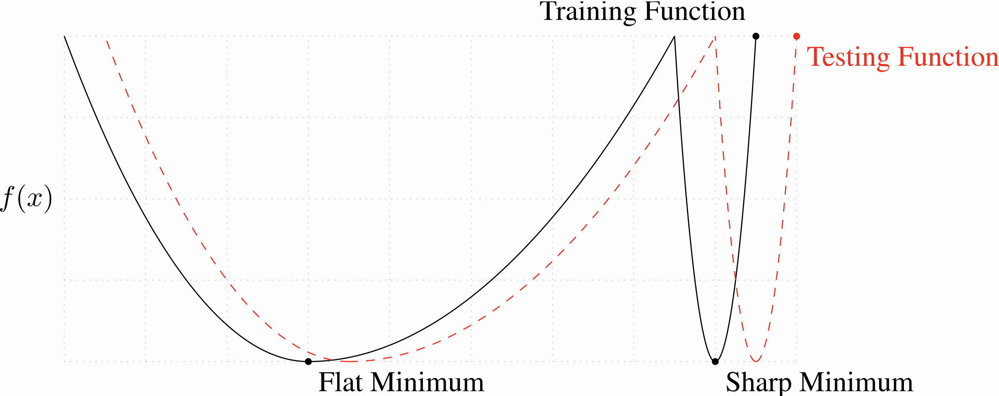
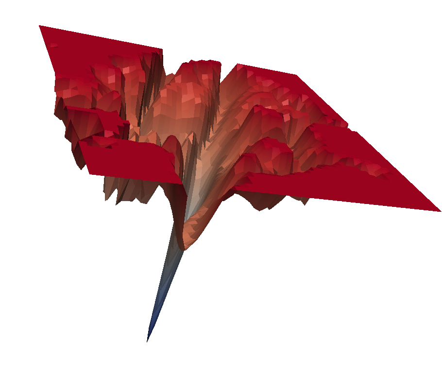
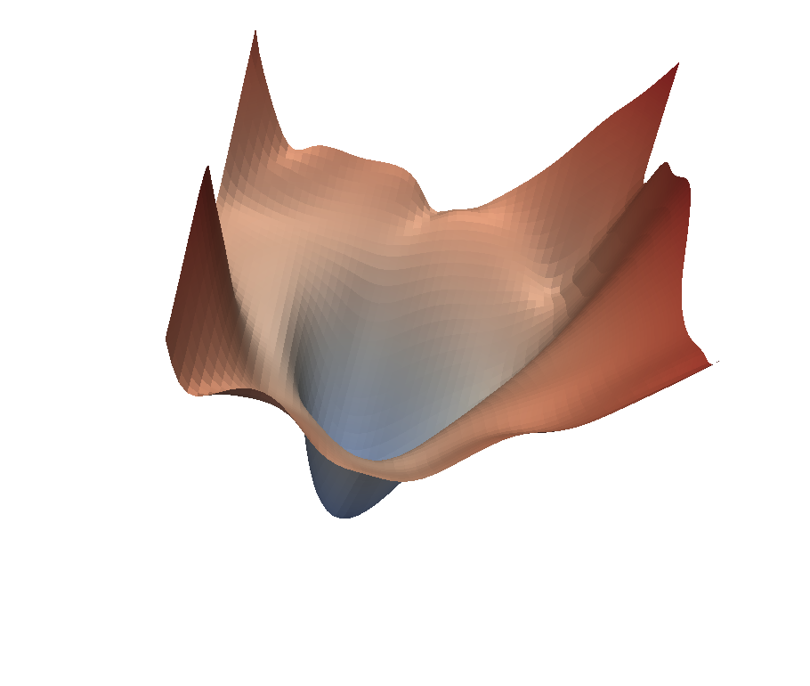
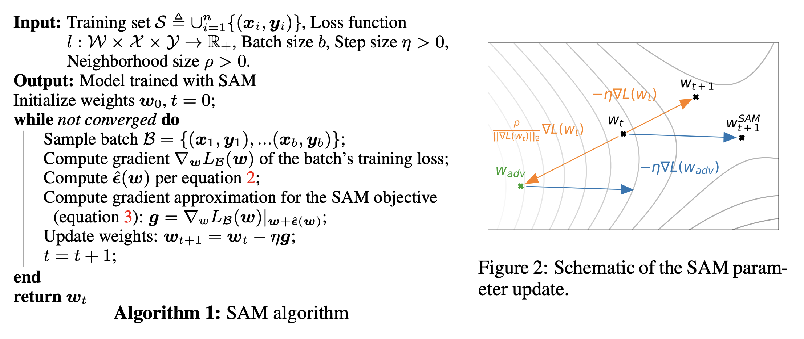
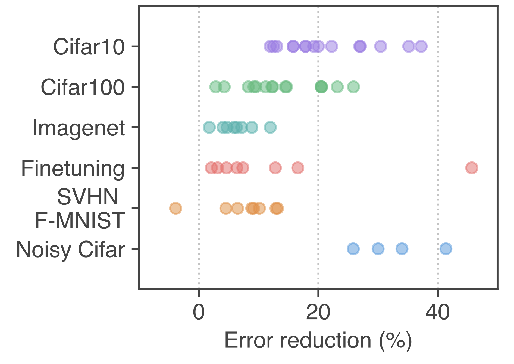
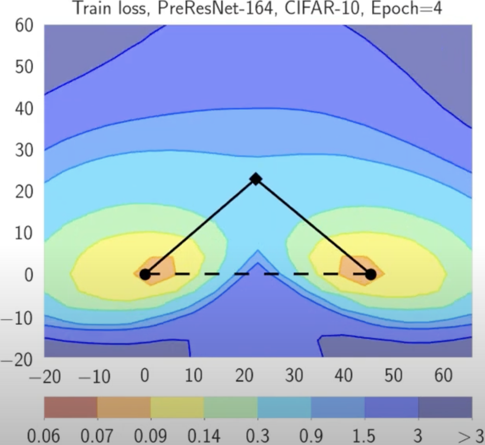
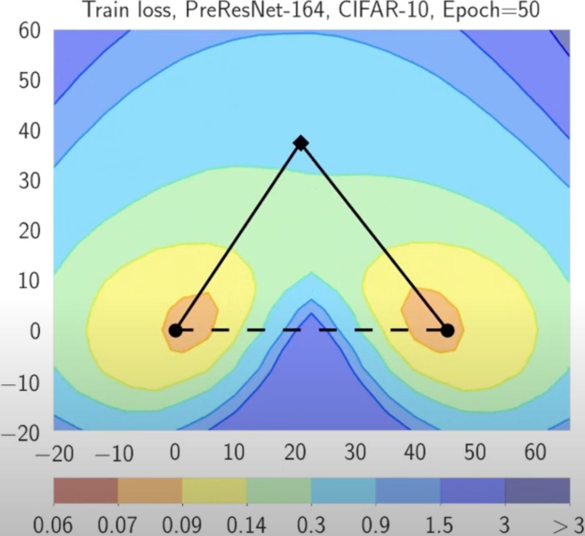
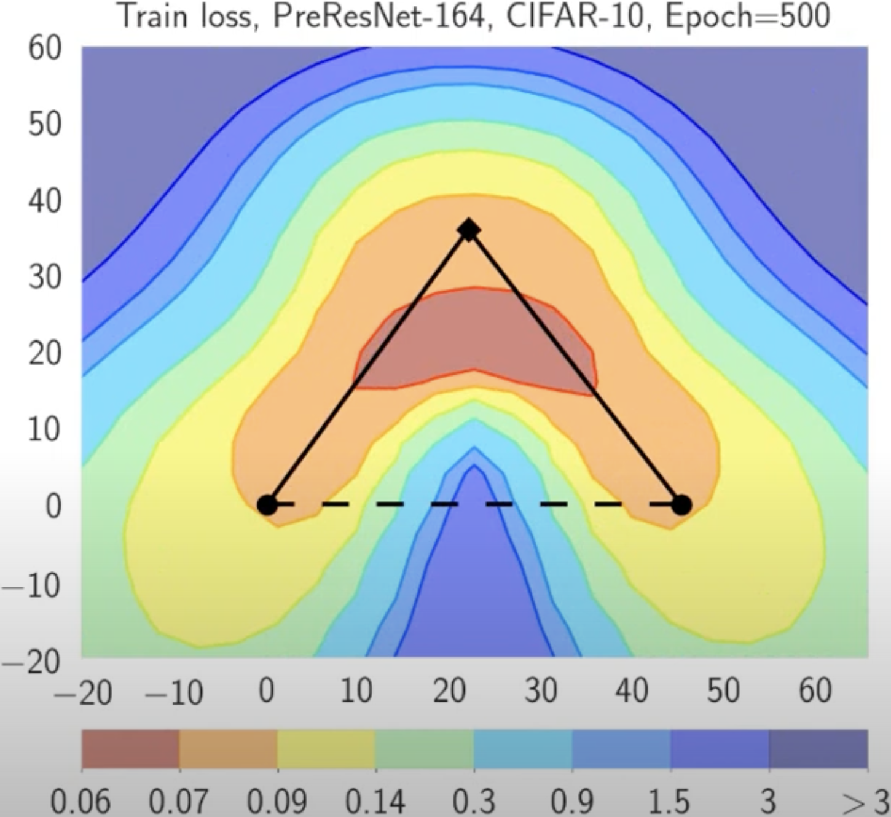
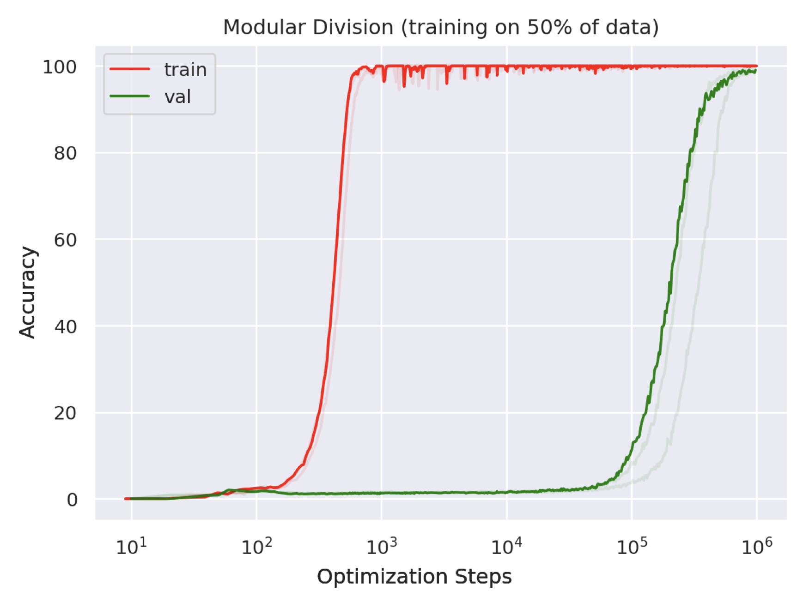

# SAM
## Плоские минимумы vs острые минимумы
{width=80% fig-align="center"}

. . .

::: {.callout-question title="Острый минимум"}
Что плохого в остром минимуме?
:::

## Оптимизация с учётом остроты (SAM) \footnote{\href{https://arxiv.org/pdf/2010.01412}{Foret, Pierre, et al. "Sharpness-aware minimization for efficiently improving generalization." (2020)}}

:::: {.columns}

::: {.column width="50%"}
{width=60% fig-align="center"}
:::

. . .

::: {.column width="50%"}
{width=60% fig-align="center"}
:::

::::

. . .

::: {.callout-tip icon="false" appearance="simple"}
Оптимизация с учётом остроты (SAM) — это процедура, направленная на улучшение обобщающей способности модели за счёт одновременной минимизации значения функции потерь и **остроты ландшафта функции потерь**.
:::

## Постановка задачи обучения

Обучающая выборка, полученная i.i.d. из распределения $D$:
$$S = \{(x_i, y_i)\}_{i=1}^{n},$$
где $x_i$ — вектор признаков, $y_i$ — метка.

. . .

Функция потерь на обучающей выборке:
$$L_{S} = \dfrac{1}{n} \sum_{i=1}^{n} l(\boldsymbol{w}, x_i, y_i),$$
где $l$ — функция потерь для одного объекта, $\boldsymbol{w}$ — параметры модели.

. . .

Функция потерь на генеральной совокупности:
$$L_{D} = \mathbb{E}_{(x, y)} [l(\boldsymbol{w}, \boldsymbol{x}, \boldsymbol{y})]$$

## Что такое острота?

:::{.callout-theorem}
Для любого $\rho>0$ с высокой вероятностью по обучающей выборке $S$, порождённой распределением $D$,
$$
L_{D}(\boldsymbol{w}) \leq \max _{\|\boldsymbol{\epsilon}\|_2 \leq \rho} L_{S}(\boldsymbol{w}+\boldsymbol{\epsilon})+h\left(\|\boldsymbol{w}\|_2^2 / \rho^2\right),
$$
где $h: \mathbb{R}_{+} \rightarrow \mathbb{R}_{+}$ — строго возрастающая функция (при некоторых технических условиях на $L_{D}(\boldsymbol{w})$).
:::

. . .

Прибавляя и вычитая $L_{S}(\boldsymbol{w})$:
$$
\left[\max _{\|\in\|_2 \leq \rho} L_{{S}}(\boldsymbol{w}+\boldsymbol{\epsilon})-L_{{S}}(\boldsymbol{w})\right]+L_{\mathcal{S}}(\boldsymbol{w})+h\left(\|\boldsymbol{w}\|_2^2 / \rho^2\right)
$$

Слагаемое в квадратных скобках отражает **остроту** $L_S$ в точке $\boldsymbol{w}$: оно показывает, насколько быстро можно увеличить функцию потерь на обучающей выборке, сдвинув параметры из $\boldsymbol{w}$ в соседнюю точку.

## Оптимизация с учётом остроты (SAM)

Функцию $h$ заменяют более простой константой $\lambda$. Авторы предлагают выбирать значения параметров, решая следующую задачу оптимизации с учётом остроты (SAM):

$$
\min _{\boldsymbol{w}} L_{{S}}^{S A M}(\boldsymbol{w})+\lambda\|\boldsymbol{w}\|_2^2 \quad \text { где } \quad L_{{S}}^{S A M}(\boldsymbol{w}) \triangleq \max _{\|\epsilon\|_p \leq \rho} L_S(\boldsymbol{w}+\boldsymbol{\epsilon}),
$$

с гиперпараметром $\rho \geq 0$ и $p \in [1, \infty]$ (небольшое обобщение, хотя $p=2$ эмпирически является лучшим выбором).

## Как минимизировать $L_{{S}}^{S A M}$?

Для минимизации $L_{{S}}^{S A M}$ используется эффективное приближение её градиента. Первый шаг — разложение $L_{{S}}(\boldsymbol{w}+\boldsymbol{\epsilon})$ в ряд Тейлора первого порядка:
$$
\boldsymbol{\epsilon}^*(\boldsymbol{w}) \triangleq \underset{\|\epsilon\|_p \leq \rho}{\arg \max } L_{{S}}(\boldsymbol{w}+\boldsymbol{\epsilon}) \approx \underset{\|\epsilon\|_p \leq \rho}{\arg \max } L_{{S}}(\boldsymbol{w})+\boldsymbol{\epsilon}^T \nabla_{\boldsymbol{w}} L_{{S}}(\boldsymbol{w})=\underset{\|\epsilon\|_p \leq \rho}{\arg \max } \boldsymbol{\epsilon}^T \nabla_{\boldsymbol{w}} L_{{S}}(\boldsymbol{w}) .
$$

. . .

Последнее выражение — это просто argmax скалярного произведения векторов $\boldsymbol{\epsilon}$ и $\nabla_{\boldsymbol{w}} L_{{S}}(\boldsymbol{w})$, и хорошо известно, какой аргумент его максимизирует:

$$
\hat{\boldsymbol{\epsilon}}(\boldsymbol{w})=\rho \operatorname{sign}\left(\nabla_{\boldsymbol{w}} L_{{S}}(\boldsymbol{w})\right)\left|\nabla_{\boldsymbol{w}} L_{{S}}(\boldsymbol{w})\right|^{q-1} /\left(\left\|\nabla_{\boldsymbol{w}} L_{{S}}(\boldsymbol{w})\right\|_q^q\right)^{1 / p},
$$
где $1 / p+1 / q=1$.

. . .

Таким образом,
$$
\begin{aligned}
\nabla_{\boldsymbol{w}} L_{{S}}^{S A M}(\boldsymbol{w}) & \approx \nabla_{\boldsymbol{w}} L_{{S}}(\boldsymbol{w}+\hat{\boldsymbol{\epsilon}}(\boldsymbol{w}))=\left.\frac{d(\boldsymbol{w}+\hat{\boldsymbol{\epsilon}}(\boldsymbol{w}))}{d \boldsymbol{w}} \nabla_{\boldsymbol{w}} L_{{S}}(\boldsymbol{w})\right|_{\boldsymbol{w}+\hat{\boldsymbol{\epsilon}}(w)} \\
& =\left.\nabla_w L_{{S}}(\boldsymbol{w})\right|_{\boldsymbol{w}+\hat{\boldsymbol{\epsilon}}(\boldsymbol{w})}+\left.\frac{d \hat{\boldsymbol{\epsilon}}(\boldsymbol{w})}{d \boldsymbol{w}} \nabla_{\boldsymbol{w}} L_{{S}}(\boldsymbol{w})\right|_{\boldsymbol{w}+\hat{\boldsymbol{\epsilon}}(\boldsymbol{w})}
\end{aligned}
$$

## Оптимизация с учётом остроты (SAM)

Современные фреймворки легко вычисляют описанное приближение. Однако для ускорения вычислений члены второго порядка можно отбросить, получив:
$$
\left.\nabla_{\boldsymbol{w}} L_{{S}}^{S A M}(\boldsymbol{w}) \approx \nabla_{\boldsymbol{w}} L_{{S}}(w)\right|_{\boldsymbol{w}+\hat{\boldsymbol{\epsilon}}(\boldsymbol{w})}
$$

. . .

{width=100% fig-align="center"}

## Результаты SAM

{width=50% fig-align="center"}

# Методы редукции дисперсии для нейронных сетей

## Почему методы редукции дисперсии не работают при обучении нейронных сетей? \footnote{\href{https://arxiv.org/abs/1812.04529}{Defazio, A., Bottou, L. (2019). On the ineffectiveness of variance reduced optimization for deep learning. Advances in Neural Information Processing Systems, 32.}}

:::: {.columns}
::: {.column width="45%"}

\begin{figure}
  \centering
  \begin{minipage}[b]{0.49\linewidth}
    \centering
    \includegraphics[width=\linewidth]{../files/variance_ratios_densenet.pdf}
    \caption{DenseNet}
  \end{minipage}%
  \begin{minipage}[b]{0.49\linewidth}
    \centering
    \includegraphics[width=\linewidth]{../files/variance_ratios_small-resnet.pdf}
    \caption{Small ResNet}
  \end{minipage}

  \vspace{1em} % небольшой отступ между рядами

  \begin{minipage}[b]{0.49\linewidth}
    \centering
    \includegraphics[width=\linewidth]{../files/variance_ratios_lenet.pdf}
    \caption{LeNet‑5}
  \end{minipage}%
  \begin{minipage}[b]{0.49\linewidth}
    \centering
    \includegraphics[width=\linewidth]{../files/variance_ratios_resnet110.pdf}
    \caption{ResNet‑110}
  \end{minipage}
\end{figure}

:::

::: {.column width="55%"}
- **SVRG / SAG** убедительно выигрывают на выпуклых задачах, однако на CIFAR-10 (LeNet-5) и ImageNet (ResNet-18) они не превосходят стандартный SGD. \pause
- Измеренное отношение «дисперсия SGD / дисперсия SVRG» остаётся $\lesssim 2$ для большинства слоёв — то есть реальное снижение шума минимально. \pause
- Возможные причины:
  - **Аугментация данных** делает опорный градиент $g_{\text{ref}}$ устаревшим уже через несколько мини-батчей. \pause
  - **BatchNorm** и **Dropout** вносят внутреннюю стохастичность, которую прошлый $g_{\text{ref}}$ не может компенсировать. \pause
  - Дополнительный проход по всей выборке (для вычисления $g_{\text{ref}}$) поглощает потенциальную экономию на итерациях. \pause
- «Потоковые» модификации SVRG, разработанные для работы с аугментацией, снижают теоретическое смещение, но всё равно уступают SGD и по времени, и по качеству. \pause
- **Вывод**: Существующие методы редукции дисперсии непрактичны для современных глубоких сетей; будущие решения должны учитывать стохастическую природу архитектуры и данных (аугментация, BatchNorm, Dropout).
:::
::::

# Связность минимумов
## Связность минимумов \footnote{\href{https://arxiv.org/pdf/1802.10026}{Garipov, T., Izmailov, P., Podoprikhin, D., Vetrov, D. P., Wilson, A. G. (2018). Loss surfaces, mode connectivity, and fast ensembling of dnns. Advances in neural information processing systems, 31.}}
![Поверхность $l_2$-регуляризованных перекрёстных потерь на обучающей выборке для ResNet-164 на CIFAR-100 как функция весов сети в двумерном подпространстве. В каждой панели горизонтальная ось зафиксирована и привязана к оптимумам двух независимо обученных сетей. Вертикальная ось меняется между панелями по мере смены плоскостей (определения — в основном тексте). Слева: три оптимума для независимо обученных сетей. В центре и справа: квадратичная кривая Безье и ломаная с одним изломом, соединяющие два нижних оптимума левой панели вдоль пути почти постоянных потерь. Обратите внимание: в каждой панели прямой линейный путь между модами проходил бы через область высоких потерь.](../files/mode_connectivity.png){width=80% fig-align="center"}

## Процедура поиска кривой

:::: {.columns}

::: {.column width="50%"}

- Веса предобученных сетей:

$$\widehat{w}_1, \widehat{w}_2 \in \mathbb{R}^{\mid \text {net} \mid}$$

- Определяем параметрическую кривую: $\phi_\theta(\cdot):[0,1] \rightarrow \mathbb{R}^{\mid \text {net} \mid}$

$$
\phi_\theta(0)=\widehat{w}_1, \quad \phi_\theta(1)=\widehat{w}_2
$$

- Функция потерь нейронной сети:

$$\mathcal{L}(w)$$

- Минимизируем усреднённые потери по $\theta$:

$$
\underset{\theta}{\operatorname{minimize}} \;\; \ell(\theta)=\int_0^1 \mathcal{L}\left(\phi_\theta(t)\right) d t=\mathbb{E}_{t \sim U(0,1)} \mathcal{L}\left(\phi_\theta(t)\right)
$$

:::

::: {.column width="50%"}
{width=70% fig-align="center"}
:::

::::

## Процедура поиска кривой

:::: {.columns}

::: {.column width="50%"}

- Веса предобученных сетей:

$$\widehat{w}_1, \widehat{w}_2 \in \mathbb{R}^{\mid \text {net} \mid}$$

- Определяем параметрическую кривую: $\phi_\theta(\cdot):[0,1] \rightarrow \mathbb{R}^{\mid \text {net} \mid}$

$$
\phi_\theta(0)=\widehat{w}_1, \quad \phi_\theta(1)=\widehat{w}_2
$$

- Функция потерь нейронной сети:

$$\mathcal{L}(w)$$

- Минимизируем усреднённые потери по $\theta$:

$$
\underset{\theta}{\operatorname{minimize}} \;\; \ell(\theta)=\int_0^1 \mathcal{L}\left(\phi_\theta(t)\right) d t=\mathbb{E}_{t \sim U(0,1)} \mathcal{L}\left(\phi_\theta(t)\right)
$$

:::

::: {.column width="50%"}
{width=70% fig-align="center"}
:::

::::

## Процедура поиска кривой

:::: {.columns}

::: {.column width="50%"}

- Веса предобученных сетей:

$$\widehat{w}_1, \widehat{w}_2 \in \mathbb{R}^{\mid \text {net} \mid}$$

- Определяем параметрическую кривую: $\phi_\theta(\cdot):[0,1] \rightarrow \mathbb{R}^{\mid \text {net} \mid}$

$$
\phi_\theta(0)=\widehat{w}_1, \quad \phi_\theta(1)=\widehat{w}_2
$$

- Функция потерь нейронной сети:

$$\mathcal{L}(w)$$

- Минимизируем усреднённые потери по $\theta$:

$$
\underset{\theta}{\operatorname{minimize}} \;\; \ell(\theta)=\int_0^1 \mathcal{L}\left(\phi_\theta(t)\right) d t=\mathbb{E}_{t \sim U(0,1)} \mathcal{L}\left(\phi_\theta(t)\right)
$$

:::

::: {.column width="50%"}
{width=70% fig-align="center"}
:::

::::

# Грокинг
## Грокинг^[[Power, Alethea, et al. "Grokking: Generalization beyond overfitting on small algorithmic datasets." (2022).](https://arxiv.org/pdf/2201.02177)]

:::: {.columns}

::: {.column width="40%"}

- После достижения нулевых потерь на обучающей выборке веса продолжают эволюционировать в режиме случайного блуждания

- Возможно, они медленно смещаются к более широкому минимуму

- Недавно обнаруженный эффект грокинга подтверждает эту гипотезу

:::

::: {.column width="60%"}
{width=70% fig-align="center"}

:::

::::

# Двойной спуск
## Двойной спуск^[[Belkin, Mikhail, et al. "Reconciling modern machine-learning practice and the classical bias–variance trade-off." (2019)](https://arxiv.org/pdf/1812.11118)]

{width=100% fig-align="center"}

## Двойной спуск

# Shampoo и Muon
## Shampoo \footnote{\href{https://arxiv.org/pdf/1802.09568}{Gupta, V., Koren, T. and Singer, Y., 2018, July. Shampoo: Preconditioned stochastic tensor optimization. In International Conference on Machine Learning (pp. 1842-1850). PMLR.
}}

Расшифровывается как **S**tochastic **H**essian-**A**pproximation **M**atrix **P**reconditioning for **O**ptimization **O**f deep networks. Метод, вдохновлённый оптимизацией второго порядка и разработанный для крупномасштабного глубокого обучения.

**Основная идея:** Приближает полноматричный предобусловитель AdaGrad с помощью эффективных матричных структур, а именно произведений Кронекера.

Для матрицы весов $W \in \mathbb{R}^{m \times n}$ обновление включает предобусловливание с использованием приближений матриц статистики $L \approx \sum_k G_k G_k^T$ и $R \approx \sum_k G_k^T G_k$, где $G_k$ — градиенты.

Упрощённая схема:

1. Вычислить градиент $G_k$.
2. Обновить статистику $L_k = \beta L_{k-1} + (1-\beta) G_k G_k^T$ и $R_k = \beta R_{k-1} + (1-\beta) G_k^T G_k$.
3. Вычислить предобусловители $P_L = L_k^{-1/4}$ и $P_R = R_k^{-1/4}$. (Обратный матричный корень)
4. Обновление: $W_{k+1} = W_k - \alpha P_L G_k P_R$.

**Замечания:**

* Стремится учесть информацию о кривизне более эффективно, чем методы первого порядка.
* Вычислительно дороже Adam, но может сходиться быстрее или к лучшим решениям по числу шагов.
* Требует аккуратной реализации для достижения эффективности (например, эффективное вычисление обратных матричных корней, работа с большими матрицами).
* Существуют варианты для тензоров различных форм (например, свёрточные слои).

## Muon \footnote{\href{https://kellerjordan.github.io/posts/muon/}{K. Jordan blogpost "Muon: An optimizer for hidden layers in neural networks". 2024.}} \footnote{\href{https://jeremybernste.in/writing/deriving-muon}{J. Bernstein blogpost "Deriving Muon". 2025.}} \footnote{\href{https://arxiv.org/pdf/2503.12645}{Kovalev, D. (2025). Understanding Gradient Orthogonalization for Deep Learning via Non-Euclidean Trust-Region Optimization. arXiv preprint arXiv:2503.12645.}}

$$
\begin{aligned}
W_{t+1} &= W_t - \eta (G_tG_t^\top)^{-1/4}G_t(G_t^\top G_t)^{-1/4} \\
&= W_t - \eta (US^2U^\top)^{-1/4} (USV^\top) (VS^2V^\top)^{-1/4} \\
&= W_t - \eta (US^{-1/2}U^\top) (USV^\top) (VS^{-1/2}V^\top) \\
&= W_t - \eta US^{-1/2}SS^{-1/2}V^\top \\
&= W_t - \eta UV^\top
\end{aligned}
$$

## Сравнение Muon и AdamW на логистической регрессии

\href{https://colab.research.google.com/github/MerkulovDaniil/hse25/blob/main/notebooks/s_17_muon.ipynb}{\faPython\ Простое сравнение Muon и AdamW на задаче логистической регрессии}

# Дополнительные материалы
## Дополнительные материалы

- \href{https://youtu.be/d60ShbSAu4A?si=UWqr7jamkJQ4W3XL}{\faYoutube\ Д. Ветров «Удивительные свойства ландшафта функции потерь в переопараметризованных моделях»}
- \href{https://www.youtube.com/watch?v=pmHkDKPg0WM}{\faYoutube\ В. Голошапов «О чём на самом деле не грокинг»}
- \href{https://broadcast.comdi.com/watch/ra9y3cd0}{\faVideo\ Д. Ковалёв «Understanding Gradient Orthogonalization for Deep Learning via Non-Euclidean Trust-Region Optimization» (Теория, лежащая в основе Muon)}
