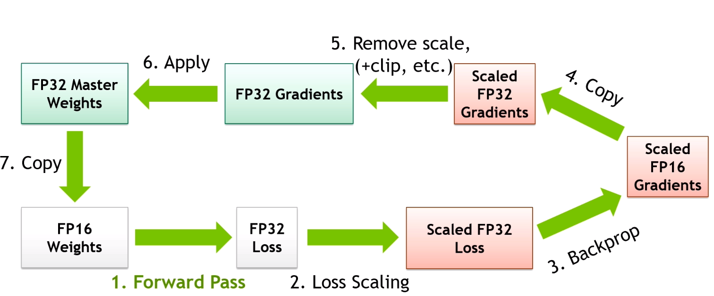

# Распределённое обучение с большим батчем

## Accurate, Large Minibatch SGD. Мотивация

::: {.callout-tip title="Главные преимущества больших данных"}
Рост масштаба данных и моделей быстро улучшает качество
:::

. . .

::: {.callout-important title="Главные недостатки больших данных"}
По мере роста модели и данных растёт и время обучения
:::

. . .

**Решение:** Использовать распределённый SGD с большим батчем для более **эффективных** итераций

## Accurate, Large Minibatch SGD. Постановка задачи
Функция потерь
$$ L(w) = \frac{1}{|X|} \sum_{x \in X} l(x, w) $$
Одна итерация Minibatch SGD (размер батча $n$)
$$ w_{t+1} = w_t - \eta \frac{1}{n} \sum_{x \in \mathcal{B}} \nabla l(x, w_t) $$
$k$ итераций Minibatch SGD (размер батча $n$)
$$ w_{t+k} = w_t - \eta \frac{1}{n} \sum_{j < k}\sum_{x \in \mathcal{B_j}} \nabla l(x, w_{t+j}) $$
Одна итерация Minibatch SGD с большим батчем (размер батча $kn$)
$$ \hat{w}_{t+1} = w_t - \hat{\eta} \frac{1}{kn} \sum_{j < k}\sum_{x \in \mathcal{B_j}} \nabla l(x, w_{t}) $$

**Желаемое свойство при обучении на нескольких GPU**: $\hat{w}_{t+1} \sim w_{t+k}$

## Accurate, Large Minibatch SGD. Основная идея
**Желаемое свойство при обучении на нескольких GPU**: $\hat{w}_{t+1} \sim w_{t+k}$

::: {.callout-tip title="Основное допущение статьи"}
Если допустить $\nabla l(x, w_t) \sim \nabla l(x, w_{t+j})$ при $j < k$, то установка $\hat \eta = k\eta$ даёт $\hat{w}_{t+1} \sim w_{t+k}$
:::

. . .

::: {.callout-question title="Что не так с допущением"}
Когда условие $\nabla l(x, w_t) \sim \nabla l(x, w_{t+j})$ явно не выполняется?
:::

. . .

1. Сеть быстро меняется в начале обучения
1. Очень большое $k$ порождает очень большое $\hat \eta$ и делает обучение нестабильным

## Accurate, Large Minibatch SGD. Решение проблем допущения
::: {.callout-question title="Что делать с проблемами допущения"}
Как бороться с проблемами допущения?
:::

. . .

**Постепенный разогрев.** Итерационный линейный планировщик с начальным значением $\hat \eta = \eta$ и конечным значением $\hat \eta  = k \eta$ примерно через $\sim 5$ эпох.

* позволяет избежать резкого увеличения скорости обучения

**Постоянный размер выборки на воркер.** При глобальном размере батча $kn$ мы сохраняем *размер выборки на воркер* $n$ постоянным при изменении числа воркеров $k$.

. . .

* крайне важно для Batch Normalization!

## Accurate, Large Minibatch SGD. Результаты на ImageNet

:::: {.columns}
::: {.column width="80%"}
{width="85%"}

:::

::: {.column width="20%"}
Кривые обучения точно воспроизводят базовый вариант (за исключением периода разогрева) вплоть до $8k$ мини-батчей.
:::
::::

## Accurate, Large Minibatch SGD. Результаты на ImageNet
:::: {.columns}
::: {.column width="50%"}
{width="100%"}

:::

::: {.column width="50%"}
Оба набора
кривых хорошо совпадают после достаточного числа эпох обучения.

Обратите внимание, что статистики BN (только для инференса) вычисляются с помощью скользящего среднего, которое при большом
мини-батче обновляется реже и поэтому более зашумлено в начале обучения (это объясняет
бо́льший разброс ошибки на валидации в ранних эпохах).
:::
::::

# Снижение потребления памяти

## Снижение потребления памяти. Выгрузка на CPU

* Выгрузка весов на CPU и загрузка их на GPU только при выполнении прямого прохода

* Выгрузка на CPU работает с подмодулями, а не с целыми моделями.

* Инференс значительно замедляется из-за итеративной загрузки и выгрузки.

* Пример в Colab [\faPython Open in Colab](https://colab.research.google.com/drive/1Ugx3dUl_MHsYCAgz12qbuz_couJajpb6?usp=sharing).


## Снижение потребления памяти. Выгрузка модели

* Выгрузка на CPU замедляет инференс, поскольку *подмодули* по мере необходимости перемещаются на GPU и сразу возвращаются на CPU при запуске нового модуля.

* Выгрузка полной модели — альтернатива, при которой целые модели перемещаются на GPU вместо обработки составляющих *подмодулей* каждой модели.

* При выгрузке модели только один из основных компонентов пайплайна (как правило, текстовый энкодер, UNet или VAE) находится на GPU, пока остальные ожидают на CPU.

* Пример в Colab [\faPython Open in Colab](https://colab.research.google.com/drive/1Ugx3dUl_MHsYCAgz12qbuz_couJajpb6?usp=sharing).


## Снижение потребления памяти. Квантизация
* Квантизация отображает значение с плавающей точкой $x \in [\alpha, \beta]$ в
$b$-битное целое число $x_q \in [\alpha_q, \beta_q]$.

* Процесс квантизации определяется как
$$x_q = \text{clip}\Big( \text{round}\big(\frac{1}{s} x + z\big), \alpha_q, \beta_q \Big)$$
 А процесс деквантизации определяется как
 $$x = s (x_q - z)$$
 Значения масштаба $s$ и точки нуля $z$ равны
 \begin{align}
s &= \frac{\beta - \alpha}{\beta_q - \alpha_q} \\
z &= \text{round}\big(\frac{\beta \alpha_q - \alpha \beta_q}{\beta - \alpha}\big) \\
\end{align}
**Заметим**, что $z$ — целое число, а $s$ — положительное число с плавающей точкой.

* Квантизация позволяет выполнять многие трудоёмкие операции глубокого обучения (например, матричное умножение) в целочисленном диапазоне с использованием эффективного целочисленного аппаратного обеспечения (`NVIDIA Tensor Core` или `Tensor Core IMMA operations`) и соответствующих алгоритмов.

## Снижение потребления памяти. Квантизация
* Для изучения теории смотрите *Quantization for Neural Networks
*, Lei Mao: [\faGit](https://leimao.github.io/article/Neural-Networks-Quantization/#Quantization).

* Пример в Colab [\faPython Open in Colab](https://colab.research.google.com/drive/1Ugx3dUl_MHsYCAgz12qbuz_couJajpb6?usp=sharing).

## Обучение со смешанной точностью (MPT)

{width="75%" fig-align="center"}

Обучение со смешанной точностью — техника, при которой в процессе обучения нейронной сети используются как 16-битные (FP16), так и 32-битные (FP32) типы чисел с плавающей точкой. Такой подход ускоряет обучение и снижает потребление памяти без потери точности модели.

## Почему MPT выгодно?

* __Более быстрое обучение__: Использование FP16 позволяет ускорить вычисления, особенно на современных GPU с Tensor Cores, таких как архитектуры NVIDIA Volta, Turing и Ampere. Это может дать ускорение обучения в 2–3 раза.

* __Снижение потребления памяти__: FP16 использует вдвое меньше памяти по сравнению с FP32, что позволяет обучать более крупные модели или использовать бо́льшие батчи.

* __Сохранение точности__: При правильной реализации обучение со смешанной точностью обеспечивает тот же уровень точности модели, что и обучение с полной точностью (FP32).

## Как это работает?

1. __Автоматическое приведение типов__: Некоторые операции, например матричные умножения и свёртки, выполняются в FP16, тогда как другие, требующие более высокой точности, остаются в FP32. В таких фреймворках как PyTorch и TensorFlow это управляется автоматически.

2. __Масштабирование функции потерь__: Чтобы предотвратить исчезновение малых значений градиентов при использовании FP16, потери масштабируются вверх во время обратного распространения ошибки, а затем масштабируются вниз перед шагом оптимизатора.


Пример на PyTorch:
```python
from torch.cuda.amp import autocast, GradScaler

scaler = GradScaler()

for data, target in dataloader:
    optimizer.zero_grad()
    with autocast():
        output = model(data)
        loss = loss_fn(output, target)
    scaler.scale(loss).backward()
    scaler.step(optimizer)
    scaler.update()
```

## Когда использовать обучение со смешанной точностью?

* Обучение на современных GPU: Особенно эффективно на GPU с Tensor Cores (например, NVIDIA V100, A100).

* Ограниченные вычислительные ресурсы: Снижает потребление памяти и ускоряет обучение, что полезно при нехватке вычислительных ресурсов.

* Смотрите также интересный пост в блоге по теме обучения со смешанной точностью [\faFilePdf](https://blog.paperspace.com/mixed-precision-training-benchmark/)
