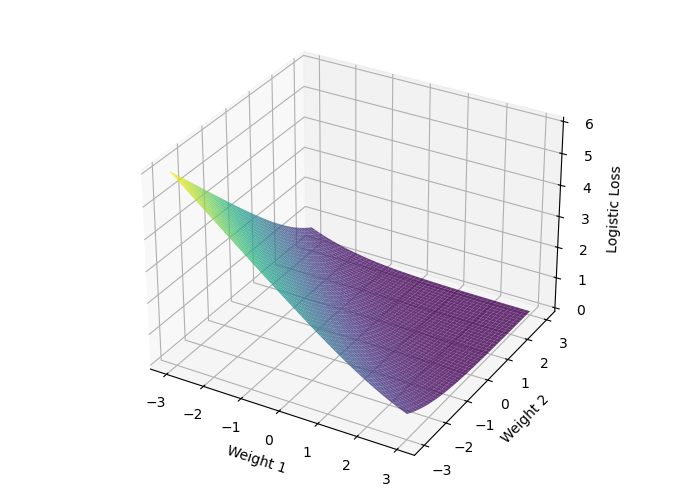
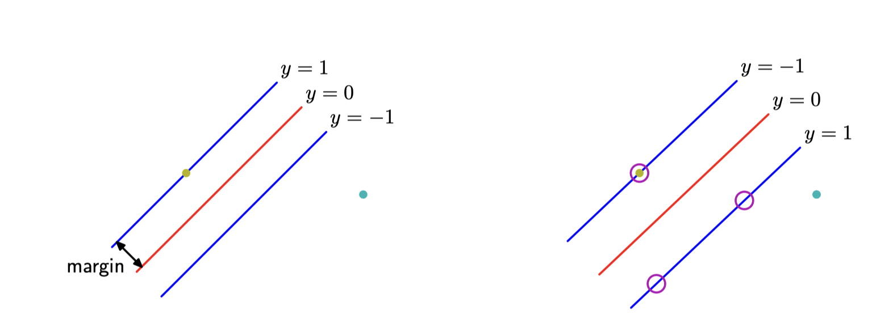
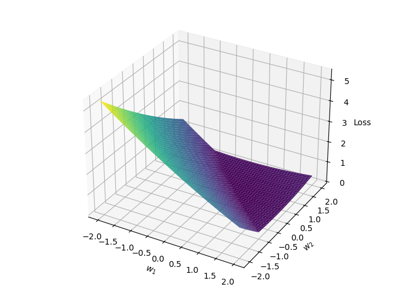

# Напоминание с лекции

# Выпуклые множества

## Отрезок

Пусть $x_1, x_2$ — два точки в $\mathbb{R^n}$. Тогда отрезок между ними определяется следующим образом:

$$
x = \theta x_1 + (1 - \theta)x_2, \; \theta \in [0,1]
$$

{width=200}

## Выпуклое множество

Множество $S$ называется **выпуклым**, если для любых $x_1, x_2$ из $S$ отрезок между ними также лежит в $S$, то есть

$$
\forall \theta \in [0,1], \; \forall x_1, x_2 \in S: \theta x_1 + (1- \theta) x_2 \in S
$$

::: {.callout-example}
Любое аффинное множество, луч, отрезок — всё это выпуклые множества.
:::

{width=200}

## Задача 1

::: {.callout-question}
Докажите, что шар в $\mathbb{R}^n$ (то есть следующее множество $\{ \mathbf{x} \mid \Vert \mathbf{x} - \mathbf{x}_c \Vert \leq r \}$) является выпуклым.
:::

## Задача 2

::: {.callout-question}
Является ли полоса $\{x \in \mathbb{R}^n \mid \alpha \leq a^\top x \leq \beta \}$ выпуклым множеством?
:::

## Задача 3

::: {.callout-question}
Пусть $S$ таково, что $\forall x,y \in S \to \frac{1}{2}(x+y) \in S$. Является ли это множество выпуклым?
:::

## Задача 4

::: {.callout-question}
Множество $S = \{x \; | \; x + S_2 \subseteq S_1\}$, где $S_1,S_2 \subseteq \mathbb{R}^n$, причём $S_1$ выпукло. Является ли это множество выпуклым?
:::

# Функции

## Выпуклая функция

Функция $f(x)$, **определённая на выпуклом множестве** $S \subseteq \mathbb{R}^n$, называется **выпуклой** на $S$, если:

$$
f(\lambda x_1 + (1 - \lambda)x_2) \le \lambda f(x_1) + (1 - \lambda)f(x_2)
$$

для любых $x_1, x_2 \in S$ и $0 \le \lambda \le 1$.
Если указанное неравенство выполняется как строгое при $x_1 \neq x_2$ и $0 < \lambda < 1$, то функция называется **строго выпуклой** на $S$.

{width=250}

## Сильная выпуклость

Функция $f(x)$, **определённая на выпуклом множестве** $S \subseteq \mathbb{R}^n$, называется $\mu$-сильно выпуклой (сильно выпуклой) на $S$, если:

$$
f(\lambda x_1 + (1 - \lambda)x_2) \le \lambda f(x_1) + (1 - \lambda)f(x_2) - \frac{\mu}{2} \lambda (1 - \lambda)\|x_1 - x_2\|^2
$$

для любых $x_1, x_2 \in S$ и $0 \le \lambda \le 1$ при некотором $\mu > 0$.

{width=250}

# Критерии выпуклости

## Дифференциальный критерий выпуклости первого порядка
Дифференцируемая функция $f(x)$, определённая на выпуклом множестве $S \subseteq \mathbb{R}^n$, является выпуклой тогда и только тогда, когда $\forall x,y \in S$:

$$
f(y) \ge f(x) + \nabla f^T(x)(y-x)
$$

Полагая $y = x + \Delta x$, критерий принимает более удобный вид:

$$
f(x + \Delta x) \ge f(x) + \nabla f^T(x)\Delta x
$$

{width=200}

## Дифференциальный критерий сильной выпуклости второго порядка
Дважды дифференцируемая функция $f(x)$, определённая на выпуклом множестве $S \subseteq \mathbb{R}^n$, является $\mu$-сильно выпуклой тогда и только тогда, когда $\forall x \in \mathbf{int}(S) \neq \emptyset$:

$$
\nabla^2 f(x) \succeq \mu I
$$

Иными словами:

$$
\langle y, \nabla^2f(x)y\rangle \geq \mu \|y\|^2
$$

## Мотивирующий эксперимент с JAX

Почему выпуклость и сильная выпуклость важны? Изучите простой [\faPython фрагмент кода](https://colab.research.google.com/drive/14qPF7fkCWAoKcmFbN0Up4V0LMR287Nch?usp=sharing).

## Задача 5

::: {.callout-question}
Покажите, что $f(x) = \|x\|$ является выпуклой на $\mathbb{R}^n$.
:::

::: {.callout-question}
Покажите, что $f(x) = x^\top Ax$, где $A\succeq 0$, является выпуклой на $\mathbb{R}^n$.
:::

## Задача 6

::: {.callout-question}
Покажите, что если $f(x)$ выпукла на $\mathbb{R}^n$, то $\exp(f(x))$ выпукла на $\mathbb{R}^n$.
:::

## Задача 7

::: {.callout-question}
Пусть $f(x)$ — выпуклая неотрицательная функция и $p \ge 1$. Покажите, что $g(x)=f(x)^p$ является выпуклой.
:::

## Задача 8

::: {.callout-question}
Покажите, что если $f(x)$ — вогнутая положительная функция на выпуклом $S$, то $g(x)=\frac{1}{f(x)}$ является выпуклой.
:::

::: {.callout-question}
Покажите, что следующая функция является выпуклой на множестве всех положительных знаменателей
$$
f(x) = \dfrac{1}{x_1 - \dfrac{1}{x_2 - \dfrac{1}{x_3 - \dfrac{1}{\ldots}}}}, x \in \mathbb{R}^n
$$
:::

## Задача 9

::: {.callout-question}
Пусть $S = \{x \in \mathbb{R}^n \; \vert \; x \succ 0, \Vert x \Vert_{\infty} \leq M \}$. Покажите, что $f(x)=\sum_{i=1}^n x_i \log x_i$ является $\frac{1}{M}$-сильно выпуклой.
:::

# Условие Поляка-Лоясиевича

## Условие Поляка-Лоясиевича (PL)

Неравенство Поляка-Лоясиевича выполняется, если для некоторого $\mu > 0$ справедливо следующее условие:
$$
\Vert \nabla f(x) \Vert^2 \geq \mu (f(x) - f^*) \forall x
$$
Пример функции, удовлетворяющей условию Поляка-Лоясиевича, но не являющейся выпуклой:
$$
f(x,y) = \dfrac{(y - \sin x)^2}{2}
$$

Пример невыпуклой функции, удовлетворяющей условию Поляка-Лоясиевича [\faPython Open in Colab](https://colab.research.google.com/github/MerkulovDaniil/optim/blob/master/assets/Notebooks/PL_function.ipynb).

# Практические примеры

## Логистическая регрессия

::: {.columns}
::: {.column width=60%}
::: {.callout-note}
## Дано
Данные:
$X \in \mathbb{R}^{m \times n}, y \in \{0, 1\}^n$.
:::

. . .

::: {.callout-important}
## Найти
Найти функцию, которая переводит объект $x$ в вероятность $p(y=1| x)$:

$p: \mathbb R^m \to (0, 1)$, $p(x) \equiv \sigma(x^Tw) = \frac{1}{1 + \exp(-x^T w)}$
:::

. . .

::: {.callout-tip}
## Критерий
Бинарная кросс-энтропия (логистические потери):

$L(p, X, y) = -\sum_{i=1}^n y_i \log p\left( X_i \right) + \left( 1 - y_i \right) \log \left(1 - p\left( X_i \right) \right),$
минимизируемая по $w$.
:::

. . .

:::
::: {.column width=38%}

:::
:::

Задачу можно сделать $\mu$-сильно выпуклой, если рассмотреть регуляризованные логистические потери в качестве критерия: $L(p, X, y) + \frac{\mu}{2} \| w \|_2^2$.

Изучите [\faPython\ эксперименты с логистической регрессией](https://colab.research.google.com/github/MerkulovDaniil/hse25/blob/main/notebooks/s4_benchmarx_convex.ipynb).

## Метод опорных векторов (SVM)

::: {.columns}
::: {.column width=60%}
::: {.callout-note}

## Дано

Данные:
$X \in \mathbb{R}^{m \times n}, y \in \{-1, 1\}^n$.
:::

. . .

::: {.callout-important}
## Найти

Найти гиперплоскость, максимизирующую отступ между двумя классами:

$f: \mathbb{R}^m \to \{-1, 1\},\ f(x) = \text{sign}(w^T x + b)$.
:::

. . .

::: {.callout-tip}
## Критерий

Кусочно-линейная функция потерь (hinge loss):

$L(w, X, y) = \frac{1}{2} \|w\|_2^2 + C\sum_{i=1}^n \max(0, 1 - y_i (X_i^T w + b)),$
минимизируемая по $w$ и $b$.

:::

Данная задача является сильно выпуклой вследствие наличия квадрата евклидовой нормы.

Изучите [\faPython\ эксперименты с методом опорных векторов в том же блокноте](https://colab.research.google.com/github/MerkulovDaniil/hse25/blob/main/notebooks/s4_benchmarx_convex.ipynb).

. . .

:::
::: {.column width=38%}

:::
:::

## Некоторые другие любопытные примеры

- \textbf{Низкоранговое приближение матрицы}
$$\min_X \|A - X\|_F^2\ \text{s.t.}\ rank(X) \le k.$$

. . .

::: {.callout-question}
Является ли задача выпуклой?
:::

. . .

По теореме Экарта-Янга задача решается с помощью SVD: $X^* = U_k \Sigma_k V_k^T$, где $A = U \Sigma V^T$.

. . .

- \textbf{Выпуклая релаксация с помощью ядерной нормы}
$$
\min_X rank(X),\ \text{s.t.}\ X_{ij} = M_{ij},\ (i, j) \in I.
$$

. . .

Задача NP-трудная, однако $\|A\|_* = trace(\sqrt{A^T A}) = \sum_{i=1}^{rank(A)} \sigma_i(A)$
является выпуклой оболочкой ранга матрицы.
